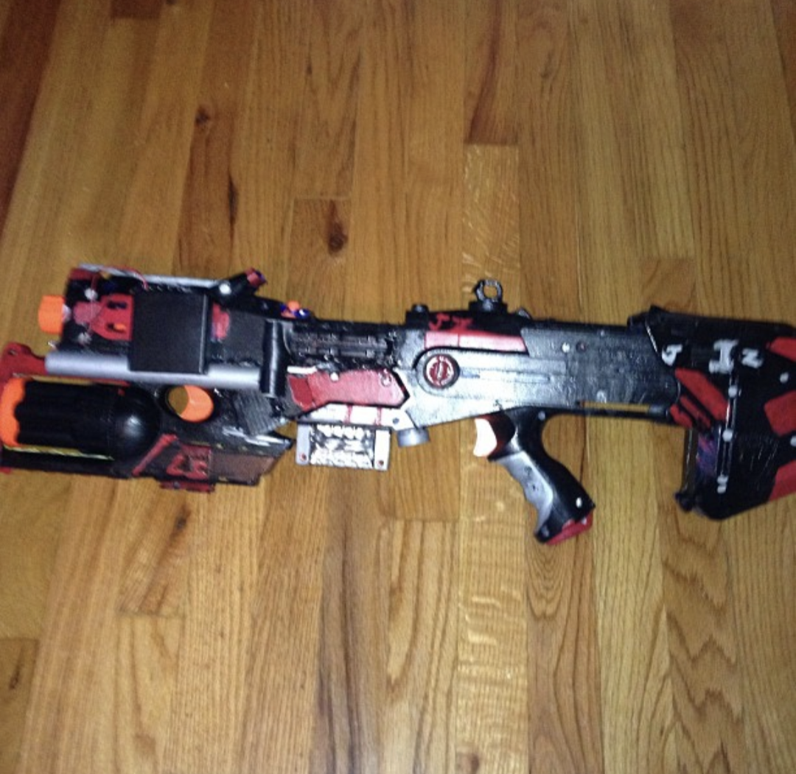

Mavshot was one of my first successful projects that I built when I was 11.  This is a [Nerf Longshot](https://nerf.fandom.com/wiki/Longshot_CS-12) body with a [Nerf Maverick](https://nerf.fandom.com/wiki/Maverick_REV-6#Standard_) attached underneath.  

I cut parts of the Longshot off with a Dremel and the handle off of the Maverick to join the two.  They are put together with hot glue, where a PVC pipe painted silver covers the seam.  

I removed the air restrictors from the chambers of both blasters with a flathead screwdriver and a hammer.  The spring in the maverick was made stronger with a Home Depot spring.  I had to shave a portion of the pullback on the Maverick so a magazine would fit inside the longshot.

Once functional modifications were done, I sanded the parts heavily to remove the factory paint and put a base coat of black on.  I brushed on red and silver enamel paint for detailing.  

The guiding force of YouTube and multiple blasters I made nonfunctional were the driving forces for me to finally get a blaster that had everything 6th grade me wanted. 

