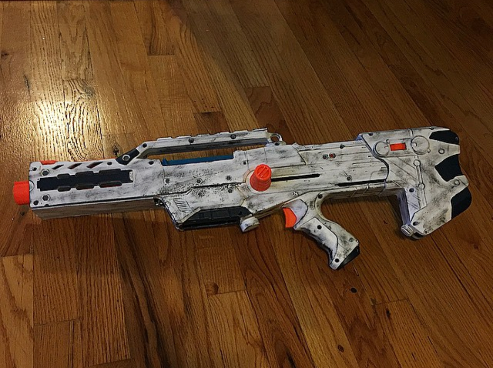

After watching a friend play Destiny I wanted to make something inspired by that game's aesthetic.  

This was a [Nerf Longshot](https://nerf.fandom.com/wiki/Longshot_CS-12) that I did minimal modifications to on the exterior functionally.  I used a Dremel to cut a portion of the front off to look more streamlined.  

<!--truncate-->

For the inside of the blaster, I removed the air restrictors and added a stronger spring.  I also improved the seal on the plunger by making the o-ring a little wider and adding white lithium grease for lubrication.  This combination of modifications made foam darts go well over 100ft.

For the exterior, I painted this all white and used dark blue enamel for detailing.  Some black dry brushing later, this is looked like a used blaster.

