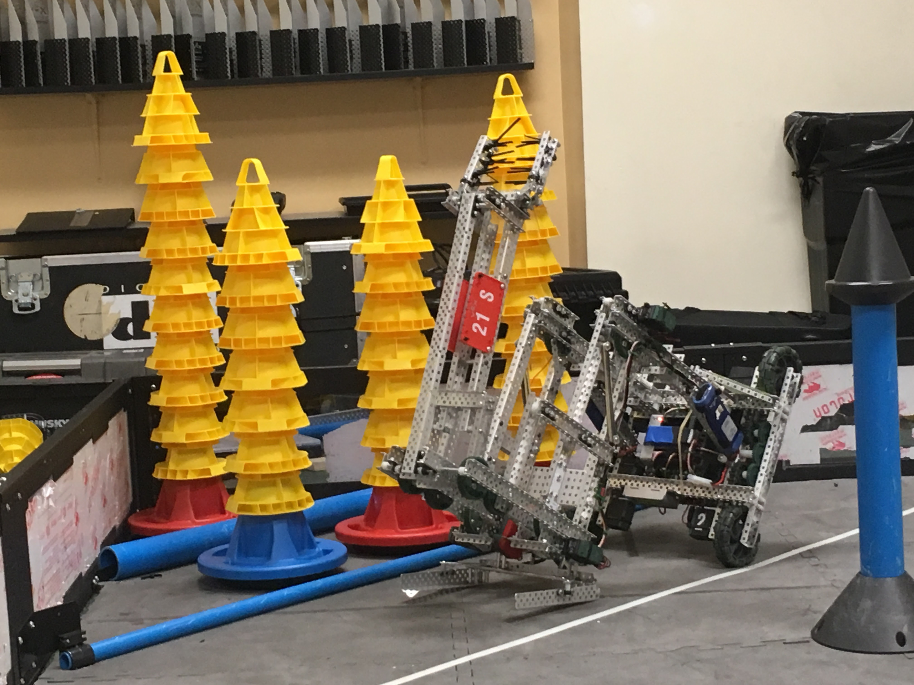

Geoffrey was one of my team's first competitive robots for the VRC season In the Zone, my junior year of high school.  This robot was designed to pick up cones and place them on mobile goals, then lift the weighted mobile goal to place it inside a higher-scoring zone. 

I designed and iterated a passive intake to click over the cones, wrote autonomous routines that used rerun, designed low-profile gear mounts for more stable lift joints, drove the robot during competitions, and made all of the software for the robot. 

https://github.com/Unionjackjz1/Geoffrey

<!--truncate-->

Build / software log coming soon!