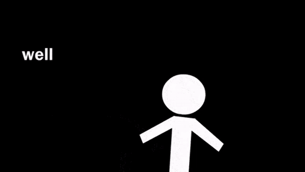
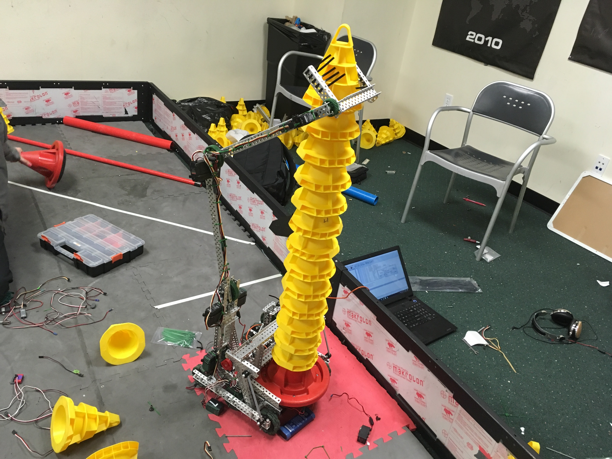
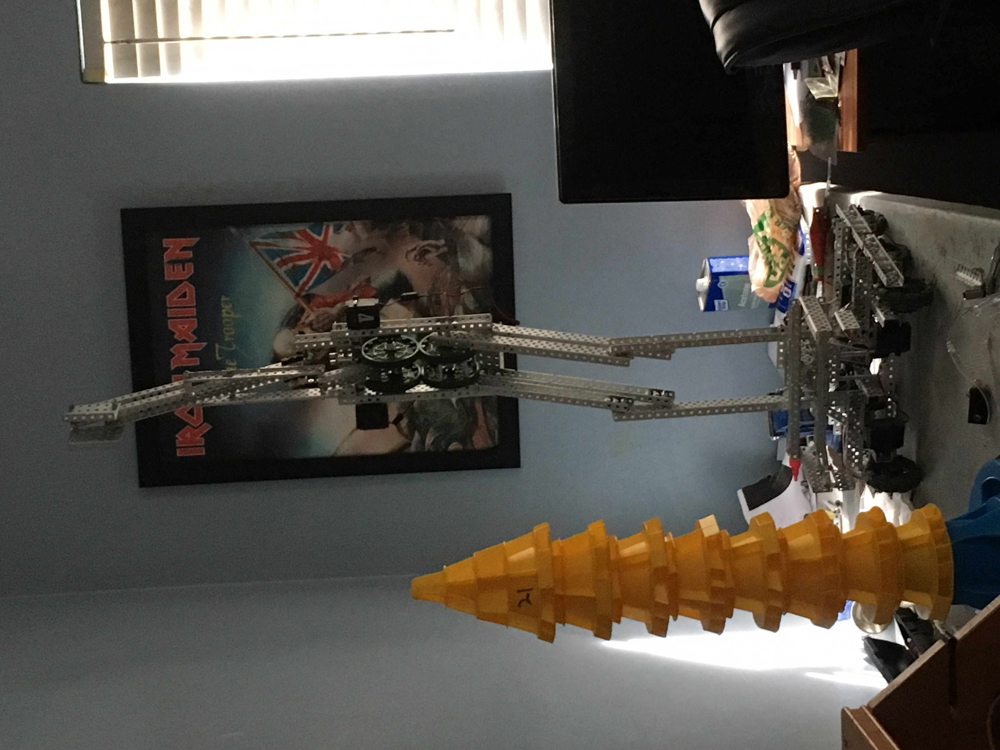
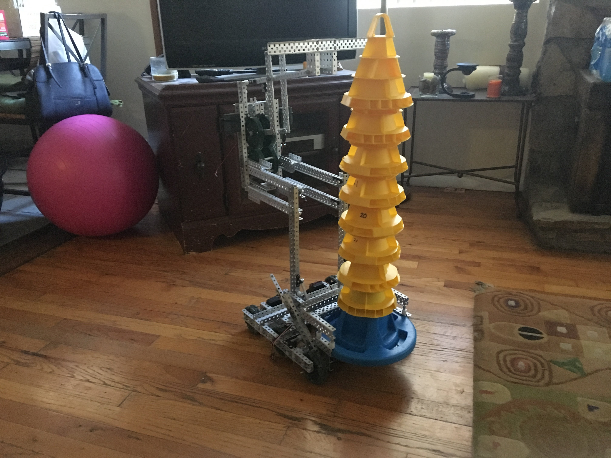
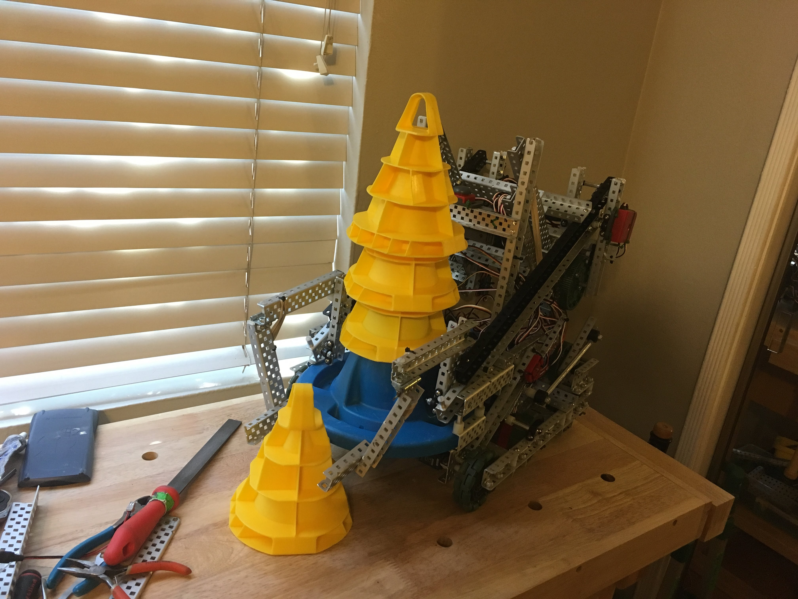
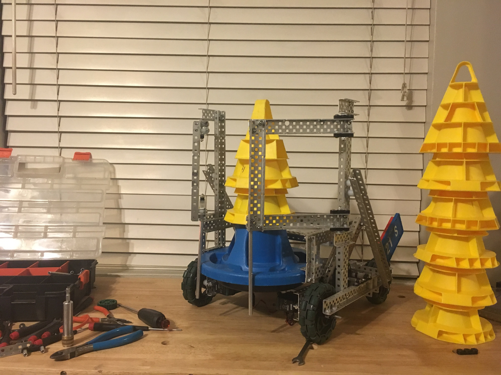
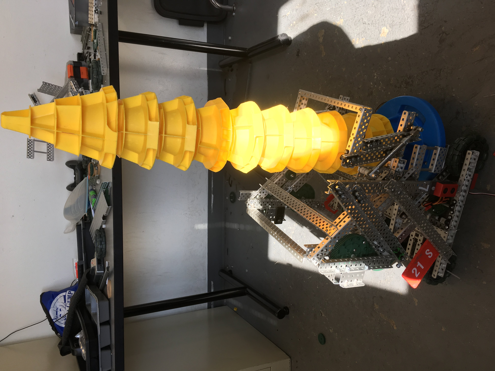

At this point, we were qualified for the State Championship. We now had 3 months of no stress to build up a robot for States, and somehow my team and I built 8 robots in this time frame and only 1 worked which was Gort.  This is a recap of the 7 robots that didn't end up working and why we decided to scrap it.  

Showcasing failure is just as important as showcasing successes.  Between Geoffrey and Gort there was a significant amount of failure, but the amount I learned from this process was invaluable.  Without learning how much of a mistake it was building so many robots and not spending any time tuning I wouldn't have succeeded in any future projects here.

The rest of this blog post is the definition of "try it and see". 

<!--truncate-->

## Robot #1: The Schlucas 
*this robot existed for 13 days*

Inspired by the [62A reveal](https://www.vexforum.com/t/62-early-season-reveal/43366), and feeling confident after qualifying for the State Championship, we decided to try and build a similar version of this robot.  We really liked how light and simple this robot was compared to how other robots looked.  

The problems with this robot were software and hardware.  At the time I didn't know how inverse kinematics works (or that it's not that complicated and I knew everything I needed to) so I was going to tune the movements for every cone.  The amount of force the zip tie intake took to grab a zone was very inconsistent, and getting the intake to spin correctly was hard.  

Here's a good [album](https://photos.app.goo.gl/FW2f4SJD36dUvdjHA) of the robot failing to move how I want it to.

## Robot #2: Thinner is Better
*this robot existed for 5 days*

The idea for this robot was to make everything super thin.  I don't have much more to go off of with the 3 photos I have of it.  

## Robot #3: Maybe a Little Wider
*this robot existed for 6 days*

The base 4 bar was too thin and didn't leave enough room for the top 4 bar.  The construction of this robot is pretty similar starting out.

After realizing there wasn't enough clearance or stability to be consistent, I tried to salvage it by picking up cones from the side instead of in front of the robot.  How it was built led to some huge levers and bending, so this was scrapped.

## Robot #4: The Widest Yet
*this robot existed for 15 days (new record!)*

Somehow on this robot, the opposite mistake was made.  This robot was too wide.

And this robot was scrapped once we realized it was [too wide](https://photos.app.goo.gl/DroWQUHgZUwW2bti8).

## Robot #5: "Tube"
*this robot existed for 10 days*

With a tournament in 10 days and a robot that we felt wasn't salvageable, we needed to come up with something simple to compete with and fast.  After some discussion with team members and other competitors, we decided to attempt a new design we were calling "Tube Bot".  This robot would do small stacks, but the idea was if we could do them fast enough then we could spend the majority of the match playing defense. 

This robot will grab cones and drop them ~2ft onto the mobile goal.  If you're asking yourself "How would this be consistent?", I'm asking myself the same question as I write this retroactively.  
<iframe width="560" height="315" src="https://www.youtube.com/embed/r4a08b07Xvw?si=zy-66ASxoDyFq9n8" title="YouTube video player" frameborder="0" allow="accelerometer; autoplay; clipboard-write; encrypted-media; gyroscope; picture-in-picture; web-share" allowfullscreen></iframe>

## Robot #6: "Tube" v2
*this "robot" existed for 4 days*  

After the great success the robot had at the tournament, we decided to make another version.  Luckily, this is as far as we got.

## Robot #7: Finally a Normal Robot.  but smaller...
*this robot existed for 15 days*  

This robot was a step in the right direction.  This had all of the traits of a "meta-design" that the entire community was iterating on and pushing forward, except everything was smaller than ours.  The clearance between the top and bottom four bars was almost 0 and they would scrape constantly, the a few intakes we tried didn't fit because of how far the mobile goal was sticking out of the robot, and we had a pneumatic leak that we couldn't find. 

 