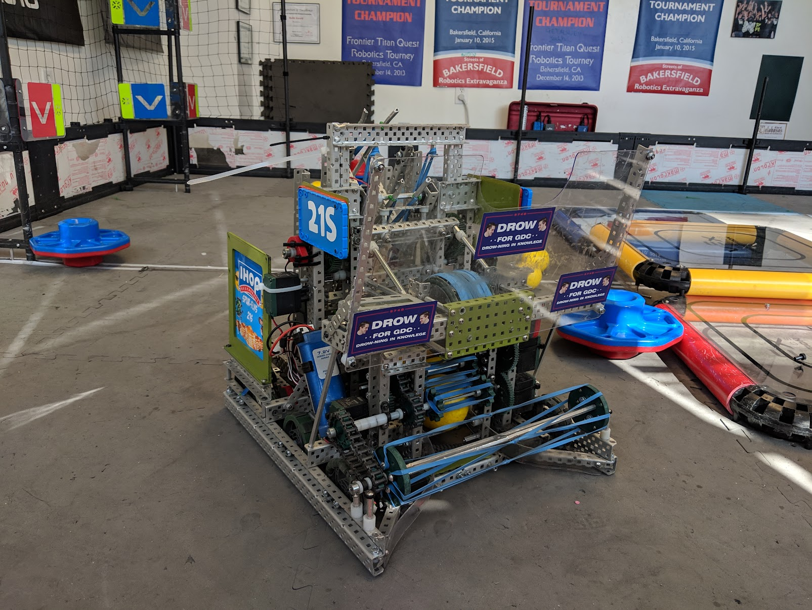

Pancake was my team's first competitive robot of the VRC season Turning Point, my senior year of high school.  This robot used a flywheel to shoot hard plastic balls at flags and could pick up and rotate caps to score them on poles.  

<iframe width="560" height="315" src="https://www.youtube.com/embed/xFh4QxeF-aQ?si=EsCoHq24hh0QABfW" title="YouTube video player" frameborder="0" allow="accelerometer; autoplay; clipboard-write; encrypted-media; gyroscope; picture-in-picture; web-share" allowfullscreen></iframe>

<!--truncate-->

## Overview

This robot was started over the summer and was decommissioned in December.  This robot lasted for 164 days.  After all of our mistakes during the previous season, we decided to keep a robot together as long as possible, practice as much as we could, and tune as much as possible.  

My contributions as team captain went to every aspect of the robot.  I wrote software for driving autonomously using PID, regulating flywheel velocity with a custom velocity controller, and adding automation while operating to make it easier on the driver.  I designed stable and low-slop lift joints, a ball indexer that uses no motors, and a flip-out aligner to score caps.

In VEX teams can create engineering notebooks and can win awards based on those notebooks and an interview process.  This is the notebook, and effectively build/softtware log, that our team made for this robot.   
https://docs.google.com/document/d/1YsQF98x46rvx_f4sj1xKEUWLEZXy9S-LXohFsXjMl4s/edit?usp=sharing

I made CAD of the robot during the pandemic.
