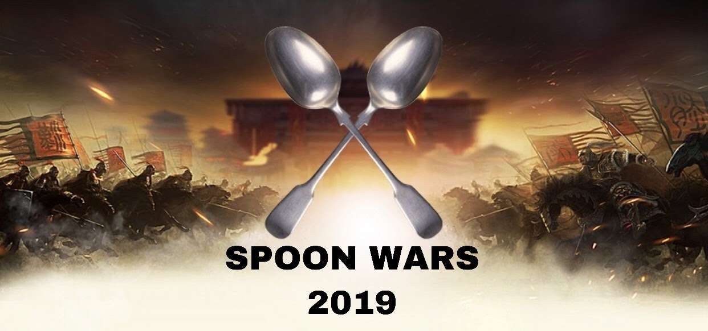

Spoon Wars was a pre-COVID tradition at CHAMPS Charter High School, where every senior was given a spoon and had to tag out another senior who isn't holding their spoon.  In my senior year, some students in robotics were hosting it so I decided to use [Google Sheets](https://docs.google.com/spreadsheets/d/1-Mcza29aSLZmGfXjjmtLiWaP_RBs_sX8DOSbPZp0WEk/edit?usp=sharing) to make scores more clear.  Without this, scores are texted to a game master and they have to share what the scores are when they can.  Now anyone can click this link and see scores.

<!--truncate-->

Each week was a phase that had a spin on the game.  The first week we had Academy Wars, where everyone in the same academy was safe from each other and they had to tag other academy members out, and the second week we gave the top 3 winners a second spoon as a second life.  Interest for the game fizzled out after the second week and the game stopped.

This was my first time using Google Sheets.  I decided to make each week a phase, and we put a spin on the game every week.  Having a dedicated sheet for each week made it easy to have other trusted people to input scores.  

The sheet automatically condenses white space from lists, removes people from lists once they are out, and automatically creates the top 10 on the front page.  The skills I learned from making this enabled me to be proficient at Google Sheets for projects in the future. 

