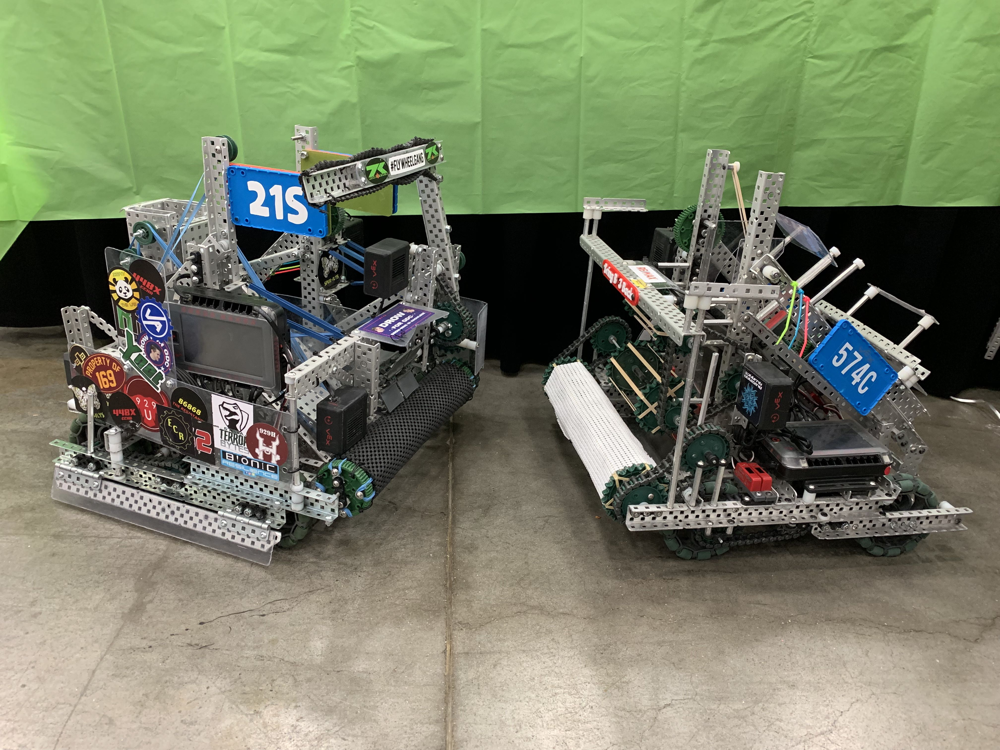
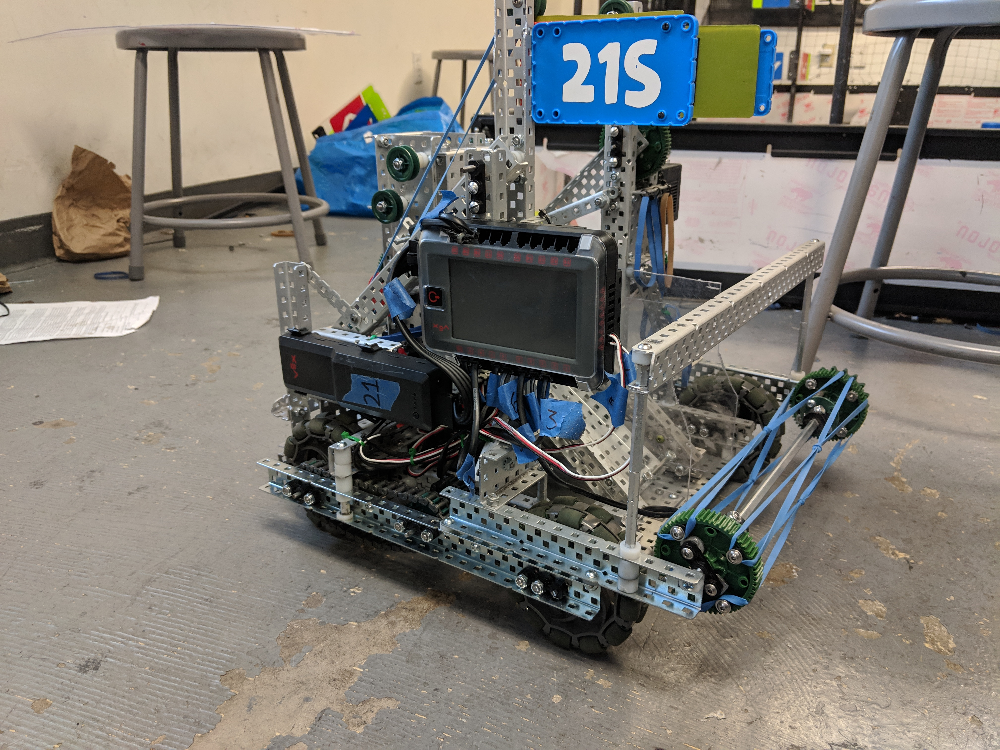
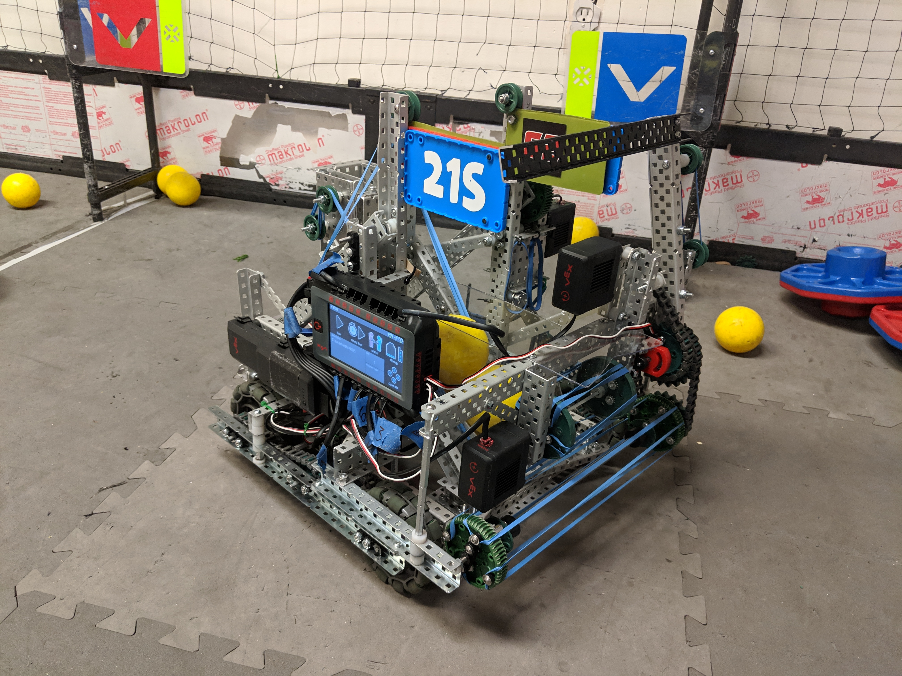

Keke was my team's final competitive robot for the VRC season Turning point, my senior year of high school.  This robot used a catapult to shoot two balls at once to shoot two flags at once, could pick up and score caps and place them on poles, and could scrape balls off of caps or the platform.

<iframe width="560" height="315" src="https://www.youtube.com/embed/ist1h6ZTdDc?si=6TjNYwcKvkhvQO0I" title="YouTube video player" frameborder="0" allow="accelerometer; autoplay; clipboard-write; encrypted-media; gyroscope; picture-in-picture; web-share" allowfullscreen></iframe>

<!--truncate-->

This robot was started in late October and was the robot we took to the World Championship, the culmination of all of the work we put in throughout High School.

My contributions as team captain went to every aspect of the robot.  I wrote autonomous routines using motion profiling, and adding automation while operating to make it easier on the driver.  I designed different stable and low-slop joints than Pancake, but most of all designed a robot that required very little maintenance after taking a beating.

## Notebook
In VEX teams can create engineering notebooks and can win awards based on those notebooks and an interview process.  This is the notebook, and effectively build / software log, that our team made for this robot.  

This was never finished, so I'll add in a summary of the remainder of the season below.

https://docs.google.com/document/d/1omhGB65uhTlaZRZvgxiF9jmN33fIssLbpcdErRU2LSE/edit?usp=sharing

We took the robot to SLO and were very happy with the performance, ranking 3rd and advancing to the finals.  Our biggest shortcoming was our autonomous not doing enough.  To be fair for SLO, we were working on such a short time schedule with how recently before we got V5 and were able to put everything on the robot.  But there was something new we wanted to try. 

Teams have started making mechanisms to intake the balls off of caps during autonomous and using them to increase the efficiency of their paths.  We have an extra motor but would like to use it elsewhere, so we came up with a passive idea.  When our cap arm raised it would release a rubber band allowing this standoff to fall down into a cap, and when we drove backwards the ball would tip into our robot.  This worked ok, was inconsistent and hindered intaking a bit. So we decided to try something else.
<iframe width="560" height="315" src="https://www.youtube.com/embed/sLf9FCNjxXg?si=PpYmkTMX0hM2RHRr" title="YouTube video player" frameborder="0" allow="accelerometer; autoplay; clipboard-write; encrypted-media; gyroscope; picture-in-picture; web-share" allowfullscreen></iframe>

We decided to go a more typical route and make a motored arm, we called this a scraper.  This allowed us to tip caps, flip caps, and take balls off of caps and the platform.  
<iframe width="560" height="315" src="https://www.youtube.com/embed/q3p2t34UsUw?si=WRuaxvga89343oH4" title="YouTube video player" frameborder="0" allow="accelerometer; autoplay; clipboard-write; encrypted-media; gyroscope; picture-in-picture; web-share" allowfullscreen></iframe>

Soon we had to compete at Google, a signature event, where the winners would qualify for the World Championship.  We continued to practice and iterate on mechanisms that would fail to make them more robust.  We got picked by 8th place, and we made it to Semi Finals where we lost to the champions.  But, our Quarter Finals match is a good one.  We were against 1st place and our alliance was having trouble and was working on the robot.  The event couldn't wait any longer so we had to play as 1 team against 2.  And against all odds (with some luck) we ended up winning the match!
<iframe width="560" height="315" src="https://www.youtube.com/embed/W3HrmSFPUpA?si=sLM_iQXf683_HbLx" title="YouTube video player" frameborder="0" allow="accelerometer; autoplay; clipboard-write; encrypted-media; gyroscope; picture-in-picture; web-share" allowfullscreen></iframe>

We ended up taking this robot to the State Championship and got picked for eliminations by 2nd place, and we advanced to Finals which qualified us for the World Championship.

Between the State Championship and World Championship we wanted to iterate everything.  Our drive struggled to get onto the platform, and our intake wasn't very fast, our scraper would get caught in the net sometimes. 

We started fixing our list of problems by changing the shape of our drive.  We exposed the front wheel so as we climbed the platform it was easier to get on.  We also redid our intake structure to make sure it was much stronger.

To stop our scraper from getting entangled in the net we angled it back farther.  This required changing how the structure was done, and needed chain instead of gears to fit everything.  

A big criticism of double catapults is the inability to shoot 1 ball at a time.  We had space for a ball to sit in our intake, so we added a sensor to detect a ball there and stop the intake.  This allowed us flexibility in scoring, and to not waste 2 balls when we only needed to score 1 flag.
<iframe width="560" height="315" src="https://www.youtube.com/embed/V6CQSywE5aw?si=X8tKsGa6JgXnVQVj" title="YouTube video player" frameborder="0" allow="accelerometer; autoplay; clipboard-write; encrypted-media; gyroscope; picture-in-picture; web-share" allowfullscreen></iframe>  
<iframe width="560" height="315" src="https://www.youtube.com/embed/iCO3P55ZqEU?si=ol17lvWTlesXVRUx" title="YouTube video player" frameborder="0" allow="accelerometer; autoplay; clipboard-write; encrypted-media; gyroscope; picture-in-picture; web-share" allowfullscreen></iframe>

And then it was off to the world championships!  We went 7-3 and got picked by 3rd seed, and advanced to finals of our division.  And we got some pretty good highlights...
<iframe width="560" height="315" src="https://www.youtube.com/embed/AX5zH4IKJ5M?si=oKlNfiKg78-kU9UU" title="YouTube video player" frameborder="0" allow="accelerometer; autoplay; clipboard-write; encrypted-media; gyroscope; picture-in-picture; web-share" allowfullscreen></iframe>