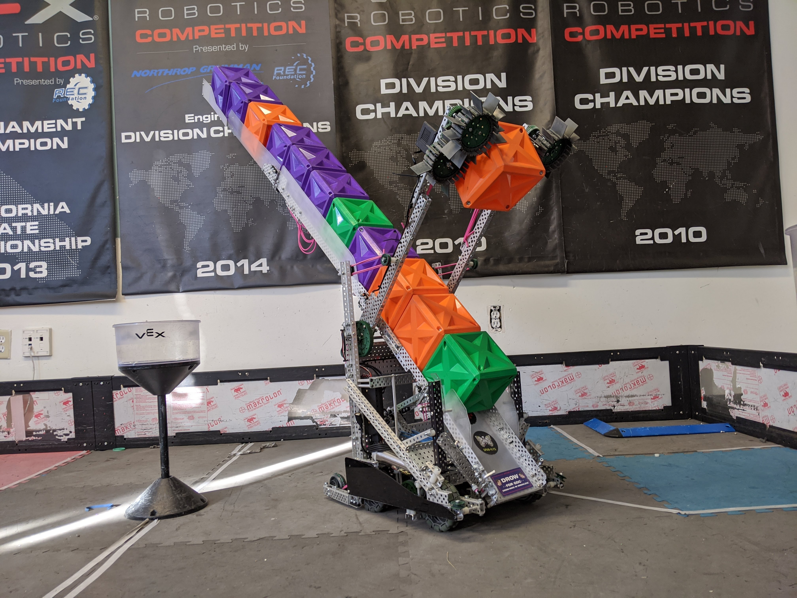

~2 months after the RI3D I decided to compete in VEXU.  I used Goofy as a starting point, and from the mistakes I learned during In the Zone decided to keep this robot together as long as I could.  By the forceful end of the season there were probably no parts the same from the original robot. This process of iterating single things over and over meant there was rarely a point that I didn't have a robot to practice with and test. 

<!--truncate-->

Build / software log coming soon!