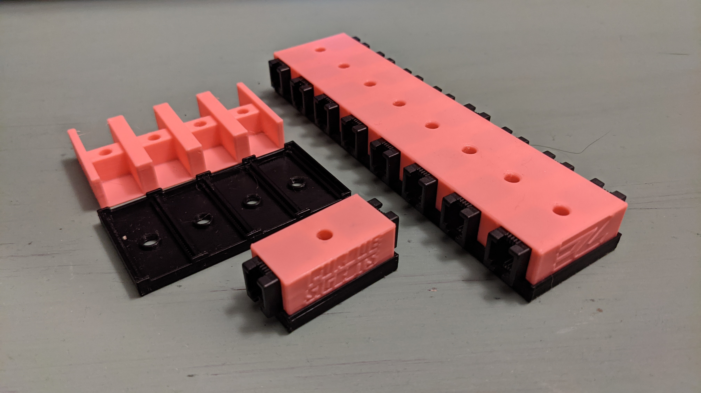

[The exclusion of a TVS diode in the VEX V5 Brain](https://wiki.purduesigbots.com/vex-electronics/vex-electronics/vex-v5-brain/v5-electronics-observations) leads to ports frying when mechanisms on the robot are more prone to static.  I made a 3D printable case for custom PCBs to solve this problem.

https://wiki.purduesigbots.com/vex-electronics/v5-esd-protection-board

<!--truncate-->

BLRS made a custom PCB with wire couplers that add a TVS diode between them.  Having a short wire from the brain to the coupler, then from the coupler to your motor makes it so the ports cannot break due to static.  These parts are explicitly illegal for competition use but are legal to use in practice.  

My involvement was designing the 3D printable case.  There are 3 versions that hold different amounts of boards,  1, 4, and 8.  The challenge was designing parts that fit the boards snugly on multiple types of printers.  During testing I had teams try printing them on an Ender 3, Prusa Mk3, and a Prusa Mini to make sure tolerances were good no matter what printer was used.  