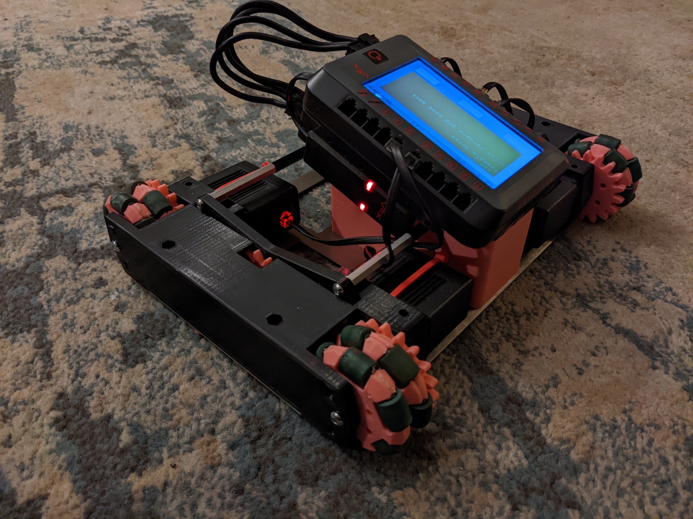
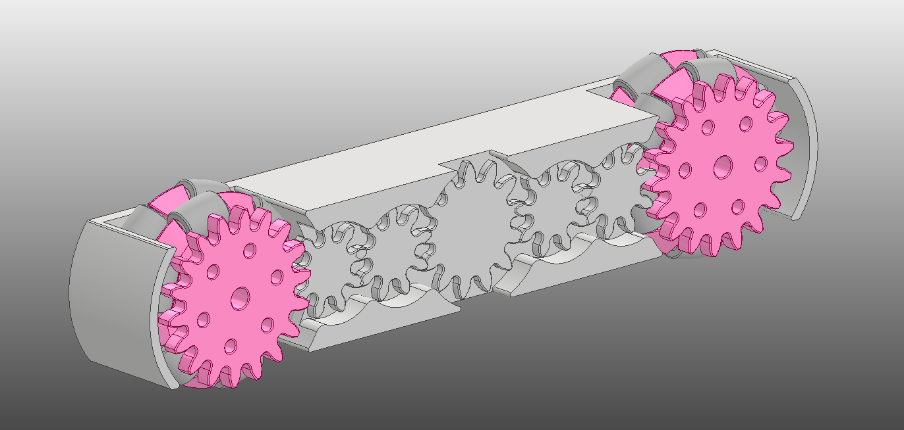
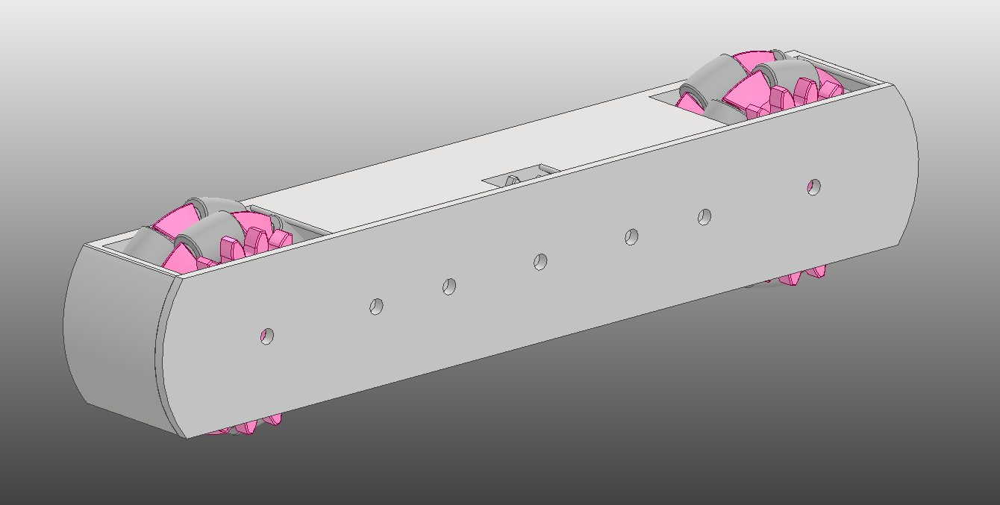
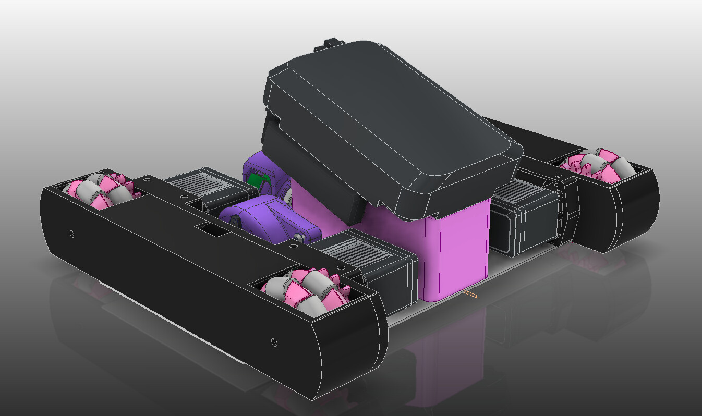
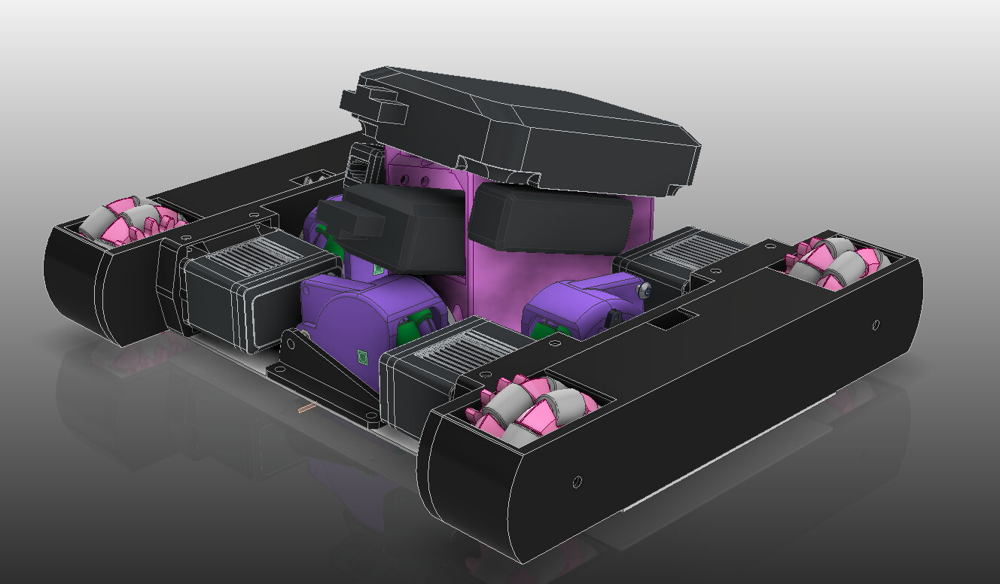
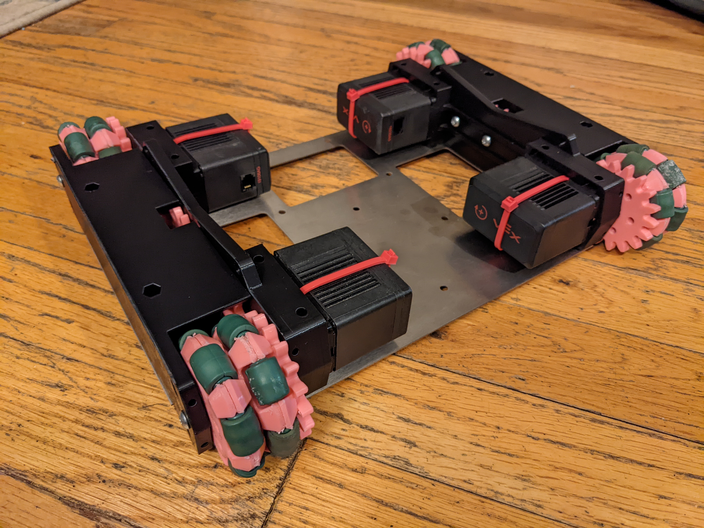
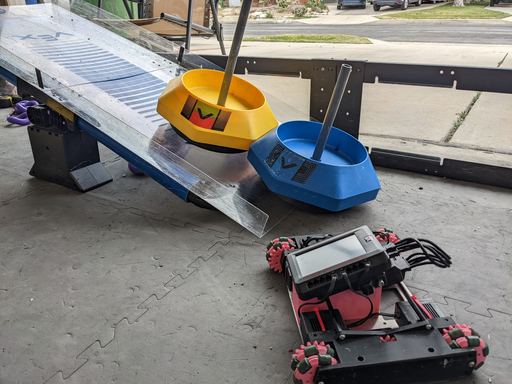

Dave was a little robot that I made quickly for testing software.  Everything on it is either 3D printed or laser cut from [Send Cut Send](https://sendcutsend.com/).  

<!--truncate-->

I started out with a double roller omni-wheel assembly that had a gear baked into the print.

I looked through my parts and found out I didn't have enough rollers from the old VEX 3.25" wheels, but I did have enough from their 4" wheels.  I redesigned the wheel using the dimensions from those rollers.  Left is 3.25" roller, right is 4". 

I wanted all of the gearing to be enclosed in the drive so I needed smaller idler gears.  The ratio is 2:1, I'll be using a 1200rpm motor to make the output wheel go 600rpm. 

The motor fronts were integrated into the drive, and the gearing was done!  All that was left was to make an electronics holder, a simple sheet to hold everything, and make sure there were cutouts for tracking wheels.

The assembly was very smooth.  Inserts got pressed into the wheels and they spun on round standoffs.  Everything else spun on screws.  

And when assembly was all done, it looked just like the CAD!  The robot helped me program for about 6 months, but I had other more realistic robots to use for software testing then.  T
