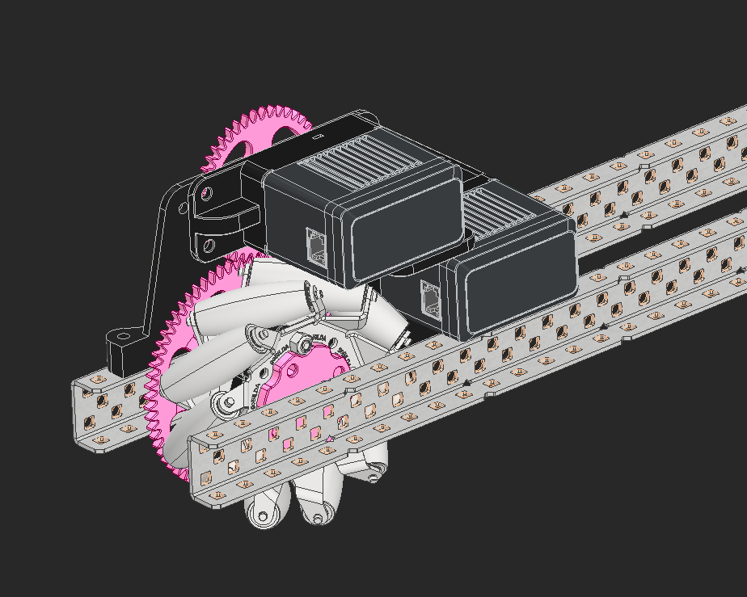

Inspired by FTC robots like [Gluten Free](https://youtu.be/i2g_b54MEFI?si=JLfJJJGFaLfl93a1) Lucas Wills and I decided we wanted to play with mecanum wheels on VEX robots.  

<!--truncate-->

After testing how inefficient the [2" and 4" V5 mecanum wheels](https://www.vexrobotics.com/wheels.html) are, we looked at how the [GoBildaWheels](https://www.gobilda.com/96mm-mecanum-wheel-set-70a-durometer-bearing-supported-rollers/) are assembled and decided their double ball bearing per roller assembly made them vastly superior to the VEX wheels. 

We designed a low profile mount designed around these wheels where the drive isn't any bigger than the space the metal takes up.  But after pricing out how much it would be in rubber, axels, and bushings, we felt it wasn't worth the ~$150 for wheels we weren't going to compete with.

More info coming soon!