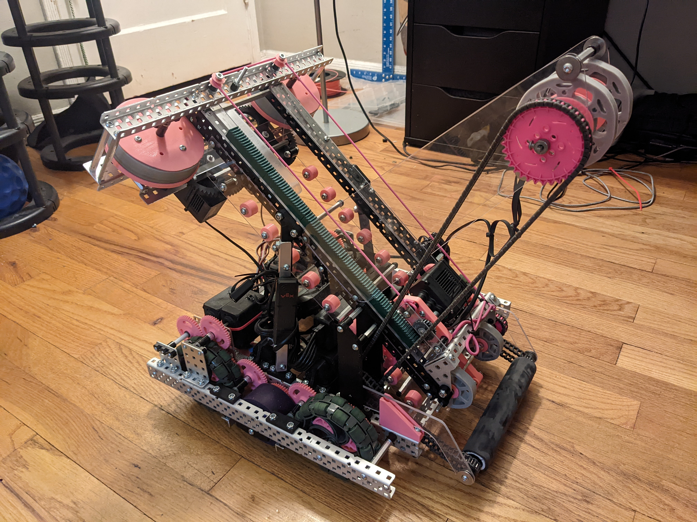

Mid was an iteration of a [simple robot built by 13186A](https://www.youtube.com/watch?v=CqWtpF6hbSg) to demonstrate to students iterating based off of others designs.  

<!--truncate-->

## About
Using 13186A as a base point, I designed and iterated the system to get discs from storage to the flywheels.  The design I ended with was a linear slide that pushed the discs through, removing all the slip that chain has.  I made software that automates the linear slide for the driver, regulates flywheel velocity using PID, jam detection on the intake, and pure pursuit for autonomous.  This robot uses custom molded traction wheels with 20A polyurethane and a custom-made gear ratio that gives 417rpm on 4.125" wheels.

Build / software log coming soon!