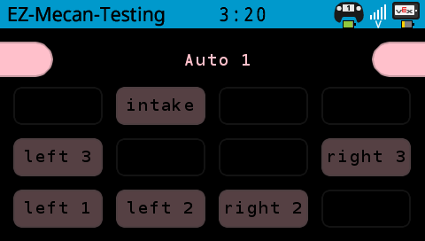

[EZ-GUI](https://github.com/EZ-Robotics/EZ-GUI) is a simple-to-use VEX V5 screen GUI that intuitively keeps track of motor temperatures and allows users to select autonomous routines. 

<!--truncate-->

## About

I've seen other teams with UIs that have many pages and can do a bunch of stuff, but I wanted something simple.  The [LLEMU](https://pros.cs.purdue.edu/v5/tutorials/topical/llemu.html) is great for an autonomous selector but it's difficult to implement motor temperature readings. 

All of the displayed names for my autonomous routines are short, so I could dedicate a very small portion of the screen to that.  The rest of the screen could be split into a grid and just have a light gray outline to start.  As motor temperatures heat up, the color of the box will increase to eventually be the same color as the left/right buttons for the autonomous selector.  The closer they are in color, the warmer the motors are.  There's black text showing the name of the motor as well.

I like this method of detecting temperature because under normal use the brain screen shows nothing.  Then as you use the robot more, you'll see something catch your eye and it reminds you to slow down / let the robot have a break.

This isn't documented or an officially released library yet, but the plan is to eventually set that up.  I'd like to add different screens as well instead of temperature reading, like a logger or being able to graph stuff.  