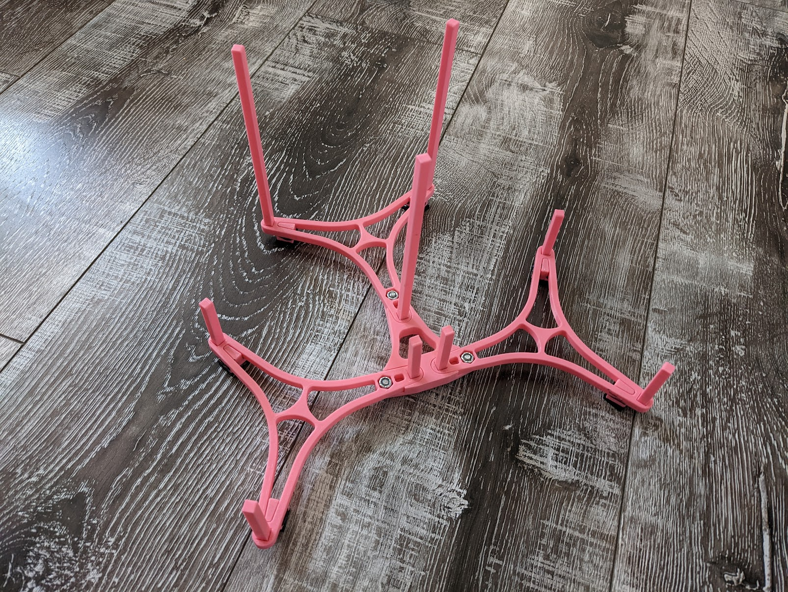

I made disc holders to help run Spin Up tournaments more efficiently.

https://www.printables.com/model/329950-vex-spin-up-preload-holder

<!--truncate-->

In the VEX game Spin Up, there are 11 discs that stay out of the field per side.  7 are match loads that can be loaded at any time during driver control, and 4 are preloads, 2 per robot.  To help people reset the fields easier, and to help competitors quickly know if they have the correct amount of discs, I made a printable preload holder.  Once the discs are flush with the stems of the print, the team has the correct amount of discs.  

These parts lasted a surprising amount of time given they were printed and were next where high school and middle school students were standing all day.  They lasted around 6 tournaments before they were too broken for use.  They are assembled using standard VEX hardware, 8-32 screws, and 11/32 locknuts.  The files are public for anyone to use. 