For Supernova Spectacular 2022 I designed and made 19 custom awards to give out during the event.  Click to read the build log.

<!--truncate-->

## Design
The event was giving out 9 awards per competition, and we held a Middle School competition on Saturday and a High School competition on Sunday.  This meant I had to make double the amount of awards.  

RECF sends some awards for free to give out for your first event.  We could have bought the rest of the trophies from RECF / VEX, but for a similar price we made custom cooler awards that we felt teams would be happier getting.  I ended up making custom awards for the highest awards (excellence, tournament champion, robot skills) and made my own plaques for the standard VEX trophies.  

The award list to make is:
- Excellence x2
- Tournament Champion x4
- Skills Champion x2
- Design x2
- Judges x2
- Think x2
- Build x2
- Create x2
- Volunteer of the Year x1

### Special Awards
I did research into how other teams made their awards.  These two stood out to me the most.  I liked having game elements behind the award, and I liked the aluminum plate for the front.  
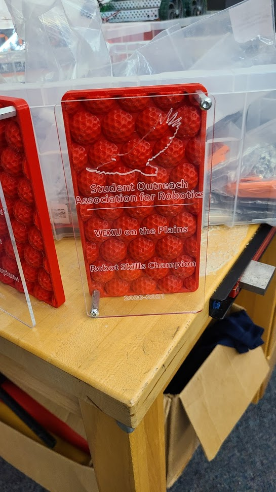
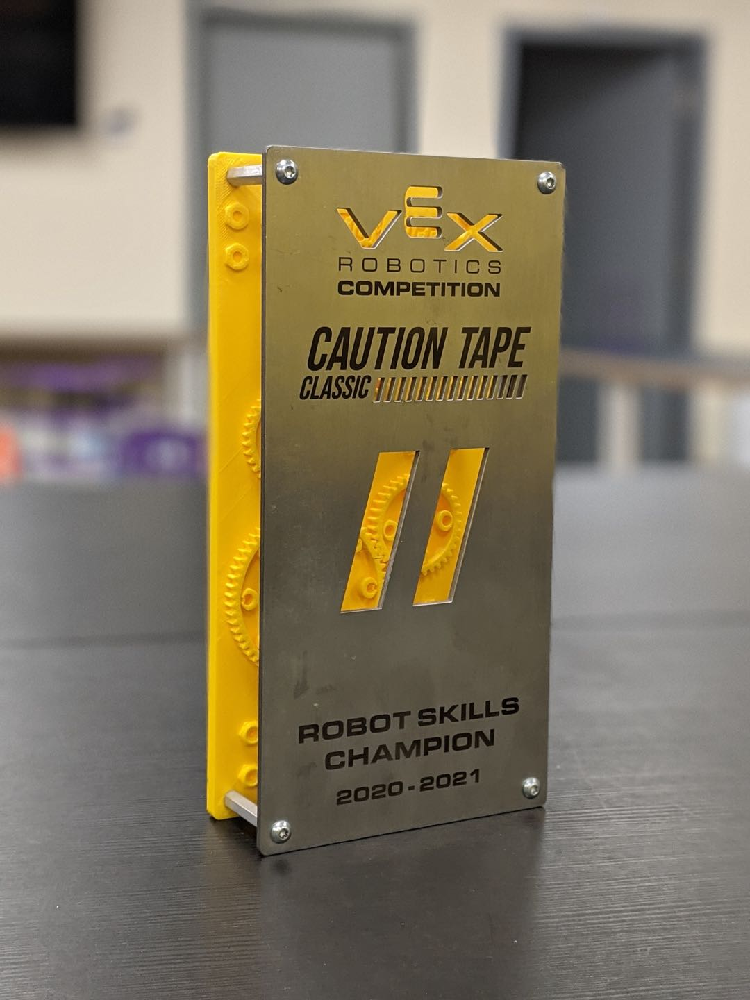

My first attempt had the discs purple instead of yellow for supernova colors.  I felt this took away from the point of them being game elements from that year, so I changed the purple to yellow.  This part will be made in 2 parts, one that I change the filament halfway through to get the yellow, and one to go around that and act as a boarder.  
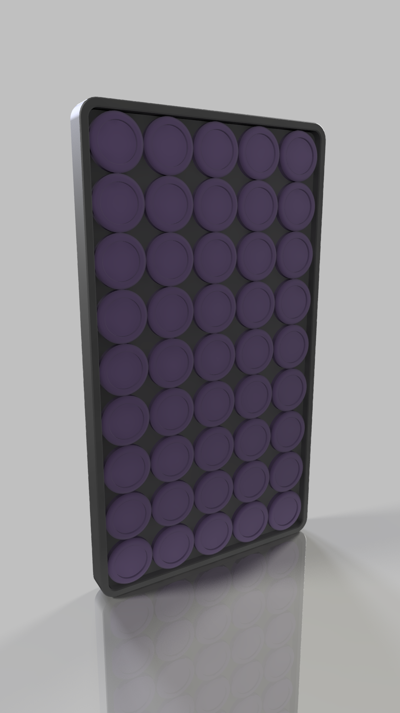
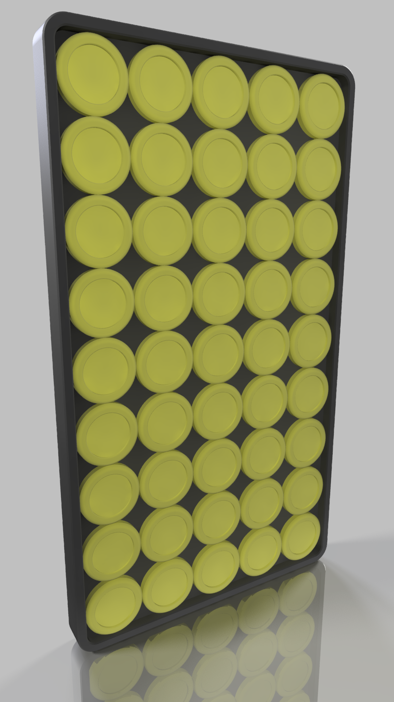

With the back of the part done, I started designing the front.  It needed to say `SUPERNOVA SPECTACULAR`, the name of the award, and the Supernova logo.  This meant for each version of the trophy the only thing I change is the bottom award name.  I made the image below to see if I liked the way this looked, but it is impossible to create like that because of floating material in letters like `O` and the inside of the Supernova logo.  
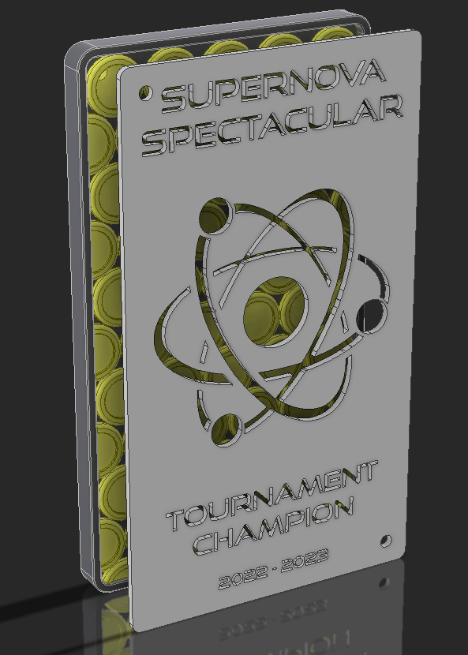

This was fixed with some connecting pieces between floating parts.  It changed how the logo looks a bit, but (before I made this article about it) no one noticed but me.  
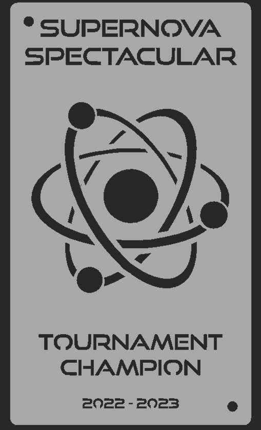

### Plaques 
With limited space on the trophy I couldn't fit the Supernova logo on the plaque.  Just putting `SUPERNOVA SPECTACULAR`, `2022-2023` along with the award name doesn't look over crowded.  
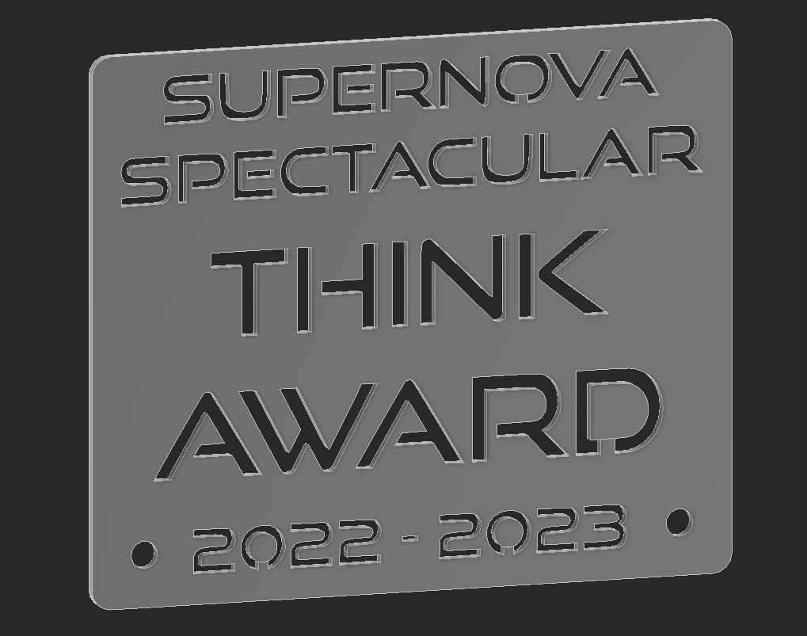

## Assembly 

Here is the final part before fabrication was started.  
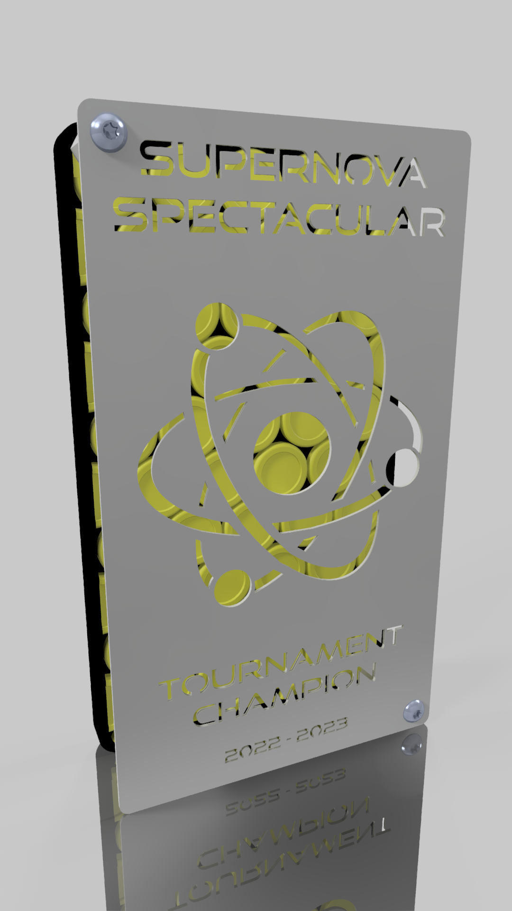

I made one to make sure it worked before printing the rest of them.  
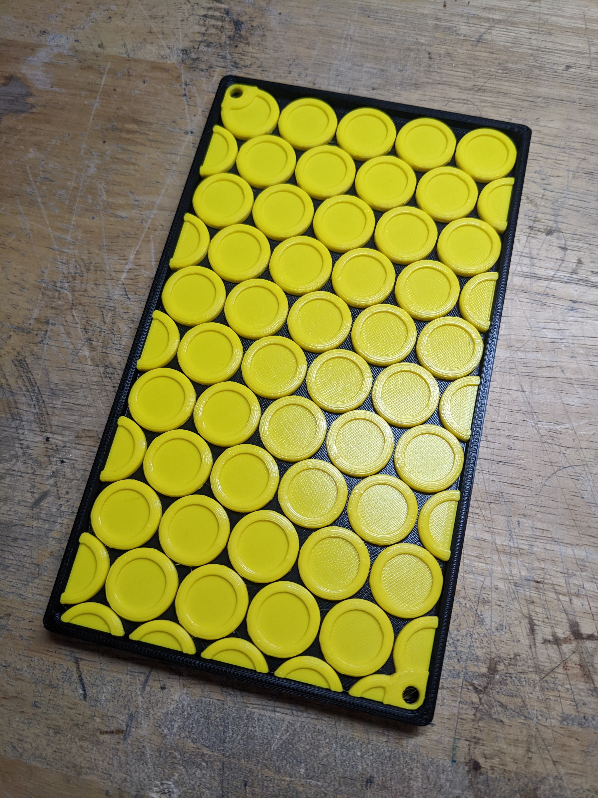
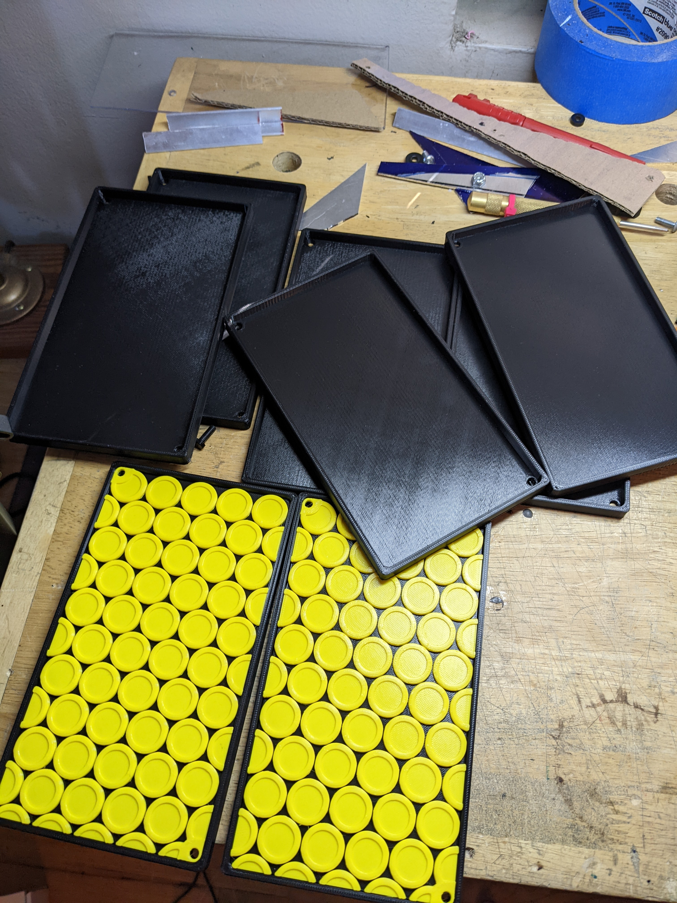

This is a 2 part assembly, where one is printed with the text and the second is spray painted purple and put behind the plaque.  
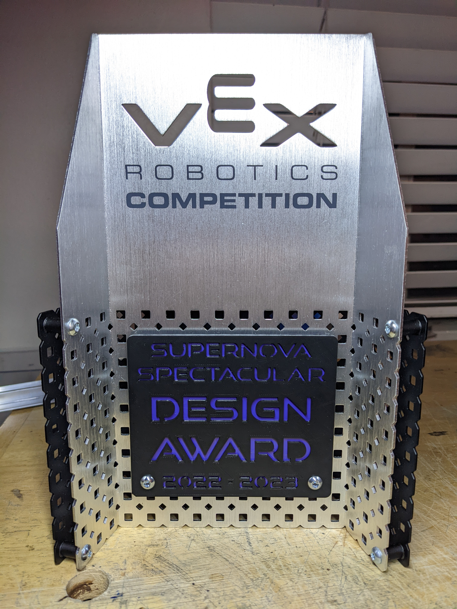

## Final Results

