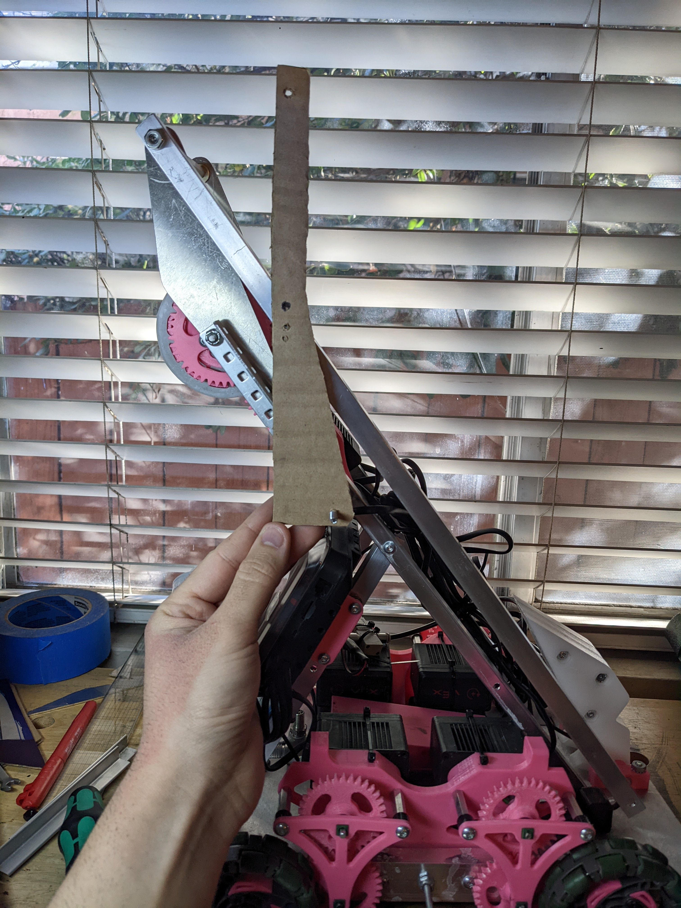

The Pushbot is a simple robot I made to demonstrate how strategy can get baked into a robot's design for the VRC game Spin Up.

<!--truncate-->
---

## About
The goal of this robot was to make a robot without a shooter to be as competitive as possible for the VRC game Spin Up.  Students liked the idea of this, so they helped create a list of constraints that my robot needed to have:
- no intake
- no shooter
- block others from shooting discs
- block others from shooting expansive
- anti wedges and wedges
- needs to spin rollers
- follows VEXU rules (8 motor drive)
- eat all the discs from the center line during autonomous
- molded traction wheel

## Design
To block shots, we had an idea that we were calling a windmill.  This beautiful image made by "CAD" was made to showcase how the structure will work on this robot.  With two intersecting diagonals, the structure for a roller and the windmill support each other.  This all requires a sturdy enough drive train.

When I was competing in Change Up, I made a drive base that used a 1/4" piece of 6061 aluminum for the main structure and had a piece of 1/16" sheet at the front.  I didn't realize at the time how overkill this bracing was, but this gave me confidence in making an extremely sturdy drivetrain with nothing but a 1/16" aluminum sheet. 

This is my first draft of figuring out where everything will go.  I generated gears for the drive to let my 3.25" wheels go 510rpm, which has the robot moving at ~86"/s.  The drive channels are 1" square tubes that I'll bandsaw down the middle  The top and bottom plates are 1/16" aluminum that I'll order from Send cut Send.

With how tall the motors are it needed some brace to stop the entire thing from bending backwards.  I added a triangle brace to the side of them and added in the gears that the top 2 motors will be spinning.  I'll need to make a plate to support the other end of those shafts later.

I added diagonals for the windmill and the roller mechanism.  The roller will be a 3" flex wheel spinning at 50rpm.  The windmill is a thin piece of nylon tube I found on McMaster, this will be very light and easy to spin up fast to block people from shooting discs.

I designed a hub for the flex wheels where a 1/4" ID bushing would sit.  This would spin on a round standoff.  To interface the gear with the mechanism I have interlocking geometry between the gear and the flex wheel hub so the force gets distributed nicer.

I'm using a 100rpm motor geared down 2:1 so the roller spins at 50rpm.  The idler gear is spinning on a round standoff that is also being used to mount the motor.

I designed a hub to hold 1/4" ID bushings for the tube, and I have the same interlocking geometry between the gear and the tube.  This is geared 1:1 and will use a 600rpm motor.

A problem the windmill has is expansion.  A robot cannot be larger than 18" when entering the low zone, and this is larger than 18" unless it's parallel to the ground.  To solve this I'm adding a ratchet so that when the motor spins backward the windmill will sit in a position where it's not larger than 18".

The pink pawl will be rubber banded to click into the ratchet.  When the windmill spins in one direction, the pawl will slop and this will be allowed to spin.  When the motor spins in the opposite direction, the pawl will engage the ratchet and this will sit in size.

This robot will be doing a lot of pushing and I need to make sure nothing on the drive breaks.  For the gears on the omni wheels, I copied the spoke pattern in VEX's 3.25" wheel so this gear interlocks with the wheel.  All of the force will get distributed across the print, and screws will be used just to keep it from falling out. 

The molded traction wheel gets little T's around it so the rubber will have a harder time falling off.  There are also pools of open space around some of the T's to hopefully stop the rubber from peeling off.  This is similar to how I've made molded wheels before, so I feel confident this will have no problems.  

The wheel also gets pocketing so a gear can interlock with it.

I made a part to support the motor shafts.  It screws into the motor gap and gets a lower mounting point that has a standoff going to the outer drive channel.  It can't go to the inner drive channel because the gear is in the way.

I also changed up the motor mount triangle support to be in the center to give some more space on the outside.

For the plow to take all of the discs off of the center line, I needed a pneumatic tank.  I made space for one in the center and made cutouts for the tank in the drive bracing.

Because pushing discs with a flat surface isn't possession, I made the front of the robot able to turn into an angle.  This is still a flat surface, and when I drive along the center line all of the discs will come to my side of the field.

I used a spare wedge from Change Up and had a simple mount for it.  For everything to be in size, the wedge needed to start up and there's a piston to release it with the Star Wars battle droid-looking mechanism. 

And with that, the CAD was done.

Ultimately we found out it was illegal to use the windmill, so sadly that will not make it into the assembly.

## Assembly
### Assembling Based on CAD
The aluminum came in from Send Cut Send and looks great.

The tank and motor mounts all fit in nicely.

I used (too much) dykem blue to drill the holes in the angles and c-channel.  I used calipers (not my nice pair) to scribe lines into the metal, and center punched hole by hole and made new lines based on those holes.  This was my first time doing this and it all went really well, the accuracy on everything is more than enough for what this is. 

Everything is coming together very smoothly and as I planned.

The plow uses zip ties to push discs, these were eventually cut to not touch the floor.  I used zip ties because this needed to be stiff enough to push a disc but flexible enough to allow the robot to go over a ~1" barrier, and zip ties accomplished that simply for me.

I added pivoting pieces of plastic to the side of the robot to stop opponents from being able to push as well.  When they try to push me, they'll drive up me and add weight to my robot.  It will still be possible to push but less effective.  These are on hinges to ensure they always touch the ground and are lower than the opponents.  This type of anti-wedge was inspired by the Battle Bots robot Hyrdra.

The wedge is mounted to lift up opponents a bit when pushing them, which makes this robot functional!

Later I made the traction wheel and got that mounted.

### Lift
With no windmill, I felt like this robot needed a way to block *something*.  What I decided on building was a 6 bar that is rubber banded up and locked to the chassis with a piston.  

The first thing to do is design a mount for the lift to sit on, I made this out of 1/16" 6061 and mounted it through the roller.

Because the geometry between these bars is strange, I prototyped the shape of the connecting linkage with cardboard.

I made the top linkage out of some 1/16" polycarbonate angle I had, and this lift was pretty light and able to lift high enough to block the entire goal (which is illegal, but I can do it!).  This is still using a prototype final linkage though.

And with a real linkage made for the last vertical, this lift can rise to a height of 51".

I made printed hooks that held onto arms and stopped them from coming out.  When the lift was raised, these arms would extend outwards.  This extra width would allow me to make an expansion blocker that is much wider than I otherwise could.
<iframe width="315" height="560"
src="https://youtube.com/embed/AdtnW2aCjzA"
title="YouTube video player"
frameborder="0"
allow="accelerometer; autoplay; clipboard-write; encrypted-media; gyroscope; picture-in-picture; web-share"
allowfullscreen></iframe>
<iframe width="315" height="560"
src="https://youtube.com/embed/fhauUic9YH4"
title="YouTube video player"
frameborder="0"
allow="accelerometer; autoplay; clipboard-write; encrypted-media; gyroscope; picture-in-picture; web-share"
allowfullscreen></iframe>

To actually block, I used an old bed sheet I had.  It's ugly but it works and didn't cost anything.
<iframe width="315" height="560"
src="https://youtube.com/embed/coOcKaicCWo"
title="YouTube video player"
frameborder="0"
allow="accelerometer; autoplay; clipboard-write; encrypted-media; gyroscope; picture-in-picture; web-share"
allowfullscreen></iframe>