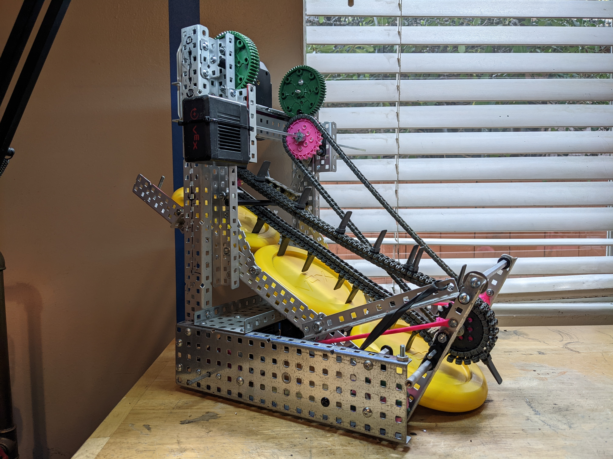

peewee is a robot built for [Mini-Up](https://docs.google.com/document/u/1/d/e/2PACX-1vQdY2_Rt6No5aRORaDMpm63pbJ1vqy-adyEWSV-1z-7VdsY-DioZ3oTteXaS8Rqcobzlop0ePqglLhB/pub), a game designed for the 9th graders to compete in at CHAMPS Charter High School.  I built a simple robot to compete in the game and use as an example for the students, and made the code available for the students to see.  The code included jam detection, automated presets on the lift, and pure pursuit for autonomous. 

<!--truncate-->

Build / software log coming soon!