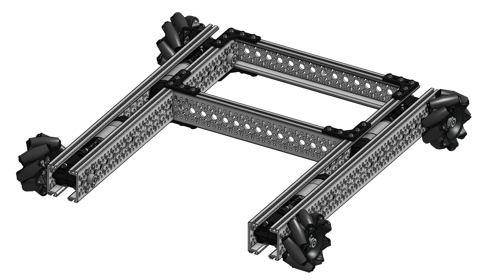

[Pure Pursuit](https://www.mathworks.com/help/nav/ug/pure-pursuit-controller.html) is a path tracking algorithm that enables a robot to chase a "carrot on a stick".  


<!--truncate-->
---

Pure Pursuit is a tracking algorithm that allows a robot to follow a given path by following a point some distance ahead like a carrot on a stick.  It requires some way of knowing where your current position is and a generated path.

## Position Tracking
Position tracking is a piece of code that given 2 or 3 encoders you can extrapolate the X, Y and angle of the robot.

This is explained far batter by others, and here are resources that I used:  
[5225A Tracking Documentation](https://wiki.purduesigbots.com/software/odometry)  
[QUEEN Video Explanation](https://www.youtube.com/watch?v=_T6KHywSP58)

This code relies on the speed that sensors update at, because it figures out the change in position over the time it takes for sensors to update, and adds that change to a current global value.  

`LEFT_OFFSET` and `RIGHT_OFFSET` are the "track width".  This is the width between the tracking wheels on the robot,  I have them split into 2 variables because technically they do not need to be the same number.  
`CENTER_OFFSET` is the distance from a perpendicular tracking wheel to the turning center of the robot.  This number can actually be anything, but the nicest way is for this to align with the robots turning center.  This can be tuned by turning the robot in place and adjusting this number until the XY stops rotating around the robot. 
```cpp
void tracking_task() {
  double l_current = 0, r_current = 0;
  double c_current = 0;
  double l = 0, r = 0, c = 0;  // delta distance
  double l_last = 0, r_last = 0, c_last = 0;
  double radius_r = 0, radius_c = 0, h = 0, h2 = 0;  // rad for big circle
  double beta = 0, alpha = 0, theta = 0;
  double Xx = 0, Yy = 0, Xy = 0, Yx = 0;
  while (true) {
    l_current = get_raw_left();
    r_current = get_raw_right();
    c_current = get_raw_center();

    l = l_current - l_last;
    r = r_current - r_last;
    c = c_current - c_last;

    l_last = l_current;
    r_last = r_current;
    c_last = c_current;

    double width = LEFT_OFFSET + RIGHT_OFFSET;

    // diff between wheels for correcting turning
    theta = (l - r) / width;

    if (theta != 0) {
      radius_r = r / theta;
      beta = theta / 2.0;
      h = ((radius_r + RIGHT_OFFSET) * sin(beta)) * 2.0;
      radius_c = c / theta;
      h2 = (radius_c + CENTER_OFFSET) * 2.0 * sin(beta);
    } else {
      h = l;
      h2 = 0;
      beta = 0;
    }

    alpha = angle_rad + beta;

    Xx = h2 * cos(alpha);
    Xy = h2 * -sin(alpha);
    Yx = h * sin(alpha);
    Yy = h * cos(alpha);

    current.x += (Xx + Yx) / TICK_PER_INCH;
    current.y += (Xy + Yy) / TICK_PER_INCH;
    angle_rad += theta;
    current.theta = to_deg(angle_rad);

    pros::delay(1);
  }
}
```
## Mecanum Drive
Mecanum wheels allow the robot to move forward / backwards and side to side.  These wheels get their own section here because they are effectively a cheat code for getting this code to work.  Because they can strafe, any error that's accumulated along the way can be accounted for.  With a drivetrain that cannot strafe, if you aren't following the path as exactly as you can, it becomes extremely difficult to account for it later.  This is why I chose this drive first, it allows me to go through all of this code without the problems that a typical drivetrain would give me. 


### Point to Point
To get the robot to move to a new target point, I need to calculate the amount the robot needs to move in the X direction, the amount the robot needs to move in the Y direction, and the amount the robot needs to move in turning. 

The direction the robot moves will change depending on the desired end angle. Some trigonometry is done to figure out the relative directions the robot needs to go, as while the robot turns the motor powers will all change.

The final thing to do is scale everything down.  If X output and Y output both exceed the maximum power that can be sent to the motors, even if one is magnitudes larger then the other, the robot will end up going straight.  We solve for this by scaling everything down to the larger number.
<iframe width="560" height="315" src="https://www.youtube.com/embed/ZbMDKJ0zA3o?si=T7nrteA03m6vQWDE" title="YouTube video player" frameborder="0" allow="accelerometer; autoplay; clipboard-write; encrypted-media; gyroscope; picture-in-picture; web-share" allowfullscreen></iframe>

```cpp
void point_to_point() {
  // Compute PID
  xPID.compute(current.x);
  yPID.compute(current.y);
  aPID.compute(get_angle());

  // Vector math
  double angle = to_rad(get_angle());
  double raw_x_power = (xPID.output * cos(angle)) - (yPID.output * sin(angle));
  double raw_y_power = (yPID.output * cos(angle)) + (xPID.output * sin(angle));
  double raw_a_power = aPID.output;

  // Set output powers
  int x_output = raw_x_power;
  int y_output = raw_y_power;
  int a_output = clip_num(raw_a_power, 60, -60);
  int max_xy = 110;

  // Vector scaling 
  if (fabs(raw_x_power) > max_xy || fabs(raw_y_power) > max_xy) {
    if (fabs(raw_x_power) > fabs(raw_y_power)) {
      double scale = max_xy / fabs(raw_x_power);
      x_output = clip_num(raw_x_power, max_xy, -max_xy);
      y_output = raw_y_power * scale;
    } else {
      double scale = max_xy / fabs(raw_y_power);
      x_output = raw_x_power * scale;
      y_output = clip_num(raw_y_power, max_xy, -max_xy);
    }
  } else {
    x_output = raw_x_power;
    y_output = raw_y_power;
  }

  // Set motors
  raw_set_drive(x_output, y_output, a_output);
}
```

Mecanum drives that use the VRC wheels are slower when strafing then in forward / backward.  Because of this, I knew I'd want a mode where the robot will go straight for most of the motion and then turn at the end to face the desired angle. 

This piece of code was added to the above function.  It modifies the target angle depending on how far away the robot is from the target position.  If it's more then 12" away, the robot will go faster and face the target position.  Once the robot is within 12" of the target it'll start to rotate to the desired angle. 
<iframe width="560" height="315" src="https://www.youtube.com/embed/pIiadWcYlac?si=JW_q3pCaxF9RjtR2" title="YouTube video player" frameborder="0" allow="accelerometer; autoplay; clipboard-write; encrypted-media; gyroscope; picture-in-picture; web-share" allowfullscreen></iframe>

```cpp
  // Add for direction
  int add = dir == REV ? 180 : 0;

  // Set angle target
  double a_target;
  if (fast_move) {
    if (fabs(distance_to_point(target.x, target.y)) < 12) {
      only_look_at_point = false;
      a_target = target.theta;
    } else {
      only_look_at_point = true;
    }
  } else {
    a_target = target.theta;
  }

  if (only_look_at_point) {
    a_target = absolute_angle_to_point(target.x, target.y) + add;
  }

  // Compute angle PID and find shortest path to angle
  aPID.set_target(relative_angle_to_point(a_target));
  aPID.compute(0);
```

### Paths with Strafe
The paths the robot will follow will be points the user inputs.  In the example below, the robot will start at (0, 0), travel to (0, 24), then to (24, 24), then back to (0, 0).
```cpp
void autonomous() {
  pure_pursuit(
        {{{0, 24, 0}, FAST_MOVE_FWD},
         {{24, 24, 0}, FAST_MOVE_FWD},
         {{0, 0, 0}, FAST_MOVE_REV}});
  wait_drive();
}
```

Once I have a list of points, to decide which point to go to next I see how far away the robot is from the next point.  The target position gets shifted until we're looking at a point that is a distance away from the robot, and it keeps changing until we're at the final position in the list. 
```cpp
void pure_pursuit() {
  raw_move_odom(movements[pp_index]);

  if (fabs(distance_to_point(movements[pp_index].target.x, movements[pp_index].target.y)) < 5) {
    pp_index++;
    if (pp_index >= movements.size()) {
      pp_index = movements.size() - 1;
    }
  }

  point_to_point();
}
```

I cleaned up how the "turn type" is handled.  There's now 3 turn types:  
`FAST_MOVE` where the robot faces the target position and within 12" will move to the final angle
`LOOK_AT_TARGET` where the robot doesn't care about the end angle, and will always look at the target
`HOLD_ANGLE` where the robot will just hold it's angle

I had to add `LOOK_AT_TARGET` because the distance away the current target is was less then 12", and the robot would always hold angle even if I didn't want it to.  This lets me to use `FAST_MOVE` as intended, and have all of my injected points follow `LOOK_AT_TARGET`.  
<iframe width="560" height="315" src="https://www.youtube.com/embed/aUpCYLBIhE0?si=LELL8e9J1XWCjrY3" title="YouTube video player" frameborder="0" allow="accelerometer; autoplay; clipboard-write; encrypted-media; gyroscope; picture-in-picture; web-share" allowfullscreen></iframe>

```cpp
  // Add for direction
  int add = current_turn_type == FAST_MOVE_REV || LOOK_AT_TARGET_REV ? 180 : 0;

  // Set angle target
  switch (current_turn_type) {
    // Looks at target until final distance then goes to final angle
    case FAST_MOVE_FWD:
    case FAST_MOVE_REV:
      if (fabs(distance_to_point(target, current)) < TURN_FAST_MOVE) {
        a_target = target.theta;
      } else {
        a_target = absolute_angle_to_point(target, current) + add;
      }
      break;
    // Looks at target the entire motion
    case LOOK_AT_TARGET_FWD:
    case LOOK_AT_TARGET_REV:
      if (fabs(distance_to_point(target, current)) > STOP_UPDATING_ANGLE) {
        a_target = absolute_angle_to_point(target, current) + add;
      }
      break;
    // Holds angle the entire motion
    case HOLD_ANGLE:
      a_target = target.theta;
    default:
      break;
  }
```

### Final Mecanum
<iframe width="560" height="315" src="https://www.youtube.com/embed/pVcdgffsMnA?si=P3Cc8XRpN6KGd6hI" title="YouTube video player" frameborder="0" allow="accelerometer; autoplay; clipboard-write; encrypted-media; gyroscope; picture-in-picture; web-share" allowfullscreen></iframe>  
<iframe width="560" height="315" src="https://www.youtube.com/embed/A_Q_yBHhWSY?si=9qDZo20ImXHNNA5K" title="YouTube video player" frameborder="0" allow="accelerometer; autoplay; clipboard-write; encrypted-media; gyroscope; picture-in-picture; web-share" allowfullscreen></iframe>

## Tank Drive
Now the goal is to get this all working properly on a tank drive setup.  I have a kind of working version [here](https://github.com/EZ-Robotics/peewee) but I didn't have a lot of time with that robot to really iron everything out.  More will be coming soon.