I designed and built french cleats for storing tools on my wall.

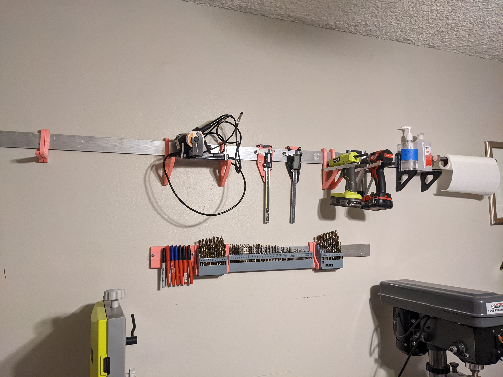

<!--truncate-->
---

It was becoming impossible to work on any project without my working surfaces covered in tools.  The tools have homes, but they are in drawers or not close to where I'm working.  I need a 1 step solution to storage for things I use often, and I'm going to use my wall for that. 

I don't think pegboards look very good (and are strangely expensive), and currently I sleep in the room I make things in so that matters to me.  I discovered what french cleats were through [Hank Green](https://youtu.be/KIqs4zIovTk?si=GSH6dp7U7DM5r2E4&t=178) in his office tour.  I remembered seeing them somewhere else and found it's a common enough workshop storage solution.  I found options for things complete systems I could buy but they were all so expensive.  I priced everything out to be significantly cheaper through McMaster, and even cheaper when I went to pick it up instead of paying for shipping. 

Instead of machining a 45 degree angle into metal which I don't have the tools for, I decided on leaving a gap between the wall and a piece of metal.  There will be a piece of plastic between them.  This lets me have a matching shape on something I mount to the wall.  
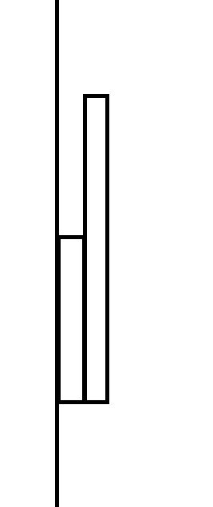

I mounted the plastic and aluminum to my wall after making sure I was hitting studs and everything was level, and started work on a drill mount. I have a piece of plastic going inside the gap between the aluminum and my wall, and I'm using 1/2" angle to make the holder for the drill. 
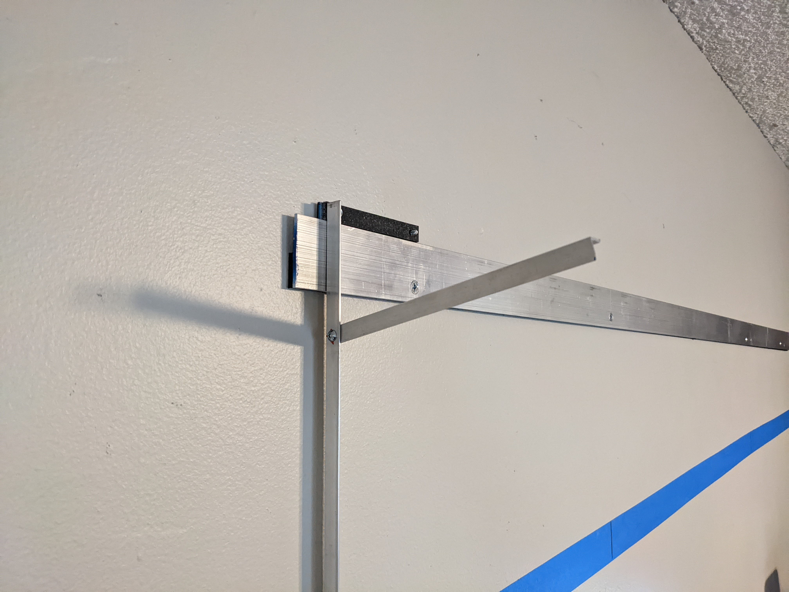

I free handed the design and hole placement but it came out working nicely.  
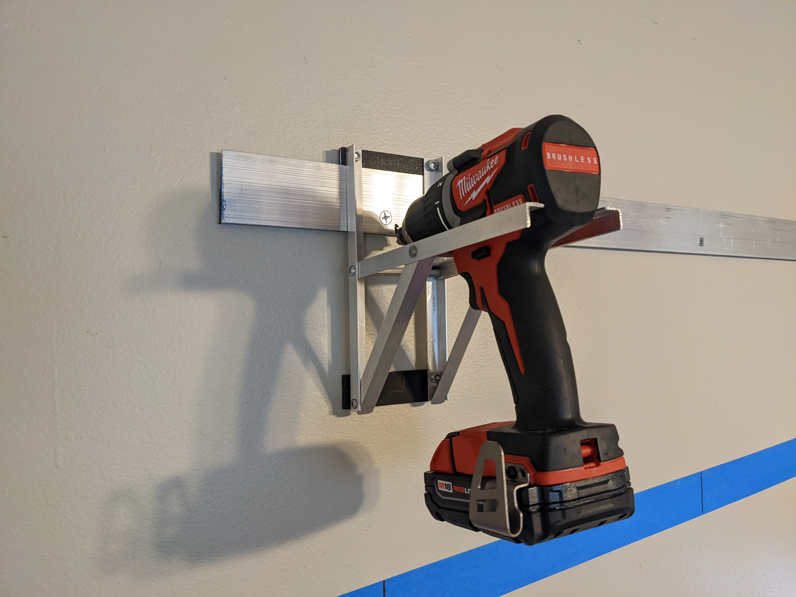

I designed caliper holders and a mount for a paper towel holder.  (yes the tape isn't level, my marker lines are level though)
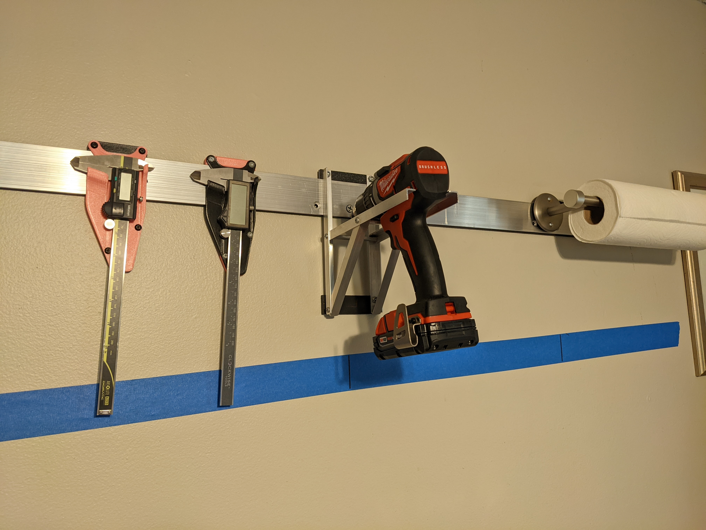

It's a lot of work to design a custom holder for everything I want on the wall.  Of course some things will need to be custom, but in general I'd like to try to use some generic hook design.
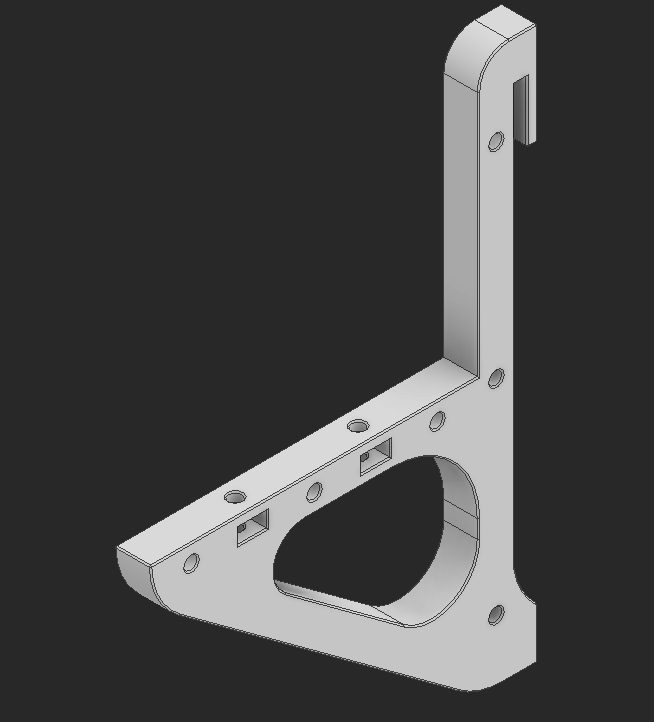

With this as a base it's much easier to add modifications to it.  This is much nicer then making a custom holder for every part. 
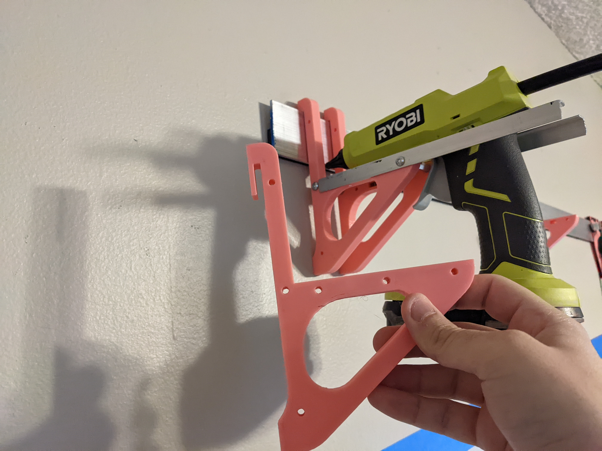
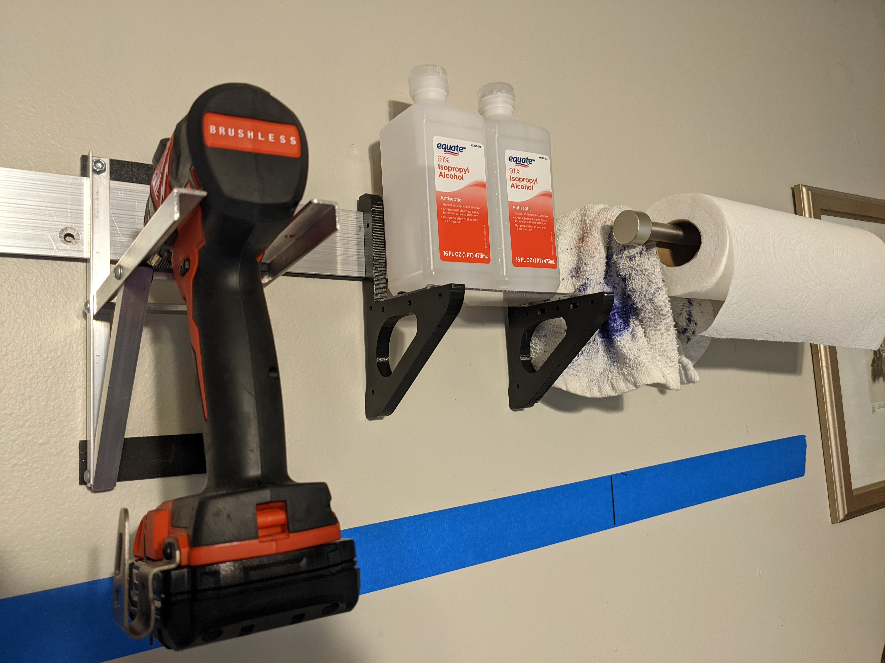

I took my drill bit case and took out each section, and made simple brackets for them to go on the wall with.  
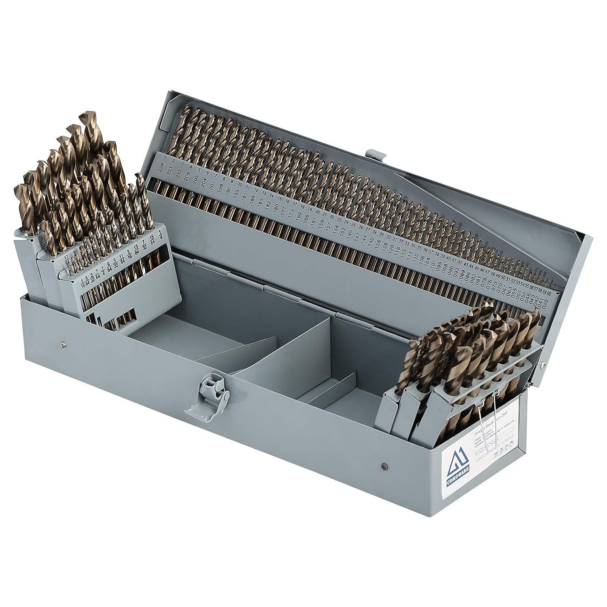
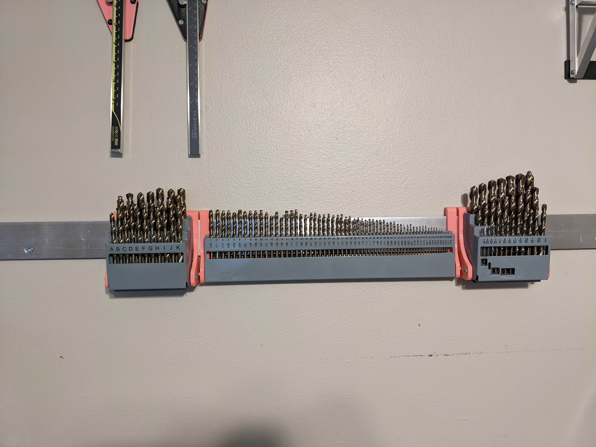

I tried to make a hexagonal little crate to hold markers and maybe pens but it ended up looking really ugly because of the amount of wasted space.  I changed the design for a strip of poly spaced out from the wall acting like a belt and this works and looks much better.
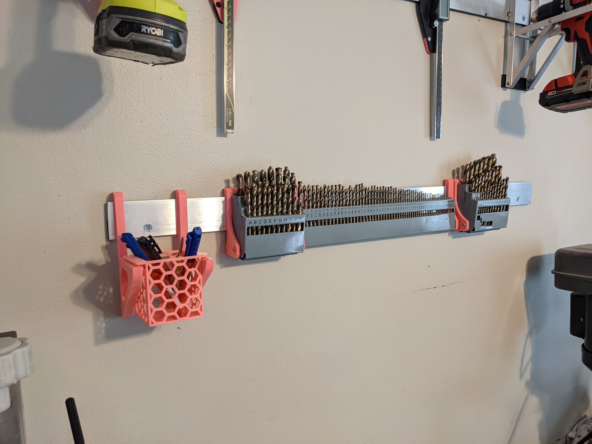
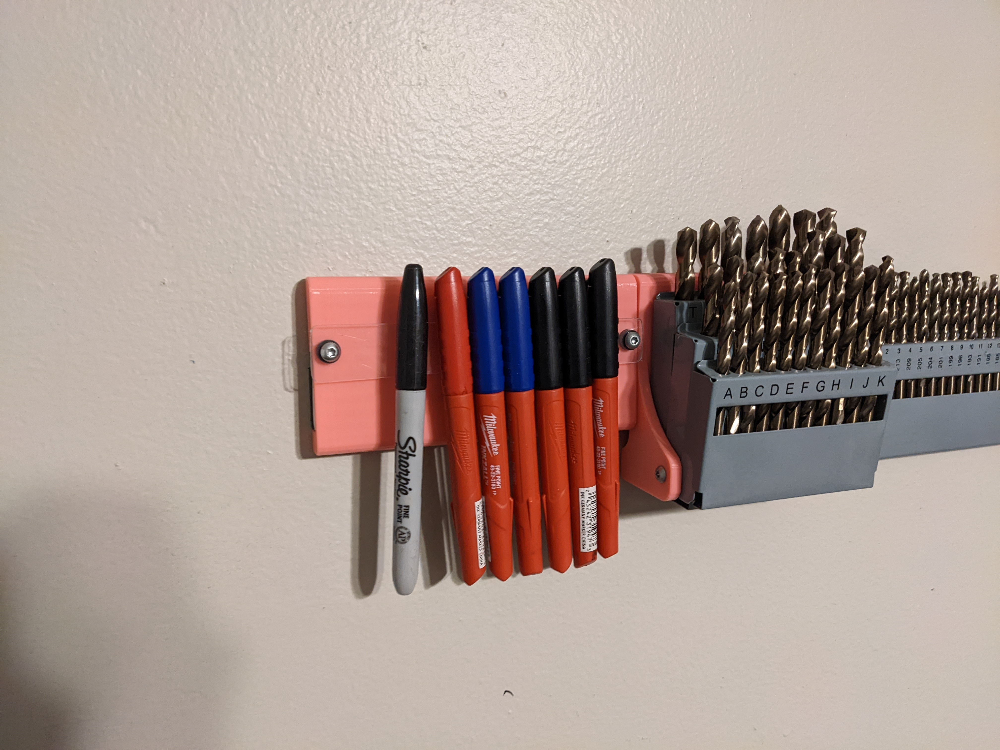

I mounted more aluminum to my wall near my workbench and have homes for tools I use often there.  I bought a Milwaukee screwdriver holder for their packout system, but just drilled holes in it and mounted a bit of aluminum to go around the french cleat.  I used one of the generic hooks to hold pliers and snips.
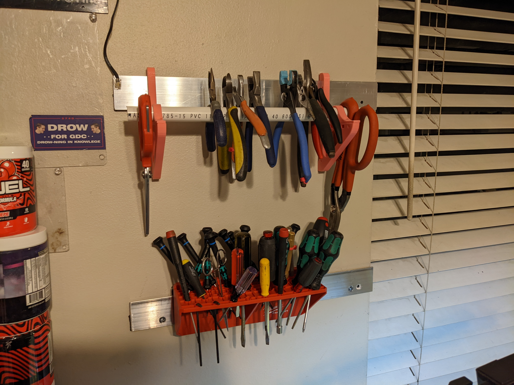

Next I need to find homes for:
- sand paper
- spray paint
- bondo
- tape
- spray paint
- dremel and dremel bits
- dykem 