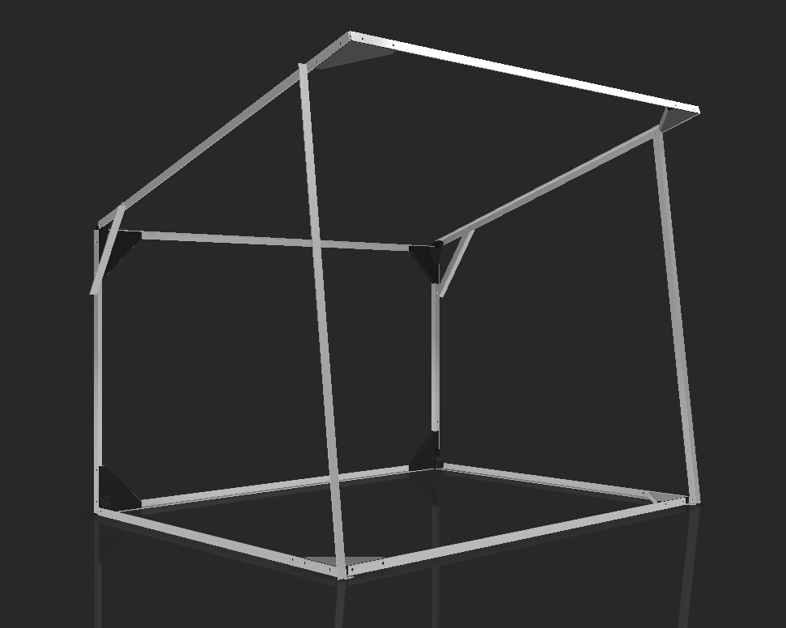
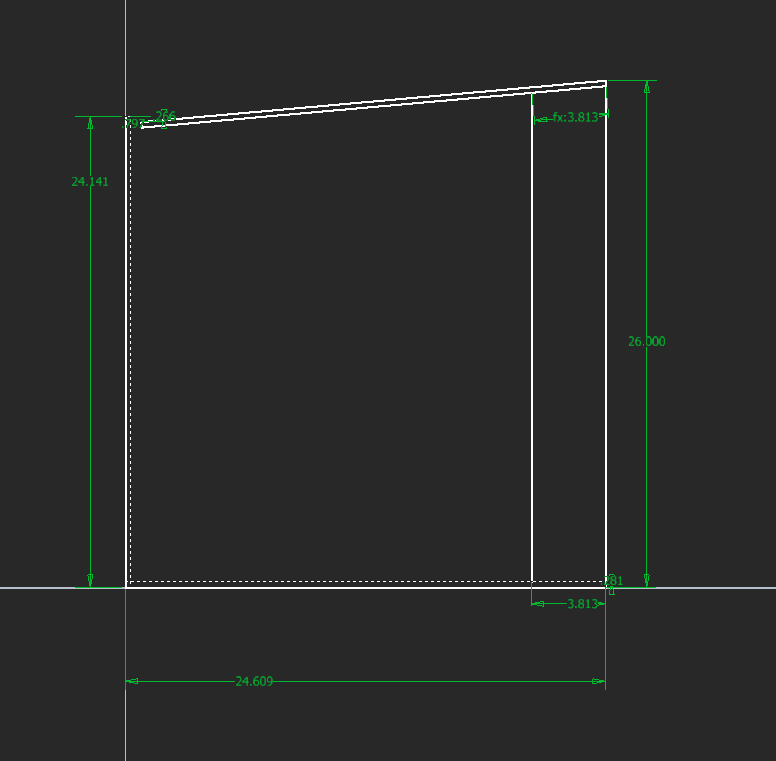
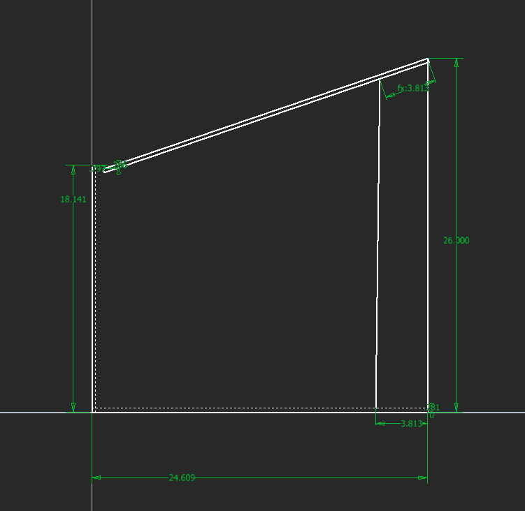
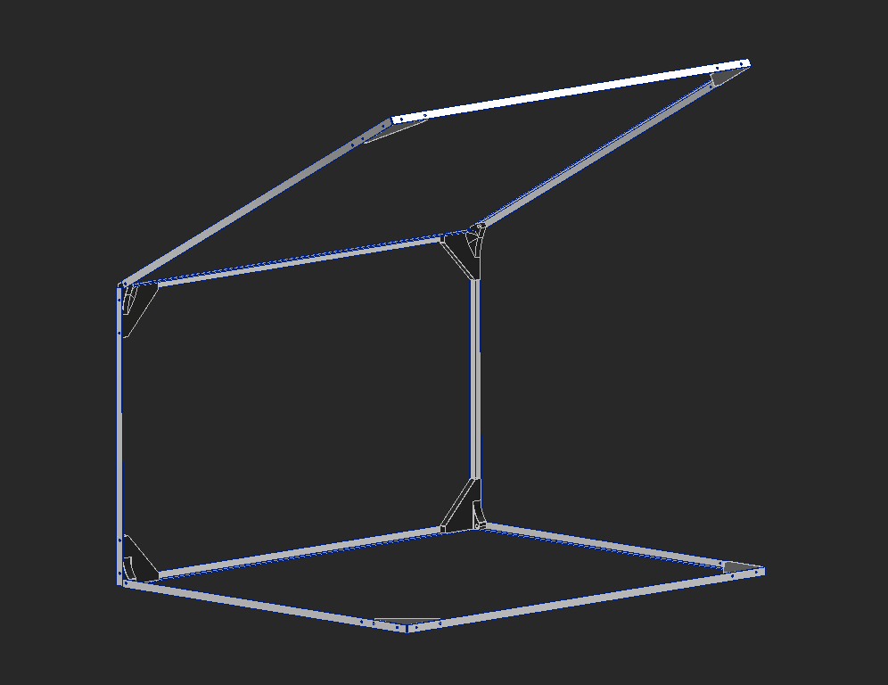
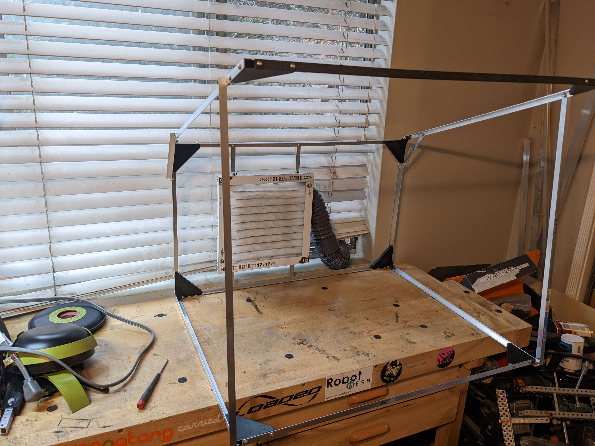
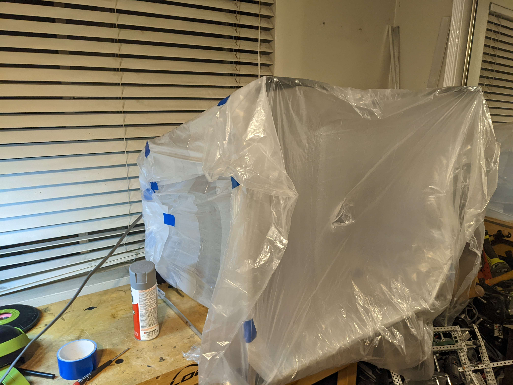
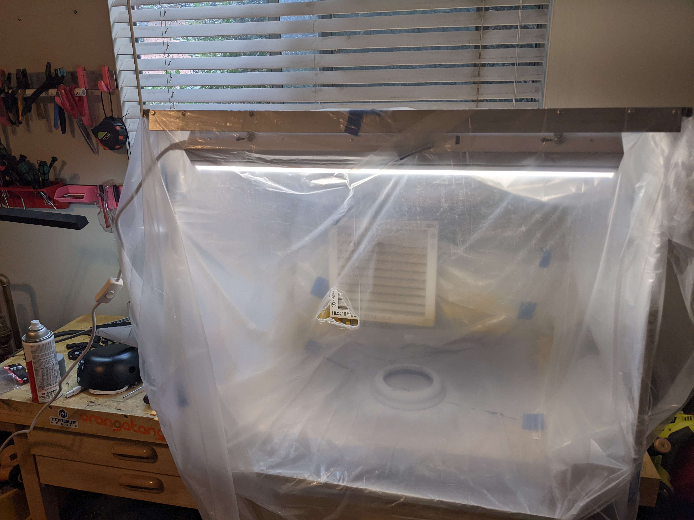

I built a ventilated box to spray paint indoors.

<!--truncate-->
---

For DD-3 I was spray painting so much that I needed a better solution for it.  I saw online people had little booths to spray paint and airbrush in.  I looked to buy one and they were ~$70 for the cheapest one I could find and it was tiny, and larger ones couldn't fold up for storage.  I decided to make my own.  

I had some aluminum 1/2" angle and decided that I'd build it all out of that.  I want to comfortably fit an R2 dome inside, so this needs to be at least 18".  I like having more room on the bottom for laying out parts, and after playing with some lengths on my workbench I decided on 30" wide and 24" deep.  Deciding height was trickier, the fan is more effective the smaller the volume of the box is.  Ultimatley I decided the back top edge wasn't going to be useful space, so the back of the box was going to eb 18" and the front 26".  

I designed 3D printed brackets to connect all of the angle.  The small back rectangle is being treated as the main box, and everything is pivoting around that for fold up.  

I added diagonals to stop everything from collapsing, and that's the design done.  The back rectangle has enough space for a fan and filter to be added, I will figure that out when I get there. 

Assembly all worked out like in CAD.  For the fan I'm using the cheapest bathroom exhaust fan Home Depot had, rated for 50 cubic feet per minute which is much larger then the volume of this booth. An air filter gets press fit over that, and the exhaust fan goes directly out my window.   

To fill in the sides I was originally going to use cardboard, but I wanted a replaceable surface on the inside so when it got gross with paint I could have a fresh surface.  I tried forgoing the cardboard entirely and just gift wrapping the box in thin plastic, which was functional but looked awful and was harder to replace then if I had cardboard.  With cardboard walls, I can just tape the plastic over the inside.  To replace this, I have to remove the booth from my desk and roll it around in plastic.  It also looks bad.  But this is a tool for me to complete another project, so I will fix that another day.

The lighting inside the box was horrible, so I got a small garage light and mounted it to the front. 

My next steps are to:
- add cardboard walls
- add an on/off switch for the exhaust
- wire the light and exhaust to a single cable