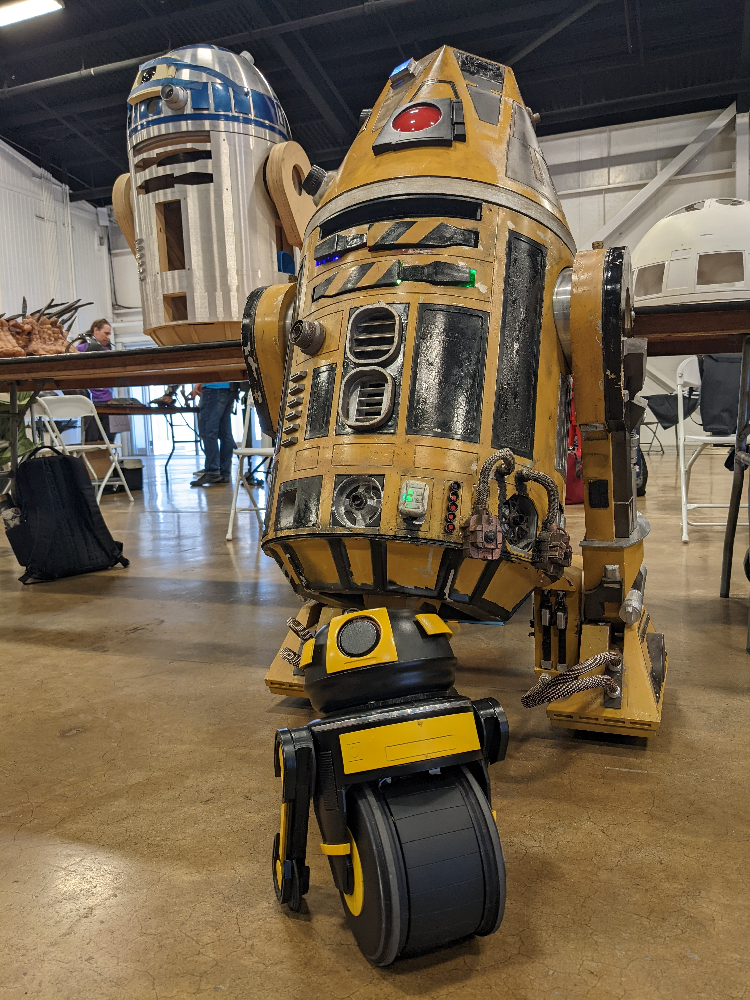

DD-3 is a Star Wars inspired fully functional droid. Built with personality in mind, DD-3 uses automation to give servos life and make DD-3 into a convincing character. 

Read more about design decisions in CAD, the assembly process and fixing mistakes, electrical issues, and bringing DD-3 to life in code here!

Link to Photo Album
Link to Code

<!--truncate-->

[Docusaurus blogging features](https://docusaurus.io/docs/blog) are powered by the [blog plugin](https://docusaurus.io/docs/api/plugins/@docusaurus/plugin-content-blog).

Simply add Markdown files (or folders) to the `blog` directory.

Regular blog authors can be added to `authors.yml`.

The blog post date can be extracted from filenames, such as:

- `2019-05-30-welcome.md`
- `2019-05-30-welcome/index.md`

A blog post folder can be convenient to co-locate blog post images:

The blog supports tags as well!

**And if you don't want a blog**: just delete this directory, and use `blog: false` in your Docusaurus config.
