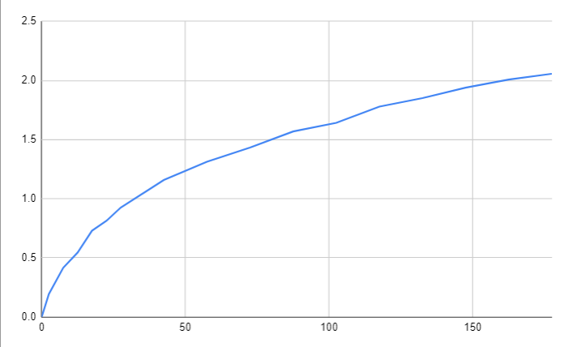

Adaptive PID is a modification of PID that scales constants based on the robots tested velocity curve.



<!--truncate--> 
---
## About
When a robot is moving it generates momentum.  PID is extremely consistent when the momentum of the system is constant.  

When tuning constants for moving, I always notice that after ~2' of movement the robot is extremely consistent.  In the closer distances the constants aren't quite right, because the momentum is different to when it's going full speed.  This is an even larger problem with turns, as the robot never reaches a constant momentum.  

A solution I want to avoid is tuning PID constants for multiple turn amounts and interpolating between them.  I haven't tested this, but I'm extremely confident this would be the best solution.  I do not like how much time this takes to setup and tune for each new robot.  My goal is to find a lazier solution that gets almost all of the way there. 

## EZ-Templates Implemented Solution
I had this problem when I was a competitor, and my solution was to:
- not run turns as fast as I could, at ~70% power
- slow down the robot within some band of target 

This allowed me to have 1 tuned constant and the robot would slow down early for larger movements making everything more similar then without this.  It isn't a perfect solution though, it has all of the same problems as not having it but less.  

## Detecting When Speed Drops
The first thing I tried was to find 2 parameters.  What was the max power being sent to the motors and for how long.  I'd keep track of all of this during the turn, and when the power started to go down I recognize that as my stopping point.  Now I have these two numbers and I use them to modify all of my PID constants.  

This would sometimes look promising but overall it felt like I needed to tune how much pull/push the two parameters gave to the PID constants for different distances, which defeats the purpose of what I'm trying to do. 
(video here)
```cpp
void time_full_speed() {
  default_constants();
  pros::delay(50);
  int time_passed = 50;
  int i = 0;
  std::vector<int> last_power = chassis.drive_get();
  std::vector<int> all_powers;
  while (true) {
    pros::delay(ez::util::DELAY_TIME);
    time_passed += ez::util::DELAY_TIME;
    printf("%i:   %i != %i\n", time_passed, chassis.drive_get()[0], last_power[0]);

    int error = abs(chassis.drive_get()[0]) - abs(last_power[0]);
    all_powers.push_back(abs(chassis.drive_get()[0]));

    if (error < -1) {
      i++;
    } else {
      i = 0;
    }

    if (i >= 3) {
      printf("%i\n\n\n", time_passed);
      break;
    }

    last_power = chassis.drive_get();
  }
  double average_power = 0.0;
  for (auto i : all_powers) {
    average_power += i;
  }
  average_power /= all_powers.size();
  double time_conversion = (360.0 / (double)time_passed);
  double speed_conversion = 80.0 / average_power;
  auto consts = chassis.pid_turn_constants_get();
  double conversion = (time_conversion) + (speed_conversion);
  double max = 1.75;
  // conversion = conversion > max ? max : conversion;
  conversion = conversion < 1 ? 1 : conversion;
  // consts.kp = consts.kp * conversion;
  // consts.kd = consts.kd * conversion;
  consts.start_i = consts.start_i / conversion;
  chassis.turnPID.integral = 0;
  chassis.pid_turn_min_set(chassis.pid_turn_min_get() / (conversion * 1.5));
  // chassis.pid_speed_max_set(chassis.pid_speed_max_get() / conversion);
  chassis.pid_turn_constants_set(consts.kp, consts.ki, consts.kd, consts.start_i);
  printf("Time Passed: %i  Last Power: %i Average Power: %.2f    \nTime Conversion: %.2f  Speed Conversion: %.2f  Conversion: %.2f   \nkP: %.2f  kD: %.2f  start i: %.0f  min: %i  max: %i\n", time_passed, last_power[0], average_power, time_conversion, speed_conversion, conversion, consts.kp, consts.kd, consts.start_i, chassis.pid_turn_min_get(), chassis.pid_speed_max_get());
}

void turning_test() {
  chassis.pid_turn_set(90_deg, TURN_SPEED);
  time_full_speed();
  chassis.pid_wait();
}
```

## Moving Target with Motion Profiling
I took my motion profile test I made for Captain R3X and implemented it here.  This works in the same way it would with a servo, where it sets new target positions for the PID to reach and the rate of change of new targets is being controlled.  This seemed promising, but because I'm not controlling velocity this wasn't working too well.  The robot would move nicely until the end of the motion where the robot would reach it's target and stop, then go to the next target, etc.  The robot was stuttering through the end of the motion.  
(video here)

## Acceleration Test
I keep thinking back to [TrueSpeed](https://www.vexforum.com/t/24cs-motor-control-value-remapping/23959/1), a fix for VEX's motor controllers that weren't linear.  The values were remapped and normalized giving a linear output through a LUT (look up table).

I tried something similar.  I told the robot to go at some speed and read the rate of change of the IMU.  After some target degree was passed I stopped reading velocity.  This was done for 17 different target values, running each test 6 times, 3 left and 3 right.  
(video here)

All of that gave me this graph.  X axis is the target we were reading to, and Y axis is the average velocity in the time it took to get there. 


To use this graph I scaled the Y axis down to 1 by dividing everything by the largest tested Y point.  That left me with many points I can draw lines through and find new conversion rates for untested turn amounts.  I took my conversion rate and I change my constants by that.  And... it worked!

In this test, the first set of turns is standard EZ-Template.  The second set of turns is using the modified constants. 
<iframe width="560" height="315" src="https://www.youtube.com/embed/qdRAPPe5oj8?si=n4ZuJxHNptZo0IWk" title="YouTube video player" frameborder="0" allow="accelerometer; autoplay; clipboard-write; encrypted-media; gyroscope; picture-in-picture; web-share" allowfullscreen></iframe>

```cpp
std::vector<std::vector<double>> scaling = {
    {0, 0},
    {2.5, 0.09400453473},
    {7.5, 0.2022555992},
    {12.5, 0.2646745481},
    {17.5, 0.3548182873},
    {22.5, 0.3951412327},
    {27.5, 0.4499251424},
    {42.5, 0.5630226236},
    {57.5, 0.6381967848},
    {72.5, 0.6967510482},
    {87.5, 0.7629670943},
    {102.5, 0.7982267571},
    {117.5, 0.8649159207},
    {132.5, 0.8999937274},
    {147.5, 0.9429511551},
    {162.5, 0.976136005},
    {177.5, 1},
};

double get_scale(double target) {
  // Find a point that is larger then target
  double initial_error = target - chassis.turnPID.target_get();
  initial_error = fabs(initial_error);
  int i = 0;
  for (auto j : scaling) {
    if (j[0] >= fabs(initial_error)) 
      break;
    i++;
  }

  // If target is equal to or larger then our largest tested point, return 1.0
  if (i == scaling.size())
    return 1.0;
  // If target is equal to or smaller then our smallest tested point, return the smallest conversion
  else if (initial_error == scaling[i][0])
    return scaling[i][1];

  // Draw lines between each pointn
  double m = (scaling[i][1] - scaling[i - 1][1]) / (scaling[i][0] - scaling[i - 1][0]);  // (y2-y1) / (x2-x1)
  double b = scaling[i][1] - (m * scaling[i][0]);                                        // b = y - mx
  double y = (m * initial_error) + b;                                                    // y = mx + b

  return y;
}

void smooth-turn(okapi::QAngle p_target, int speed) {
  default_constants();
  double conversion = get_scale(p_target.convert(okapi::degree));
  auto consts = chassis.pid_turn_constants_get();
  consts.kp = consts.kp * conversion;
  consts.kd = consts.kd * conversion;
  consts.ki = consts.ki * conversion;
  consts.start_i = consts.start_i * conversion;
  chassis.pid_turn_constants_set(consts.kp, consts.ki, consts.kd, consts.start_i);
  printf("\nConversion: %.2f   kP: %.2f  kD: %.2f  start i: %.0f  min: %i  max: %i\n", conversion, consts.kp, consts.kd, consts.start_i, chassis.pid_turn_min_get(), chassis.pid_speed_max_get());

  chassis.pid_turn_set(p_target, speed);
}
```

In the tests for the data that was collected, the speed that the robot was going at is constant.  A potential improvement is to allow multiple tests with multiple speeds, and make a 3D graph to find new scaling values.  At some point this defeats the purpose of being easier then the alternative though. 