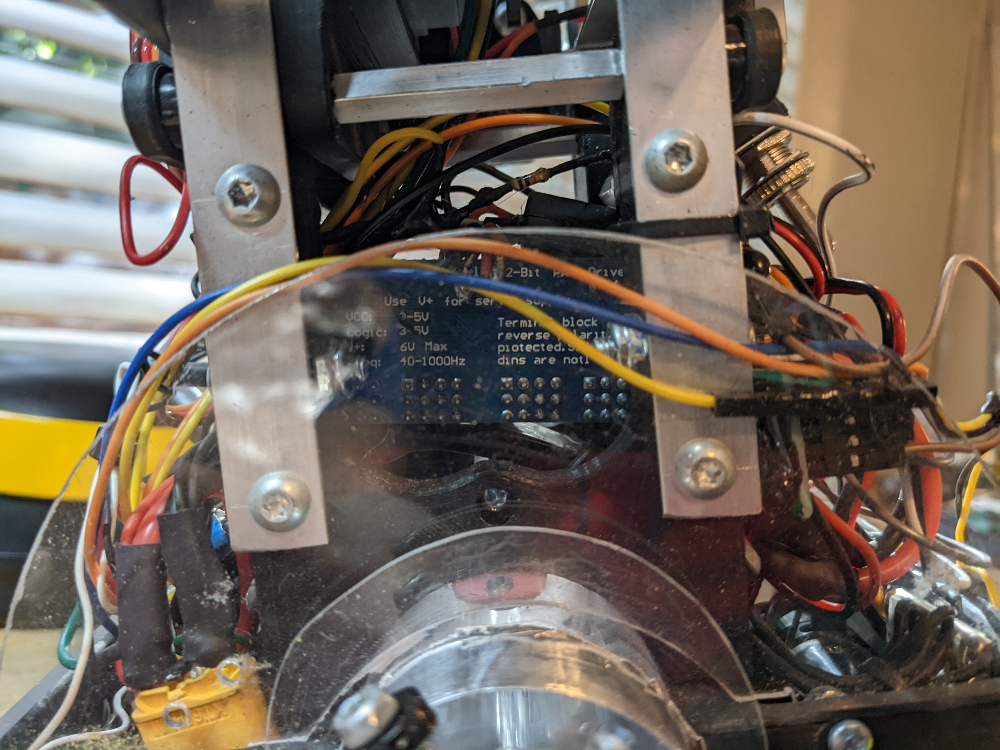
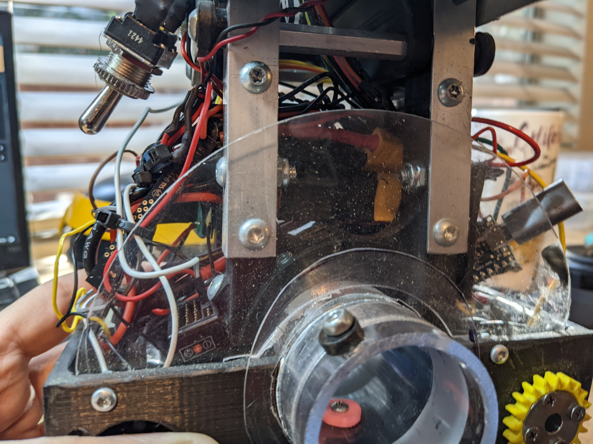

DD-3 is a Star Wars inspired fully functional droid. Built with personality in mind, DD-3 uses automation to give servos life and make DD-3 into a convincing character. 

Build log, from the start.  Click `Read More`!


<!--truncate-->
---
## D-O
:::note

This section is WIP

:::

---  
## Open Sauce 2023
I didn't work on this project for ~3 weeks after it ate my finger.  The next time I was running it, I needed to implement safeties to stop something like that happening.

At Open Sauce I saw some self balancing robots that used the same mpu6050 that I was trying to balance with which gave me more confidence that I could pull of what I was trying to pull off.  

I also ran into the R2 Builders booth and had a discussion with [CuriousMarc](https://www.curiousmarc.com/home).  I remember watching his YouTube videos back in ~2016, it was very cool to meet him.  He let me look inside the droid and we spoke for a bit.  He told me to start simple before jumping into a larger project like an R2. I realized then I had to simplify this project to get it done and making the entire project rely on something I wasn't 100% sure would work as well as I hoped was concerning. 

I started looking into drawings of droids and stumbled across this which feels so perfect.  It has the D-O tire but adds arms, and the body looks like an R2 but the head is a BB-8.  It seems perfect, and this became my reference photo for simplifying the project.


---
## Long Beach Comic Con 2023
I saw there was a convention on September 2 and 3 and decided to sign up.  This would be my deadline for getting the robot presentable.

:::note

This section is WIP

:::

---  
## OC Maker Faire 2023
Goal: October 21 2023 
### Plans
With everything I learned talking to the other droid builders at Long Beach Comic Con, I decided to sand back paint on every part and redo them. The highest priority for me was to go to the next con with the robot working.  Here's my priority list:
- redoing wiring, double check everything, add speakers
- repaint everything
- practice traveling with the robot to make sure it works after travel

### Redoing Wiring
I was pretty tired of breaking things and had help from Kiana Dumdumaya to make sure everything is being done correctly. 

The first thing she did was make a Google Sheet with every component and connections between them, which I think is genius and super simple. 


Kiana was much more methodical about testing everything then I had been.  I would look up how to connect a component and immediately solder it together, and test as I went.  Kiana made sure everything worked through a breadboard before making any connections, and soldering after.  This process made me realize that my frustration with electronics is just my lack of methodology like I have with software and hardware.


An improvement we wanted to make to the wiring was to use SBUS instead of PWM on the receiver.  The receiver has 8 PWM pins, using them means we only have 8 channels from the transmitter to read and 8 pins on the arduino get used.  SBUS is a serial protocol that can contain all of the channels on the transmitter and would only take UART on the arduino.  


This required making a serial inverter so the arduino could read it, but after that everything worked seamlessly with an [sbus library](https://github.com/bolderflight/sbus).  We found [this page](https://www.ernstc.dk/arduino/sbus.html) which had a schematic for a serial inverter for SBUS.


I brought the robot to work to see if everything would work after packing it in the case and traveling with it.  I had a hiccup where my joystick inputs weren't doing anything, but I figured this would have been a problem with the on/off switch as that's the only thing that would stop the joysticks from moving.  I checked and a wire was unplugged from the arduino, and everything worked after that!  
<iframe width="315" height="560"
src="https://youtube.com/embed/IsVxDqDYuvk?si=QfPQhgxrZzTwgiFX"
title="YouTube video player"
frameborder="0"
allow="accelerometer; autoplay; clipboard-write; encrypted-media; gyroscope; picture-in-picture; web-share"
allowfullscreen></iframe>

I wanted to get speakers working for this event, but I couldn't get it to work in time.  The audio quality was terrible from PWM on the arduino, and there wasn't time to get a better solution.  Audio will have to wait.

I tried getting the communication between body and head arduino to work, I had a few problems.  The serial port on my arduino was now being used for SBUS, and the software serial library made by arduino wasn't working in my case and was causing the servos to stutter.  Even with that, as I was testing somehow the arduino in the head shorted, it got extremely hot and wasn't responsive to anything.  

### Repainting Everything
At Long Beach Comic-Con, I asked the other builders how they finished their 3D prints to not look printed.  The suggestions were to:
1) sand a lot before putting anything on, get rid of layer lines and make it smooth
2) use a filler, bondo spot putty or filler primer
3) sand the primer back to smooth everything out
4) check if it needs another layer of primer/bondo and another sanding, repeat as needed

We also discussed how green isn't really a Star Wars color.  And after I was told the green looks like guacamole, I wasn't really feeling it.  So I decided to go to more of a yellow similar to the original reference drawing.

I experimented on a small decorative piece on the leg, and really focusing on step 1 to avoid a "garbage in, garbage out" scenario worked amazing.  Green is before, yellow is after.


With the amount I was going to be painting, I wanted a better solution to doing everything outside.  I built a ventilated spray paint booth, which I also have a project page on.


I started this for some of the larger parts to get the worst of it over with, sanding takes forever.  After realizing how important the initial first step is, I put more attention to it.  After sanding I'd fill holes with bondo and sand it back.  I'd also mix bondo and acetone to get a consistency of thick paint so I could cover large areas.  Doing this meant I needed to repeat the filler primer step much less. 


The finish I could get was much better now.


### Testing and Fixes

Because of how overkill the motor are for this project, I needed to implement slew rate to the drive.  The goal of this is to ramp up the power being sent to the motor.  If I tell the motors to go 30%, they should ramp up to that 30%.

This in itself is pretty simple.  I take the speed that was set to the motor, check if it's bigger or smaller then what we currently have, and add or subtract a constant to that number.  This loop iterates every 10ms and now we have a slew.
```cpp
// Slew the drive motors to avoid changes in motion that are too large
double l_target = 0.0, r_target = 0.0;
double l_current = 0.0, r_current = 0.0;
const double MAX = 2;
void drive_set(double l, double r) {
  if (drive_switch_enabled()) {
    l_target = r_target = r_current = l_current = 0.0;
    drive_set_raw(l_target, r_target);
    return;
  }
  l_target = l;
  r_target = r;

  double max = fmax(fabs(l_target), fabs(r_target));
  double l_add = MAX, r_add = MAX;
  if (fabs(l_target) > fabs(r_target)) {
    l_add = MAX;
    r_add = MAX;
  } else if (fabs(l_target) < fabs(r_target)) {
    l_add = MAX;
    r_add = MAX;
  }

  if (l_current > l_target)
    l_current -= l_add;
  else if (l_current < l_target)
    l_current += l_add;

  if (r_current > r_target)
    r_current -= r_add;
  else if (r_current < r_target)
    r_current += r_add;

  drive_set_raw(l_current, r_current);
}
```

A problem that I noticed after driving with this code is driving in arcs felt wrong.  If I drove in an arc, where the left side would go at 30 power and the right side at 15, both sides would increase at the same rate until the slower side hit 15.  So the robot would drive forward and then turn, even though I never told it to go forward.  

I solved this by scaling the slower side down by the ratio of `slower side / faster side` with this code and everything felt significantly better.
```cpp
  double max = fmax(fabs(l_target), fabs(r_target));
  double min = fmin(fabs(l_target), fabs(r_target));
  double l_add = MAX, r_add = MAX;
  if (fabs(l_target) > fabs(r_target)) {
    l_add = MAX;
    r_add = MAX * (min / max);
  } else if (fabs(l_target) < fabs(r_target)) {
    l_add = MAX * (min / max);
    r_add = MAX;
  }
```

I wanted to change the sensitivity of the joysticks, so I added the same joystick curve I've been using on my VEX robots which I explain [here](https://ez-robotics.github.io/EZ-Template/tutorials/joystick_curve). 

But the drive still felt strange.  It can't point turn nicely because it has 4 wheels that don't slide well.  There is some code in FRC called curvature drive which is single stick arcade but makes the robot feel like a typical RC car.  One axis is forward / backward, and the other axis controls "the angle the front wheels are facing" but in code.  With the implementation I'm using I can't point turn anymore, but I couldn't before anyway so that doesn't bother me. 
```cpp
  // Curvature Drive from
  // https://github.com/OkapiLib/OkapiLib/blob/54995fd390aaf4d4949a516a76580c50b394912f/src/api/chassis/model/skidSteerModel.cpp#L140-L169
  double scale = max_speed;
  double forward = (joystick_curve_fwd(joystick_channel(LEFT_Y), curve_fwd)) / 127.0;
  double curve = (joystick_curve_turn(joystick_channel(LEFT_X), curve_turn)) / 127.0;

  double left_speed = forward + fabs(forward) * curve;
  double right_speed = forward - fabs(forward) * curve;

  // normalizes output
  double faster_side = fmax(fabs(left_speed), fabs(right_speed));
  if (faster_side > 1.0) {
    left_speed /= faster_side;
    right_speed /= faster_side;
  }

  left_speed = left_speed * scale;
  right_speed = right_speed * scale;
```

There is a seam between both halves of the body and this always bothered me.  I was going to try to make a strip that goes up along the seam so it's covered by something that looks like an intentional vertical line.  

Kiana suggested instead of that to just have something that wraps around the body and squeezes it all together.  I was skeptical because of the strange geometry with that part of the body, but after she drew this image I felt like it was worth it.


I finished up the pelican case and added spots for the batteries and for the controller. 


I wanted to bring it to work again to make sure everything was still working, and good thing I did.  I was having a strange issue where the switch wasn't working again, but this time everything seemed like it was plugged in.  At this point there had been 2 problems with the switch, so after work I reprogrammed the switch to be on the controller instead.  I brought it back to work the next day and everything was working perfectly. I added a safety so when the switch goes from disabled to enabled, nothing turns on for 3 seconds.

### At the Event
final pictures/videos/thoughts

---  
## LA Comic Con 2023
Goal: December 3 2023
### Plans
There is a lot I'd like to change to the robot, but I can only give it so much time.  This is the priority list for changes I'd like to make, and we'll get to as many as we can:
- use gyros in the controller to decide when the controller is set down and disable the robot if it's set down for too long
- fix the anything that broke after it drove off of a table
- wire the head servos to the body
- stop controller "activity warning" and brushless ESC's beeping when left alone too long
- fix head spin clicking
- redo the entire head tilt for a delta linkage
- change ring gear for a wheel that's sprung into a track for longevity when kids try to spin the head  
- speakers


### Controller AFK Shutoff
I want the robot to turn itself off when I set the controller down, but only sometimes.  When the eye/eyebrows are fully done, I'd like to be able to leave the robot on and let everything animate on its own. 

There is a switch on the controller to disable all head movement, and there's a switch on the controller to disable the drive.  If the drive is left on I want the robot to disable when I set the controller down.  But if the drive is off, nothing should turn off when I set the controller down.  

I don't want the robot to turn off while I'm using the joysticks, even if the robot is completely still.  Currently I only check if the joysticks have been used recently and allow this function to run when they haven't, but I need to add every input on the controller to that list.  So only after no input has been touched for X amount of time will we start checking for the controller being set down. 

Then we check the position over time (velocity) of the controller to see if it's sitting.  If it is, a timer starts, and after that amount of time has passed the robot will shut off.

This needs a little less sensitivity to moving.  Currently if the controller is on a table and someone walks nearby the controller thinks it's moving.

```cpp
  // Disable drive if the controller is set down for a certain amount of time
  if (controller_switch_output & !are_joysticks_running()) {
    // Current values
    int cur_x = joystick_channel(GYRO_X);
    int cur_y = joystick_channel(GYRO_Y);

    // Figure out the velocity of the controller
    int x = cur_x - last_x;
    int y = cur_y - last_y;

    // Give wiggle room for noise
    // x = abs(x) <= 1 ? 0 : x;
    // y = abs(y) <= 1 ? 0 : y;

    last_x = cur_x;
    last_y = cur_y;

    // If X and Y velocity are 0, and either X or Y isn't currently at 0 degrees, start the timer
    if (x == 0 && y == 0 && (cur_x != 0 || cur_y != 0))
      afk_timer += 20;
    else
      afk_timer = 0;

  } else {
    afk_timer = 0;
  }

  // Once the timer has reached 2000, disable everything on the robot
  if (afk_timer >= 2000) {
    controller_switch_timer = false;
    startup_switch_output = false;
    last_switch_state = true;
    controller_switch_timer = 0;
    afk_timer = 0;
    return;
  }
```

### Fixing the Fall
First, everything comes apart...


All of the damage went to the head.  A lot of mechanical parts that were hot glued on have fell off, and some paint is chipped all around the eye. 

I'm starting by hot glueing everything back into place.  It's a pretty gross process, it isn't leading to consistency between both eyebrows which are meant to be the same.  The eye is a mess too- I saw another builder use springs instead of wire so nothing breaks when it's hit, and that's something I'd like to use. 

After fixing everything mechanically it's shown me how unhappy I am with the construction of the head.  After this event I need to find a better solution for my problems with it.  Maybe it's 3D printing a new head, or it's just making entire subsystems that are printed and get hot glued in, instead of relying on hot glue to index everything inside the head. Who could have guessed that would be inconsistent.

Some paint scratched too.  I have two options with repairing scratches, I can either repaint it and continuously try to keep it perfect, or I can repair it and over time this will gain natural weathering.  I'm going to fix it over time.  The front yellow plate fell off during the fall and the eye took a big scratch, exposing bondo spot putty that was used to fill some gaps. 


The color isn't an exact match, but it's hard to tell that my black acrylic paint was more matte then the rest of the head because the yellow part acts as a barrier. 


The body cracked a little at some weaker points in the design.  There isn't much scratched on the body though.


I filled the parts that did scratch with some yellow paint, and filled the vent with a lighter gray on the inside and gold around.  I like idea of yellow exposing itself when the black scratches. 


### Wiring Head Servos to the Body
I tried to find a place to plug the servos into the servo board but the pins on the servo board are completely inaccessibly.  The opposite side of the blue board needs to be reached.


Where this looks from the other side. 


The only solution I could come up with is to remove the servo board, desolder some pins and flip them to the other side, which worked out.  Now to add wires the polycarbonate just has to be removed. 


Then it's just wiring everything together and labeling all the wires.
+++++++++++picture of it all wired+++++++++++++++++

### Automated Animations 
