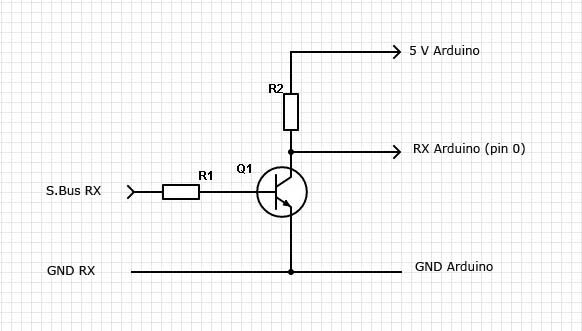
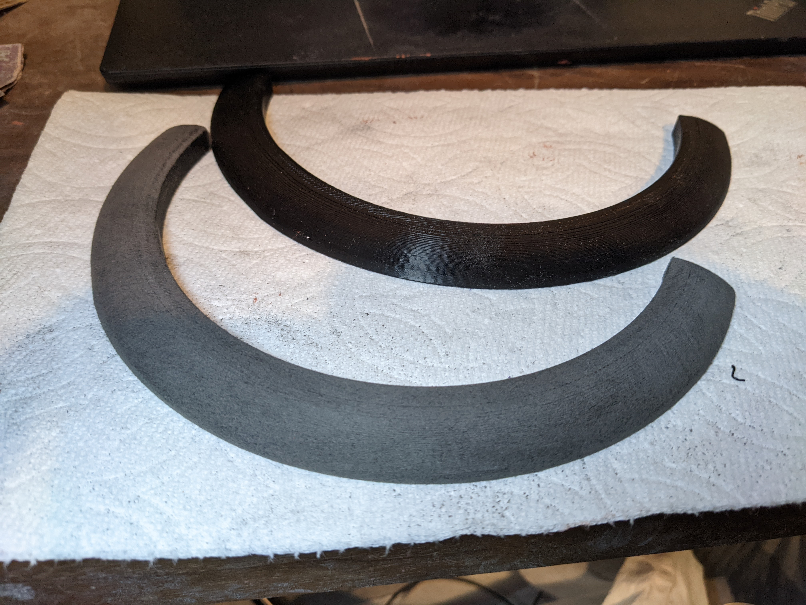
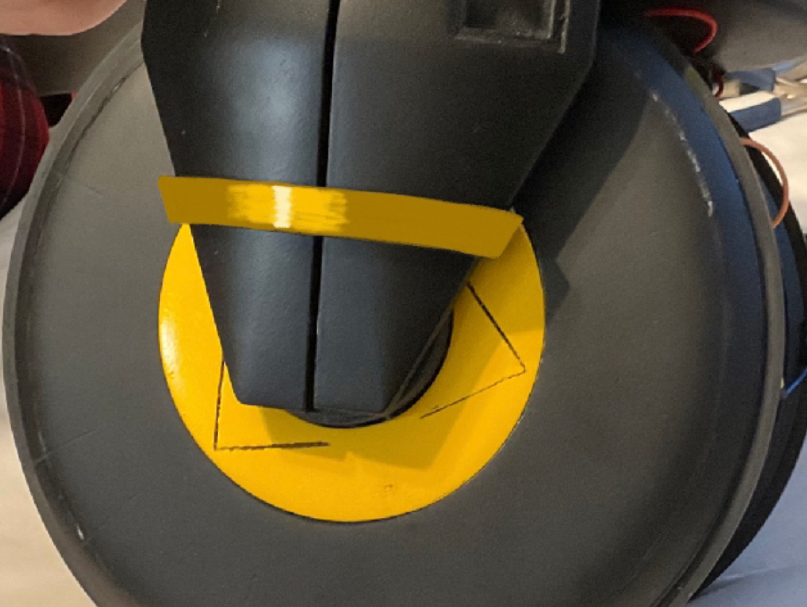
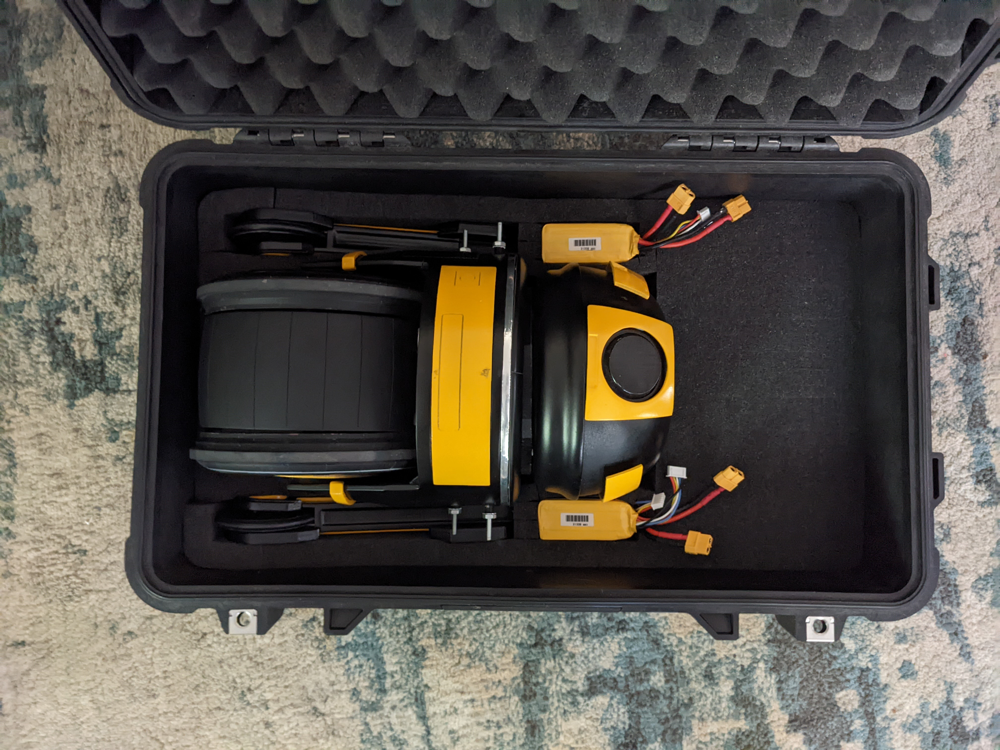
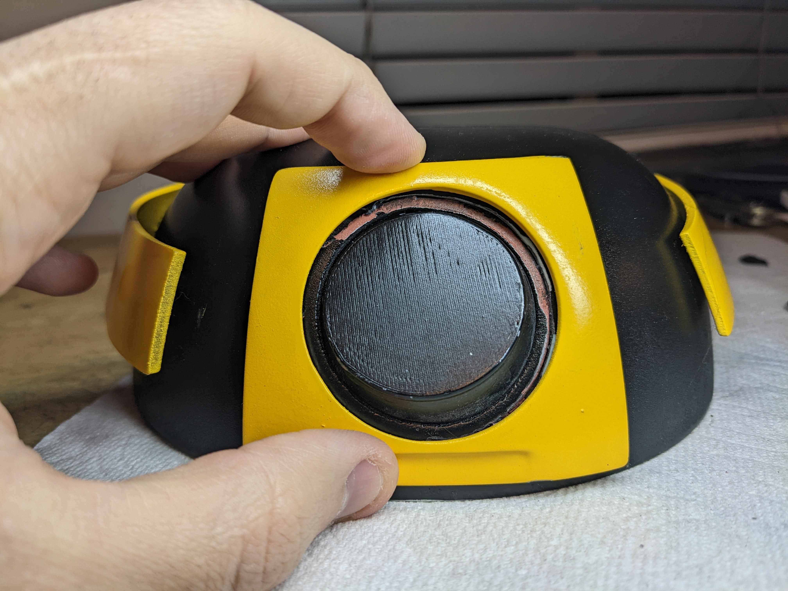
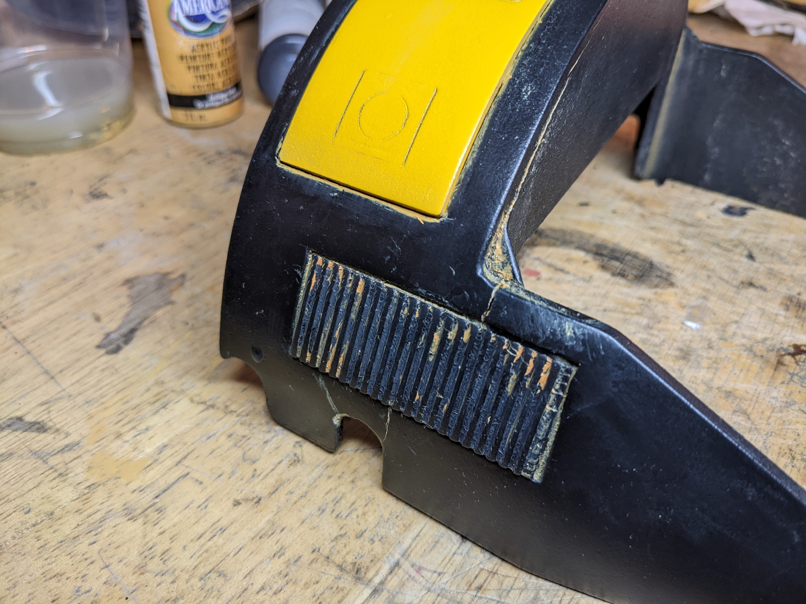

DD-3 is a Star Wars inspired fully functional droid. Built with personality in mind, DD-3 uses automation to give servos life and make DD-3 into a convincing character. 

Build log, from the start.  Click `Read More`!


<!--truncate-->
---
## D-O
:::note

This section is WIP

:::

---  
## Open Sauce 2023
I didn't work on this project for ~3 weeks after it ate my finger.  The next time I was running it, I needed to implement safeties to stop something like that from happening.

At Open Sauce I saw some self-balancing robots that used the same mpu6050 that I was trying to balance with which gave me more confidence that I could pull off what I was trying to pull off.  

I also ran into the R2 Builders booth and discussed it with [CuriousMarc](https://www.curiousmarc.com/home).  I remember watching his YouTube videos back in ~2016, it was very cool to meet him.  He let me look inside the droid and we spoke for a bit.  He told me to start simple before jumping into a larger project like an R2. I realized then I had to simplify this project to get it done and making the entire project rely on something I wasn't 100% sure would work as well as I hoped was concerning. 

I started looking into drawings of droids and stumbled across this which feels so perfect.  It has the D-O tire but adds arms, and the body looks like an R2 but the head is a BB-8.  It seems perfect, and this became my reference photo for simplifying the project.


---
## Long Beach Comic Con 2023
Goal: September 2-3, 2023

### Plans
I saw there was a convention on September 2 and 3 and decided to sign up.  This would be my deadline for getting the robot functional.  I'd like to recreate the image the best I can. 

A big requirement is for this robot to have personality.  Nothing matches the personality of WALL-E, but I'd like to do as much as I can to give this personality.  Something great about Chopper is the head tilt.  It adds so many characters and it is something I'll be implementing in this robot. 

The electronics plan is to use a Teensy 3.2 in the body and the head and communicate over serial between the two.

### Design and Assembly
The first thing I needed to do was check the dimensions.  I can't easily modify the width of the robot, so I need to make sure the width of the body looks about correct. I took some construction paper to see how I felt about it, and the dimensions I liked were the same as the scaled dimensions from the reference image.  Moving forward I'll just grab dimensions from the reference image. 


The main challenge with this is figuring out how to have a structure above the wheels that gets covered by the body.  I decided to build a T inside the robot where the edges of the T will sit above the wheel.  I replaced the servo mounts with a shoe-horn-like piece that has a 1/2" aluminum angle gets mounted to. 


The legs needed to get mounted diagonally and needed a mount at the end of this T structure.  How this piece is designed changes how the T exactly gets made so I decided to design this first.  This has captive nuts and sits inside of the 1/2" angle.  I also needed to make sure there was space at the corners for the body to sit, which distances the length of the arms on the T.


Through this, I also realized that any decorative cover that goes over the wheel is affected by this.  There is a limit to the thickness of it based on the leg mount shown above because there is a slight overhang on the leg mount to the wheel.  I made a test wheel cap to make sure clearance is all good. 


I got a little too into it and ended up designing a wheel cap more and I printed it to see it.  This will become the first part I play with finishing and making it look like it's not 3D printed. 


I got both servo mounts replaced with the new horseshoe pieces and got all 4 pieces of angle on.  I have screws going through in multiple axes and have standoffs going between everything to make sure it stays square. 


Because of the orientation of the angle, I had to flip the leg mounts upside down to what I originally wanted.  When comparing how the new dimensions lined up with the reference image, it all looked the same.  So this was ok and I left it. 


Working on this with 1 wheel became increasingly annoying as more weight was added higher up.  I would need legs on this if I wanted to easily continue work on it, so I needed to figure out how the legs were going to be made.  I sanity-checked the angle of the legs and this feels correct. 


The legs are 1/2" aluminum c-channel that I cut out the center of to have the wheel sit.  This wheel is temporary as I come up with a better aesthetically fitting design, but works for testing functionality and stopping this from falling over.


I was on/off sanding and painting the wheel hubs.  I very quickly learned how important and annoying sanding is.  I ended up with something that I felt was good, and I'd be doing this much more over the course of this project and would get better at this.


The wheel hub caps have holes for 4-40 screws to thread into, but the wheels do not have holes for this.  I printed a jig so I could drill these holes out in the wheel, I didn't feel like this was worth reprinting the entire wheel for. 


An issue on D-O was the gear being press-fitted onto the motor shaft eventually stripped.  I found aluminum hubs on Amazon and decided to make a gear to interface with this. I needed to drill a hole in the body so the set screw was accessible.


The metal hub was a little larger than the smallest point on my gear so I used my "lathe" (drill + belt sander) to make it smaller.  I checked the diameter frequently with calipers. 


Thank you to Zach Pinkerton for leaving this review on this [lazy susan](https://a.co/d/1QRSCqb)!  I have no idea if this is the best one or not, but the review is enough for me.


I printed mounts for the lazy susan with space for bushings, and printed brackets to hold a screw that the entire lazy susan pivots off of.  
<iframe width="560" height="315" src="https://www.youtube.com/embed/M7PbQq6D48E?si=YfEPyxlpbQgVRYaE" title="YouTube video player" frameborder="0" allow="accelerometer; autoplay; clipboard-write; encrypted-media; gyroscope; picture-in-picture; web-share" allowfullscreen></iframe>  
  
I made a mount for the servo and cut out a linkage from 1/8" polycarbonate to connect the servo horn to the lazy susan.  
<iframe width="560" height="315" src="https://www.youtube.com/embed/Oa7mW7nhXUE?si=9-WQb64j8WYOxDbx" title="YouTube video player" frameborder="0" allow="accelerometer; autoplay; clipboard-write; encrypted-media; gyroscope; picture-in-picture; web-share" allowfullscreen></iframe>  

To make the head spin I designed a ring gear similar to how the wheels work.  I'll use an N20 motor to make the head spin. 


I designed a press-fit mount for the motor that has a set screw to hold the motor in place.  This mounts to the part of the lazy susan that is stationary.
  


I didn't want to buy more aluminum hubs and I feel the head won't be under an intense amount of force, so I've come up with a strange solution.  Using a VEX shaft collar with a 1/4" screw, I can make geometry in the gear to fit around this.  Then I can clamp the shaft collar to the motor and the gear will clamp around the shaft collar.  This is surprisingly stable, and I imagine this will only work in small scale very low-torque situations like this. 

  


I (finally) switched out the painter's tape for "adhesive shim" aka aluminum tape. The bearings now press fit over the shafts. 


I tried to assemble the robot and realized that I cannot assemble the wheels with the hub caps, they block where screws need to go to keep the wheel from falling off the shaft.  I split the design into 2 parts and have the inner part mounted with magnets.  This also makes it significantly easier to get the color split between the two parts. 


I made this test body to check how the dimensions felt on the actual robot, and I wasn't happy with it.  I felt like everything needed to come down farther.  


Something I did get right on this design is the lip underneath the body.  This allows me to figure out what to put there, and it doesn't limit me mechanically to anything while I continue to work on this. 


I added these new dimensions and added pockets for vents and a decorative front plate.  The dimensions for this ended up feeling perfect.  


I tried a new wheel design using a VEX flex wheel but I'm really not happy with it, instead, I'll try using an o-ring. 


I designed a new wheel that I think looks better and uses an o-ring instead of a VEX flex wheel.  I also made the leg design, but this won't be the final version.  My Prusa Mini is small and I cannot fit this entire leg on the printer.  I'll need to split it up into multiple pieces.  Designing each part of this leg from scratch while trying to figure out how to get it all to fit seems like a nightmare.  So instead I've designed the leg as a single part, and once I'm happy with it I'll pull the dimensions for the separated pieces. 


I wasn't too happy with the back of the leg, I felt it needed more of the hook shape around the wheel.  Once I added that I was pretty happy with the way it looked. 


I wanted some mechanical interlocking between the pieces on the leg, so I have these chamfers that make sure these two parts are indexed together. 


All of the parts come together like this.  I changed the shape of the top portion of the leg because more space was needed to cover the keps nuts that hold the metal in place. 


I decided to have separate parts that are painted a different color that attaches to the leg.  


The electronics need covering.  I had the idea to make a piece that flexes around the body and clicks into place over the main printed chassis.  This part is printed and ideally will flex around the chassis.


The center tire idea worked!  The legs are also all coming together and working as I expected. 


For the head, I want it to be mounted with magnets.  For that, I need the head to index with the lazy susan.  I made 3D printed cones to mount to the lazy susan, and have receiving ends of that on a plate that the head will get mounted to. 
<iframe width="315" height="560" src="https://www.youtube.com/embed/GL3CSzSX-kg?si=yHeT-2k5VA5J-A22" title="YouTube video player" frameborder="0" allow="accelerometer; autoplay; clipboard-write; encrypted-media; gyroscope; picture-in-picture; web-share" allowfullscreen></iframe>  

I started painting the legs while I designed and worked on the head.  The head is a $0.50 bowl that I got from Target.  I wasn't sure if it would work or not, but the dimensions looked about right so I picked it up.  I liked the dimensions so I went ahead with using it.  I also kind of liked the idea of using this wall greens medicine cap as the eye.


I CADed the bowl and added some decoration around it.  I have the eye around a ball joint I'm going to 3D print and a cover around the eye.  I also made "eyebrows" that are going to move in and out to give the robot more expression.  I tried adding a top part that is colored, but the robot looks like it has a receding hairline, so I won't be going forward with that. 


The eyebrows are connected to a linkage to move them in and out slightly, and the eye has an X and Y servo that will move it in both axes.


To fill the crevis in the bottom of the bowl, I used durhams putty.  This is a very cheap powder, which is ~$3, and the powder gets added to water.  I can control the viscosity of it by changing the ratio of powder to water, and then I can fill in the area with this.  It's very sandable, and does cure to be "rock hard". 


I got the head primed and painted and got the rest of the structure painted. 


### Electronics 
To get serial, power, and ground to the head I'm going to use a slip ring.  The slip ring is mounted in the center of the stationary part of the lazy susan. 
  

I wired everything up and started to get the head to work!  I'm communicating with serial to the Teensy in the head and I'm able to control all of the servos in the head. 
<iframe width="315" height="560"
src="https://youtube.com/embed/myDEqXWcs1M?si=WTrMGEtHHyj75Lg0"
title="YouTube video player"
frameborder="0"
allow="accelerometer; autoplay; clipboard-write; encrypted-media; gyroscope; picture-in-picture; web-share"
allowfullscreen></iframe>

Eventually after testing some more, the robot stopped responding to anything.  I figured out that I fried the Teensy in the head and the body.  After asking Kiana Dumdumaya why this would happen, we looked through the specs of the Teensy and saw that it only supports 3.3v IO when I'm using 5v IO and downstepping a 4s lipo to 5v for the electronics.  We decided to switch over to an Arduino Nano Every.  I tried to get that working before the event but for some reason, I ended up frying the Arduino in the body too when I was testing.  I didn't want to rush this and waste a bunch of money, so I decided to wait until I could work with Kiana to get all of the electronics working and redo everything with her.  I'd go to the convention with a completed visual robot and incomplete electronics. 

### At Long Beach Comic Con 2023
I learned an absolute ton at this event.  I felt bad showing up with a robot that didn't work, but the amount of support and advice I received to get this robot working was significantly more than I had anticipated.  I was so focused on talking to everyone that I didn't take as many pictures as I would have liked. 


---  
## OC Maker Faire 2023
Goal: October 21, 2023 
### Plans
With everything I learned talking to the other droid builders at Long Beach Comic Con, I decided to sand back paint on every part and redo them. The highest priority for me was to go to the next con with the robot working.  Here's my priority list:
- redoing the wiring, double check everything, adding speakers
- repaint everything
- practice traveling with the robot to make sure it works after travel

### Redoing Wiring
I was pretty tired of breaking things and had help from Kiana Dumdumaya to make sure everything was being done correctly. 

The first thing she did was make a Google Sheet with every component and connections between them, which I think is genius and super simple. 


Kiana was much more methodical about testing everything than I had been.  I would look up how to connect a component and immediately solder it together, and test as I went.  Kiana made sure everything worked through a breadboard before making any connections and soldering after.  This process made me realize that my frustration with electronics is just my lack of methodology as I have with software and hardware.


An improvement we wanted to make to the wiring was to use SBUS instead of PWM on the receiver.  The receiver has 8 PWM pins, using them means we only have 8 channels from the transmitter to read and 8 pins on the Arduino get used.  SBUS is a serial protocol that can contain all of the channels on the transmitter and would only take UART on the Arduino.  


This required making a serial inverter so the Arduino could read it, but after that, everything worked seamlessly with an [sbus library](https://github.com/bolderflight/sbus).  We found [this page](https://www.ernstc.dk/arduino/sbus.html) which had a schematic for a serial inverter for SBUS.


I brought the robot to work to see if everything would work after packing it in the case and traveling with it.  I had a hiccup where my joystick inputs weren't doing anything, but I figured this would have been a problem with the on/off switch as that's the only thing that would stop the joysticks from moving.  I checked and a wire was unplugged from the Arduino, and everything worked after that!  
<iframe width="315" height="560"
src="https://youtube.com/embed/IsVxDqDYuvk?si=QfPQhgxrZzTwgiFX"
title="YouTube video player"
frameborder="0"
allow="accelerometer; autoplay; clipboard-write; encrypted-media; gyroscope; picture-in-picture; web-share"
allowfullscreen></iframe>

I wanted to get speakers working for this event, but I couldn't get it to work in time.  The audio quality was terrible from PWM on the Arduino, and there wasn't time to get a better solution.  Audio will have to wait.

I tried getting the communication between body and head Arduino to work, but I had a few problems.  The serial port on my Arduino was now being used for SBUS, and the software serial library made by Arduino wasn't working in my case and was causing the servos to stutter.  Even with that, as I was testing somehow the Arduino in the head shorted, it got extremely hot and wasn't responsive to anything.  

### Repainting Everything
At Long Beach Comic-Con, I asked the other builders how they finished their 3D prints to not look printed.  The suggestions were to:
1) sand a lot before putting anything on, get rid of layer lines, and make it smooth
2) use a filler, bondo spot putty, or filler primer
3) sand the primer back to smooth everything out
4) check if it needs another layer of primer/bondo and another sanding, repeat as needed

We also discussed how green isn't a Star Wars color.  And after I was told the green looked like guacamole, I wasn't feeling it.  So I decided to go to more of a yellow similar to the original reference drawing.

I experimented on a small decorative piece on the leg, and focusing on step 1 to avoid a "garbage in, garbage out" scenario worked amazing.  Green is before, yellow is after.


With the amount I was going to be painting, I wanted a better solution to doing everything outside.  I built a ventilated spray paint booth, which I also have a project page on.


I started this for some of the larger parts to get the worst of it over with, sanding takes forever.  After realizing how important the initial first step is, I paid more attention to it.  After sanding I'd fill holes with bondo and sand it back.  I'd also mix bondo and acetone to get a consistency of thick paint so I could cover large areas.  Doing this meant I needed to repeat the filler primer step much less. 


The finish I could get was much better now.



### Testing and Fixes

Because of how overkill the motors are for this project, I needed to implement a slew rate to the drive.  The goal of this is to ramp up the power being sent to the motor.  If I tell the motors to go 30%, they should ramp up to that 30%.

This in itself is pretty simple.  I take the speed that was set to the motor, check if it's bigger or smaller than what we currently have, and add or subtract a constant to that number.  This loop iterates every 10ms and now we have a slew.
```cpp
// Slew the drive motors to avoid changes in motion that are too large
double l_target = 0.0, r_target = 0.0;
double l_current = 0.0, r_current = 0.0;
const double MAX = 2;
void drive_set(double l, double r) {
  if (drive_switch_enabled()) {
    l_target = r_target = r_current = l_current = 0.0;
    drive_set_raw(l_target, r_target);
    return;
  }
  l_target = l;
  r_target = r;

  double max = fmax(fabs(l_target), fabs(r_target));
  double l_add = MAX, r_add = MAX;
  if (fabs(l_target) > fabs(r_target)) {
    l_add = MAX;
    r_add = MAX;
  } else if (fabs(l_target) < fabs(r_target)) {
    l_add = MAX;
    r_add = MAX;
  }

  if (l_current > l_target)
    l_current -= l_add;
  else if (l_current < l_target)
    l_current += l_add;

  if (r_current > r_target)
    r_current -= r_add;
  else if (r_current < r_target)
    r_current += r_add;

  drive_set_raw(l_current, r_current);
}
```

A problem that I noticed after driving with this code is driving in arcs felt wrong.  If I drove in an arc, where the left side would go at 30 power and the right side at 15, both sides would increase at the same rate until the slower side hit 15.  So the robot would drive forward and then turn, even though I never told it to go forward.  

I solved this by scaling the slower side down by the ratio of `slower side / faster side` with this code and everything felt significantly better.
```cpp
  double max = fmax(fabs(l_target), fabs(r_target));
  double min = fmin(fabs(l_target), fabs(r_target));
  double l_add = MAX, r_add = MAX;
  if (fabs(l_target) > fabs(r_target)) {
    l_add = MAX;
    r_add = MAX * (min / max);
  } else if (fabs(l_target) < fabs(r_target)) {
    l_add = MAX * (min / max);
    r_add = MAX;
  }
```

I wanted to change the sensitivity of the joysticks, so I added the same joystick curve I've been using on my VEX robots which I explain [here](https://ez-robotics.github.io/EZ-Template/tutorials/joystick_curve). 

But the drive still felt strange.  It can't point turn nicely because it has 4 wheels that don't slide well.  There is some code in FRC called curvature drive which is single-stick arcade but makes the robot feel like a typical RC car.  One axis is forward / backward, and the other axis controls "the angle the front wheels are facing" but in code.  With the implementation I'm using I can't point turn anymore, but I couldn't before anyway so that doesn't bother me. 
```cpp
  // Curvature Drive from
  // https://github.com/OkapiLib/OkapiLib/blob/54995fd390aaf4d4949a516a76580c50b394912f/src/api/chassis/model/skidSteerModel.cpp#L140-L169
  double scale = max_speed;
  double forward = (joystick_curve_fwd(joystick_channel(LEFT_Y), curve_fwd)) / 127.0;
  double curve = (joystick_curve_turn(joystick_channel(LEFT_X), curve_turn)) / 127.0;

  double left_speed = forward + fabs(forward) * curve;
  double right_speed = forward - fabs(forward) * curve;

  // normalizes output
  double faster_side = fmax(fabs(left_speed), fabs(right_speed));
  if (faster_side > 1.0) {
    left_speed /= faster_side;
    right_speed /= faster_side;
  }

  left_speed = left_speed * scale;
  right_speed = right_speed * scale;
```

There is a seam between both halves of the body and this always bothered me.  I was going to try to make a strip that goes up along the seam so it's covered by something that looks like an intentional vertical line.  

Kiana suggested instead of that to just have something that wraps around the body and squeezes it all together.  I was skeptical because of the strange geometry of that part of the body, but after she drew this image I felt like it was worth it.



I finished up the pelican case and added spots for the batteries and the controller. 



I wanted to bring it to work again to make sure everything was still working, and good thing I did.  I was having a strange issue where the switch wasn't working again, but this time everything seemed like it was plugged in.  At this point there had been 2 problems with the switch, so after work, I reprogrammed the switch to be on the controller instead.  I brought it back to work the next day and everything was working perfectly. I added safety so that when the switch goes from disabled to enabled, nothing turns on for 3 seconds.

### At OC Maker Faire 2023

<iframe width="560" height="315" src="https://www.youtube.com/embed/QHBAFHdF71U?si=WKsknEyCu6PMA-Uy" title="YouTube video player" frameborder="0" allow="accelerometer; autoplay; clipboard-write; encrypted-media; gyroscope; picture-in-picture; web-share" allowfullscreen></iframe>


---  
## LA Comic Con 2023
Goal: December 2-3, 2023
### Plans
There is a lot I'd like to change to the robot, but I can only give it so much time.  This is the priority list for changes I'd like to make, and we'll get to as many as we can:
- use gyros in the controller to decide when the controller is set down and disable the robot if it's set down for too long
- fix the anything that broke after it drove off of a table
- wire the head servos to the body
- stop controller "activity warning" and brushless ESC's beeping when left alone for too long
- redo the entire head tilt for a delta linkage
- change ring gear for a wheel that's sprung into a track for longevity when kids try to spin the head  
- speakers


### Controller AFK Shutoff
I want the robot to turn itself off when I set the controller down, but only sometimes.  When the eye/eyebrows are fully done, I'd like to be able to leave the robot on and let everything animate on its own. 

There is a switch on the controller to disable all head movement, and there's a switch on the controller to disable the drive.  If the drive is left on I want the robot to disable when I set the controller down.  But if the drive is off, nothing should turn off when I set the controller down.  

I don't want the robot to turn off while I'm using the joysticks, even if the robot is completely still.  Currently, I only check if the joysticks have been used recently and allow this function to run when they haven't, but I need to add every input on the controller to that list.  So only after no input has been touched for X amount of time will we start checking for the controller being set down. 

Then we check the position over time (velocity) of the controller to see if it's sitting.  If it is, a timer starts, and after that amount of time has passed the robot will shut off.

This needs a little less sensitivity to moving.  Currently, if the controller is on a table and someone walks nearby the controller thinks it's moving.

```cpp
  // Disable drive if the controller is set down for a certain amount of time
  if (controller_switch_output & !are_joysticks_running()) {
    // Current values
    int cur_x = joystick_channel(GYRO_X);
    int cur_y = joystick_channel(GYRO_Y);

    // Figure out the velocity of the controller
    int x = cur_x - last_x;
    int y = cur_y - last_y;

    last_x = cur_x;
    last_y = cur_y;

    // If X and Y velocity are 0, and either X or Y isn't currently at 0 degrees, start the timer
    if (x == 0 && y == 0 && (cur_x != 0 || cur_y != 0))
      afk_timer += 20;
    else
      afk_timer = 0;

  } else {
    afk_timer = 0;
  }

  // Once the timer has reached 2000, disable everything on the robot
  if (afk_timer >= 2000) {
    controller_switch_timer = false;
    startup_switch_output = false;
    last_switch_state = true;
    controller_switch_timer = 0;
    afk_timer = 0;
    return;
  }
```

I did this by adding a buffer to the velocity to the code above, where if it's less then 1 it'll treat it like 0. 
```cpp
    // Give wiggle room for noise
    x = abs(x) <= 1 ? 0 : x;
    y = abs(y) <= 1 ? 0 : y;
```

The data from the gyro seemed noisy when I would move quickly still, so I added an SMA filter to the gyro readings.  This was extremely sensitive before, and now all works as I expect it to. 
```cpp
  // SMA filter for the gyros in the controller
  if (gyro_x_vector.size() >= gyro_x_vector.max_size())
    gyro_x_vector.remove(0);

  if (gyro_y_vector.size() >= gyro_y_vector.max_size())
    gyro_y_vector.remove(0);

  gyro_x_vector.push_back(joystick_channel_raw(GYRO_X));
  gyro_y_vector.push_back(joystick_channel_raw(GYRO_Y));

  // int xx = 0, yy = 0;
  int max = gyro_x_vector.size();
  for (int i = 0; i < max; i++) {
    gyro_x_output += gyro_x_vector[i];
    gyro_y_output += gyro_y_vector[i];
  }
  gyro_x_output /= max;
  gyro_y_output /= max;
  ```

### Fixing the Fall
First, everything comes apart...


All of the damage went to the head.  A lot of mechanical parts that were hot glued on have fallen off, and some paint is chipped all around the eye. 

I'm starting by hot-gluing everything back into place.  It's a pretty gross process, it isn't leading to consistency between both eyebrows which are meant to be the same.  The eye is a mess too- I saw another builder use springs instead of wire so nothing breaks when it's hit, and that's something I'd like to use. 

After fixing everything mechanically it's shown me how unhappy I am with the construction of the head.  After this event, I need to find a better solution to my problems with it.  Maybe it's 3D printing a new head, or it's just making entire subsystems that are printed and get hot glued in, instead of relying on hot glue to index everything inside the head. Who could have guessed that would be inconsistent?

Some paint scratched too.  I have two options for repairing scratches, I can either repaint it and continuously try to keep it perfect, or I can repair it and over time this will gain natural weathering.  I'm going to fix it over time.  The front yellow plate fell off during the fall and the eye took a big scratch, exposing bondo spot putty that was used to fill some gaps. 


The color isn't an exact match, but it's hard to tell that my black acrylic paint was more matte than the rest of the head because the yellow part acts as a barrier. 


The body cracked a little at some weaker points in the design.  There isn't much scratched on the body though.


I filled the parts that did scratch with some yellow paint and filled the vent with a lighter gray on the inside and gold around.  I like the idea of yellow exposing itself when the black scratches. 


### Wiring Head Servos to the Body
I tried to find a place to plug the servos into the servo board but the pins on the servo board are completely inaccessible.  The opposite side of the blue board needs to be reached.


Where this looks from the other side. 


The only solution I could come up with was to remove the servo board, desolder some pins, and flip them to the other side, which worked out.  Now to add wires the polycarbonate just has to be removed. 


Then it's just wiring everything together and labeling all the wires.


### At LA Comic Con 2023
<iframe width="560" height="315" src="https://www.youtube.com/embed/BFHmbZconYs?si=m7Rbp61tfYlYZbbu" title="YouTube video player" frameborder="0" allow="accelerometer; autoplay; clipboard-write; encrypted-media; gyroscope; picture-in-picture; web-share" allowfullscreen></iframe>


  


