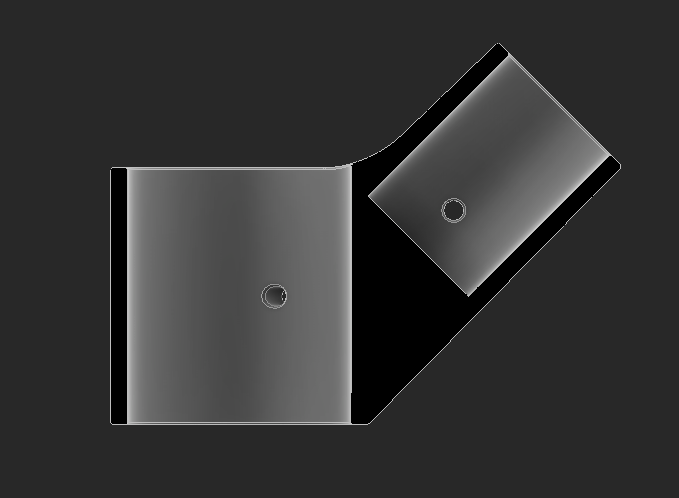

I designed, manufactured, and assembled PVC bipods for live streaming a VEX tournament. 

<!--truncate--> 
## Design

For this bipod, I want the maximum height to be around 10ft.  Traditional bipods and tripods are more expensive as they're designed to carry larger weights than a webcam.  There are many designs online, but none of them are adjustable and I'd like that to be a requirement for this.  

To keep the two stages together, I'd need to design something similar to a shaft collar.  Some clamp around the shaft, and some dig a screw into the shaft to prevent movement. 

Some research later, I stumbled across a product that's called a "telescoping tube clamp".  This is exactly what I want, but I don't want to spend money on it so I'll be designing my version of this. 

The first version of this is a coupler between two PVC sizes.  There's a hole between a slit so when a screw gets tightened, the entire thing will squeeze around the PVC.  I'm concerned this might not have enough grip to hold the pipe in place, this could be fixed with some modified geometry or with some rubber lined on the inside.  The slit also might not come down far enough to allow for enough flex, but that can be fixed by increasing the length of the slit or by making the top portion taller.  For the screw, I'll try to find wing screws and wing nuts so this can all be adjusted without tools. 

The base of the structure for this will be a triple PVC connector.  I tried to find one at my local hardware store but couldn't for the 1 1/4" PVC I'm using for this, so I have to 3D print it. 

To make sure the main pole gets as much support as possible, this goes all the way down to the bottom of the print.  The parts that hold the legs can be slightly weaker because they get a triangle brace to support them.  

I designed a gusset to triangle brace the base stage of the telescope.  This is a 45-degree angle, only because it makes this much easier to install by having 1 unique part.  If this angle isn't enough, I can design 2 brackets to accomplish that.

After sitting on it for a bit, I iterated on this design to use less material for the triangle brace.  This was made by revolving a cylinder and then lofting the face of the rectangle to the tip of the cylinder.  I added some screw holes so I have the option to mechanically link everything together. 

The most complex part of this is the gusset that meets up with the triangle braces.  This has to be similar to the base mount shown above, but the "legs" (triangle supports) are all at 45-degree angles to the main pole.  This part ties the structure together.  

The main hole on this is hollow so it can sit where it needs to on the main pipe.  This can be slid up and down to make sure the entire structure is square.  

The inside geometry of this part is very similar to the base structure.  The triangles don't come through to the main pipe, and this will get supported through the triangle too. 

This completes the base triangle.  I might have to add another member between the legs, but hopefully, sandbags on top of the legs will solve that.  I can add this if needed once it's assembled.  

I messed with some parameters for the telescoping mount and made it wider to fit the PVC and longer to have more contact with everything.  This fits in with the CAD.  

Our [Logitech C920](https://a.co/d/dyE8HOH) cameras already have some articulation in them, so for the camera mount I have just one 1/4-20 hole to secure the camera, which also has mounting holes to ensure the camera doesn't fall off.  We quickly found out that our cameras did not articulate as much as we anticipated, and we'll have to make the camera mount articulate too.  

The articulating version of the camera mount is extremely similar to the non-articulating one.  This splits the design in two and adds a screw for the part the camera goes to to pivot up and down.  The screw can be tightened for it to stop moving, or it can be pre-tightened to have some friction.  

## Manufacturing 
I printed everything with 4 walls and 15% gyroid infill.  I've noticed walls do significantly more for strength than infill.  

## Completed Bipods
The bipods were very easy to assemble and I had two of them cut and put together in under 30 minutes.  These were then set up in front of each competition field at Supernova Spectacular to host the live stream, and they worked great!

This is just a cool picture of me explaining the rules to competitors with my bipod in the background.  

Since the conclusion of our event, the bipods have moved to their final home in the robotics lab for The Science Academy and will be used to record scrimmages so students can review matches.  
