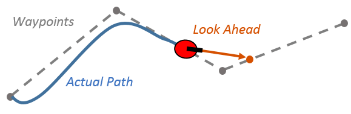
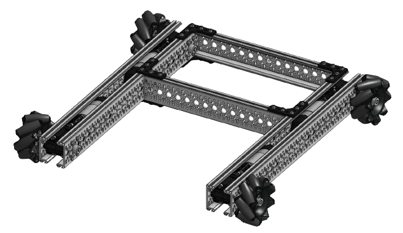

import Tabs from '@theme/Tabs';
import TabItem from '@theme/TabItem';

I made a [pure-pursuit](https://www.mathworks.com/help/nav/ug/pure-pursuit-controller.html) algorithm for [mecanum drive](https://github.com/EZ-Robotics/EZ-Mecanum) and [tank drives](https://github.com/EZ-Robotics/EZ-Tank-Odom).  



<!--truncate-->

Pure Pursuit is a tracking algorithm that allows a robot to follow a given path by following a point some distance ahead like a carrot on a stick.  It requires some way of knowing where your current position is and a generated path.

## Position Tracking
Position tracking is a piece of code that given 2 or 3 encoders you can extrapolate the X, Y, and angle of the robot.

This is explained far better by others, and here are the resources that I used:  
[5225A Tracking Documentation](https://wiki.purduesigbots.com/software/odometry)  
[QUEEN Video Explanation](https://www.youtube.com/watch?v=_T6KHywSP58)

This code relies on the speed at which sensors update, because it figures out the change in position over the time it takes for sensors to update, and adds that change to a current global value.  

`LEFT_OFFSET` and `RIGHT_OFFSET` are the "track width".  This is the width between the tracking wheels on the robot,  I have them split into 2 variables because technically they do not need to be the same number.  
`CENTER_OFFSET` is the distance from a perpendicular tracking wheel to the turning center of the robot.  This number can be anything, but the nicest way is for this to align with the robot's turning center.  This can be tuned by turning the robot in place and adjusting this number until the XY stops rotating around the robot. 
```cpp
void tracking_task() {
  double l_current = 0, r_current = 0;
  double c_current = 0;
  double l = 0, r = 0, c = 0;  // delta distance
  double l_last = 0, r_last = 0, c_last = 0;
  double radius_r = 0, radius_c = 0, h = 0, h2 = 0;  // rad for big circle
  double beta = 0, alpha = 0, theta = 0;
  double Xx = 0, Yy = 0, Xy = 0, Yx = 0;
  while (true) {
    l_current = get_raw_left();
    r_current = get_raw_right();
    c_current = get_raw_center();

    l = l_current - l_last;
    r = r_current - r_last;
    c = c_current - c_last;

    l_last = l_current;
    r_last = r_current;
    c_last = c_current;

    double width = LEFT_OFFSET + RIGHT_OFFSET;

    // diff between wheels for correcting turning
    theta = (l - r) / width;

    if (theta != 0) {
      radius_r = r / theta;
      beta = theta / 2.0;
      h = ((radius_r + RIGHT_OFFSET) * sin(beta)) * 2.0;
      radius_c = c / theta;
      h2 = (radius_c + CENTER_OFFSET) * 2.0 * sin(beta);
    } else {
      h = l;
      h2 = 0;
      beta = 0;
    }

    alpha = angle_rad + beta;

    Xx = h2 * cos(alpha);
    Xy = h2 * -sin(alpha);
    Yx = h * sin(alpha);
    Yy = h * cos(alpha);

    current.x += (Xx + Yx) / TICK_PER_INCH;
    current.y += (Xy + Yy) / TICK_PER_INCH;
    angle_rad += theta;
    current.theta = to_deg(angle_rad);

    pros::delay(1);
  }
}
```
## Mecanum Drive
Mecanum wheels allow the robot to move forward / backward and side to side.  These wheels get their own section here because they are effectively a cheat code for getting this code to work.  Because they can strafe, any error that's accumulated along the way can be accounted for.  With a drivetrain that cannot strafe, if you aren't following the path as exactly as you can, it becomes extremely difficult to account for it later.  This is why I chose this drive first, it allows me to go through all of this code without the problems that a typical drivetrain would give me. 


### Point to Point
To get the robot to move to a new target point, I need to calculate the amount the robot needs to move in the X direction, the amount the robot needs to move in the Y direction, and the amount the robot needs to move in turn. 

The direction the robot moves will change depending on the desired end angle. Some trigonometry is done to figure out the relative directions the robot needs to go, as while the robot turns the motor powers will all change.

The final thing to do is scale everything down.  If X output and Y output both exceed the maximum power that can be sent to the motors, even if one is magnitudes larger than the other, the robot will end up going straight.  We solve this by scaling everything down to a larger number.
<iframe width="560" height="315" src="https://www.youtube.com/embed/ZbMDKJ0zA3o?si=T7nrteA03m6vQWDE" title="YouTube video player" frameborder="0" allow="accelerometer; autoplay; clipboard-write; encrypted-media; gyroscope; picture-in-picture; web-share" allowfullscreen></iframe>

```cpp
void point_to_point() {
  // Compute PID
  xPID.compute(current.x);
  yPID.compute(current.y);
  aPID.compute(get_angle());

  // Vector math
  double angle = to_rad(get_angle());
  double raw_x_power = (xPID.output * cos(angle)) - (yPID.output * sin(angle));
  double raw_y_power = (yPID.output * cos(angle)) + (xPID.output * sin(angle));
  double raw_a_power = aPID.output;

  // Set output powers
  int x_output = raw_x_power;
  int y_output = raw_y_power;
  int a_output = clip_num(raw_a_power, 60, -60);
  int max_xy = 110;

  // Vector scaling 
  if (fabs(raw_x_power) > max_xy || fabs(raw_y_power) > max_xy) {
    if (fabs(raw_x_power) > fabs(raw_y_power)) {
      double scale = max_xy / fabs(raw_x_power);
      x_output = clip_num(raw_x_power, max_xy, -max_xy);
      y_output = raw_y_power * scale;
    } else {
      double scale = max_xy / fabs(raw_y_power);
      x_output = raw_x_power * scale;
      y_output = clip_num(raw_y_power, max_xy, -max_xy);
    }
  } else {
    x_output = raw_x_power;
    y_output = raw_y_power;
  }

  // Set motors
  raw_set_drive(x_output, y_output, a_output);
}
```

Mecanum drives that use the VRC wheels are slower when strafing than in forward / backward.  Because of this, I knew I'd want a mode where the robot would go straight for most of the motion and then turn at the end to face the desired angle. 

This piece of code was added to the above function.  It modifies the target angle depending on how far away the robot is from the target position.  If it's more than 12" away, the robot will go faster and face the target position.  Once the robot is within 12" of the target it'll start to rotate to the desired angle. 
<iframe width="560" height="315" src="https://www.youtube.com/embed/pIiadWcYlac?si=JW_q3pCaxF9RjtR2" title="YouTube video player" frameborder="0" allow="accelerometer; autoplay; clipboard-write; encrypted-media; gyroscope; picture-in-picture; web-share" allowfullscreen></iframe>

```cpp
  // Add for direction
  int add = dir == REV ? 180 : 0;

  // Set angle target
  double a_target;
  if (fast_move) {
    if (fabs(distance_to_point(target.x, target.y)) < 12) {
      only_look_at_point = false;
      a_target = target.theta;
    } else {
      only_look_at_point = true;
    }
  } else {
    a_target = target.theta;
  }

  if (only_look_at_point) {
    a_target = absolute_angle_to_point(target.x, target.y) + add;
  }

  // Compute angle PID and find the shortest path to the angle
  aPID.set_target(relative_angle_to_point(a_target));
  aPID.compute(0);
```

### Paths with Strafe
The paths the robot will follow will be points the user inputs.  In the example below, the robot will start at (0, 0), travel to (0, 24), then to (24, 24), then back to (0, 0).
```cpp
void autonomous() {
  pure_pursuit(
        {{{0, 24, 0}, FAST_MOVE_FWD},
         {{24, 24, 0}, FAST_MOVE_FWD},
         {{0, 0, 0}, FAST_MOVE_REV}});
  wait_drive();
}
```

Once I have a list of points, to decide which point to go to next I see how far away the robot is from the next point.  The target position gets shifted until we're looking at a point that is a distance away from the robot, and it keeps changing until we're at the final position in the list. 
```cpp
void pure_pursuit() {
  raw_move_odom(movements[pp_index]);

  if (fabs(distance_to_point(movements[pp_index].target.x, movements[pp_index].target.y)) < 5) {
    pp_index++;
    if (pp_index >= movements.size()) {
      pp_index = movements.size() - 1;
    }
  }

  point_to_point();
}
```

I cleaned up how the "turn type" is handled.  There are now 3 turn types:  
`FAST_MOVE` where the robot faces the target position and within 12" will move to the final angle
`LOOK_AT_TARGET` where the robot doesn't care about the end angle, and will always look at the target
`HOLD_ANGLE` where the robot will just hold its angle

I had to add `LOOK_AT_TARGET` because the distance away from the current target was less than 12", and the robot would always hold an angle even if I didn't want it to.  This lets me use `FAST_MOVE` as intended, and have all of my injected points follow `LOOK_AT_TARGET`.  
<iframe width="560" height="315" src="https://www.youtube.com/embed/aUpCYLBIhE0?si=LELL8e9J1XWCjrY3" title="YouTube video player" frameborder="0" allow="accelerometer; autoplay; clipboard-write; encrypted-media; gyroscope; picture-in-picture; web-share" allowfullscreen></iframe>

```cpp
  // Add for direction
  int add = current_turn_type == FAST_MOVE_REV || LOOK_AT_TARGET_REV ? 180 : 0;

  // Set angle target
  switch (current_turn_type) {
    // Looks at the target until final distance then goes to the final angle
    case FAST_MOVE_FWD:
    case FAST_MOVE_REV:
      if (fabs(distance_to_point(target, current)) < TURN_FAST_MOVE) {
        a_target = target.theta;
      } else {
        a_target = absolute_angle_to_point(target, current) + add;
      }
      break;
    // Looks at target the entire motion
    case LOOK_AT_TARGET_FWD:
    case LOOK_AT_TARGET_REV:
      if (fabs(distance_to_point(target, current)) > STOP_UPDATING_ANGLE) {
        a_target = absolute_angle_to_point(target, current) + add;
      }
      break;
    // Holds angle the entire motion
    case HOLD_ANGLE:
      a_target = target.theta;
    default:
      break;
  }
```

### Point Injection and Path Smoothing
This is based on the [Dawgma Adaptive Pure Pursuit paper](https://www.chiefdelphi.com/t/paper-implementation-of-the-adaptive-pure-pursuit-controller/166552).

Using the path following above, I want the code to internally add points every 1" along the path.  This will make the robot care about how it gets somewhere instead of blindly aiming towards a single point.  This code creates a new point that's 1" away from the current point on the way to the next big target point, and repeats for every input point.  
```cpp
// Inject point based on https://www.chiefdelphi.com/t/paper-implementation-of-the-adaptive-pure-pursuit-controller/166552
std::vector<odom> inject_points(std::vector<odom> imovements) {
  injected_pp_index.clear();
  // Create new vector that includes the starting point
  std::vector<odom> input = imovements;
  input.insert(input.begin(), {{{target.x, target.x, imovements[0].target.theta}, imovements[0].turn_type, imovements[0].max_xy_speed, imovements[0].max_turn_speed}});

  std::vector<odom> output;  // Output vector
  int output_index = -1;     // Keeps track of current index

  // This for loop runs for how many points there are minus one because there is one less vector than points
  for (int i = 0; i < input.size() - 1; i++) {
    // Figure out how many points fit in the vector
    int num_of_points_that_fit = (distance_to_point(input[i + 1].target, input[i].target)) / SPACING;

    // Add parent point
    // Make sure the robot is looking at next point
    output.push_back({input[i].target,
                      input[i + 1].turn_type,
                      input[i].max_xy_speed,
                      input[i].max_turn_speed});
    output_index++;
    injected_pp_index.push_back(output_index);

    // Add the injected points
    for (int j = 0; j < num_of_points_that_fit; j++) {
      // Calculate the new point with known information: hypot and angle
      double angle_to_point = absolute_angle_to_point(input[i + 1].target, input[i].target);
      pose new_point = vector_off_point(SPACING, {output[output_index].target.x, output[output_index].target.y, angle_to_point});

      // Make sure the robot is looking at the next point
      turn_types turn;
      if ((input[i + 1].turn_type == FAST_MOVE_REV || input[i + 1].turn_type == FAST_MOVE_FWD) && fabs(distance_to_point(input[i + 1].target, new_point)) > TURN_FAST_MOVE - LOOK_AHEAD) {
        turn = input[i + 1].turn_type == FAST_MOVE_REV ? LOOK_AT_TARGET_REV : LOOK_AT_TARGET_FWD;
      } else {
        turn = input[i + 1].turn_type;
      }

      // Push new point to vector
      output.push_back({{new_point.x, new_point.y, input[i + 1].target.theta},
                        turn,
                        input[i + 1].max_xy_speed,
                        input[i + 1].max_turn_speed});
      output_index++;
    }
    // Make sure the final point is there
    output.push_back(input[i + 1]);
    output_index++;
  }

  // Return final vector
  return output;
}
```

Another benefit of injecting points is we get more ability to smooth the path.  The Dawgma paper cites another paper by [James Teow on path smoothing for robots](https://medium.com/@jaems33/understanding-robot-motion-path-smoothing-5970c8363bc4).  I translated his code from Python to C++ and got the below code.  A slight path smoothing helps get rid of impossible sharp corners and gives the robot a path that more closely represents what it's going to follow anyway.  
```cpp
// Path smoothing based on https://medium.com/@jaems33/understanding-robot-motion-path-smoothing-5970c8363bc4
std::vector<odom> smooth_path(std::vector<odom> ipath, double weight_smooth, double weight_data, double tolerance) {
  double path[500][2];
  double new_path[500][2];

  // Convert odom to array
  for (int i = 0; i < ipath.size(); i++) {
    path[i][0] = new_path[i][0] = ipath[i].target.x;
    path[i][1] = new_path[i][1] = ipath[i].target.y;
  }

  double change = tolerance;

  while (change >= tolerance) {
    change = 0.0;
    for (int i = 1; i < ipath.size() - 2; i++) {
      for (int j = 0; j < 2; j++) {
        double x_i = path[i][j];
        double y_i = new_path[i][j];
        double y_prev = new_path[i - 1][j];
        double y_next = new_path[i + 1][j];

        double y_i_saved = y_i;
        y_i += weight_data * (x_i - y_i) + weight_smooth * (y_next + y_prev - (2.0 * y_i));
        new_path[i][j] = y_i;

        change += abs(y_i - y_i_saved);
      }
    }
  }

  // Convert array to odom
  std::vector<odom> output = ipath;  // Set output to input so target angles, turn types, and speed hold
  // Overwrite x and y
  for (int i = 0; i < ipath.size(); i++) {
    output[i].target.x = new_path[i][0];
    output[i].target.y = new_path[i][1];
  }

  return output;
}
```

### Final Mecanum
<iframe width="560" height="315" src="https://www.youtube.com/embed/pVcdgffsMnA?si=P3Cc8XRpN6KGd6hI" title="YouTube video player" frameborder="0" allow="accelerometer; autoplay; clipboard-write; encrypted-media; gyroscope; picture-in-picture; web-share" allowfullscreen></iframe>  
<iframe width="560" height="315" src="https://www.youtube.com/embed/A_Q_yBHhWSY?si=9qDZo20ImXHNNA5K" title="YouTube video player" frameborder="0" allow="accelerometer; autoplay; clipboard-write; encrypted-media; gyroscope; picture-in-picture; web-share" allowfullscreen></iframe>

## Tank Drive
Now the goal is to get this all working properly on a tank drive setup.  I have a kind of working version [here](https://github.com/EZ-Robotics/peewee) but I didn't have a lot of time with that robot to iron everything out.  

Below is my rewrite of this about a year later.  This uses v3.0.0 of [EZ-Template](https://ez-robotics.github.io/EZ-Template/) as a base.  

### Tracking Differences
For the tank drives, I wanted to play with using no tracking wheels.  Tracking wheels are free-spinning wheels that have sensors on them, and they are mounted on "suspension" so they always contact the ground even if the robot lifts off the ground.  

The encoders inside of V5 motors have been shockingly good, I've had very consistent results using them.  Not having tracking wheels means my robot will not be able to correct for movements that the robot doesn't read.  So I won't be able to push the robot and have it fully correct.  This will only be able to correct for movements the robot thinks have happened, so if there's a wheel slip the robot won't be able to account for that either.  These are all problems that exist with the consistent autonomous routines that have been made previously with the built-in encoders, so for this, I felt it was fine.  

### Point to Point

#### Target Angle 
An issue that isn't had with the mecanum drive is accounting for the target heading because this drive cannot drive.  If we set the target angle to be the angle between our current position and target, we run into problems where the angle doesn't scale with distance.  If we're at (0.5, 11.5) trying to go to (12, 12) the robot will turn 45 degrees to move this half-inch.  As the robot moves this issue will be compounded causing oscillation in the target.  

This can be solved by projecting a new point (only used for this angle calculation) that follows the line between the robot and the real target.  There are two possible solutions for this though, because we can project forward or backward.  So in this function below, I figure out both of these solutions and pick the one farther away from where the robot targets.  
```cpp
// Find the angle to face during movements
std::vector<pose> Drive::find_point_to_face(pose current, pose target, bool set_global) {
  double tx_cx = target.x - current.x;
  double m = 0.0;
  double angle = 0.0;
  if (tx_cx != 0) {
    m = (target.y - current.y) / tx_cx;
    angle = 90.0 - util::to_deg(atan(m));
  }
  pose ptf1 = util::vector_off_point(LOOK_AHEAD, {target.x, target.y, angle});
  pose ptf2 = util::vector_off_point(LOOK_AHEAD, {target.x, target.y, angle + 180});

  if (set_global) {
    double ptf1_dist = util::distance_to_point(ptf1, current);
    double ptf2_dist = util::distance_to_point(ptf2, current);
    if (ptf1_dist > ptf2_dist) {
      ptf1_running = true;
    } else {
      ptf1_running = false;
    }
  }
  point_to_face = {ptf1, ptf2};

  return {ptf1, ptf2};
}
```

#### Overshooting
The biggest issue (and difference) with implementing this on a tank drive vs a mecanum drive is how overshooting is handed.  

With the mecanum code, all of the math is done based on `target x - current x`.  This gives a direction, as it would return positive or negative depending on what the value of each one is.  

With the tank code, you have to set your XY PID to the distance between the robot and the target.  The distance formula can give this to us, but it removes any negative values.  In practice, this means the robot will slow down as it approaches the target, but once it passes the target the robot will continue to move.  
  <Tabs
  groupId="ex1"
  defaultValue="v2"
  values={[
    { label: 'Tank',  value: 'v2', },
    { label: 'Mecanum',  value: 'v3', },
  ]
}>

<TabItem value="v2">

```cpp
// Compute angle PID and find the shortest path to the angle
aPID.set_target(relative_angle_to_point(a_target));
aPID.compute(0);

// Compute xy PID
xyPID.set_target(distance_to_point(temp_xy_target, current) * dir);
xyPID.compute(0);

// Raw outputs
double xy_raw_output = xyPID.output * cos(to_rad(relative_angle_to_point(a_target))); // Scale this based on how far away our angle is to target
double a_raw_output = aPID.output;
```

</TabItem>


<TabItem value="v3">

```cpp
double angle = to_rad(get_angle());
double raw_x_power = (xPID.output * cos(angle)) - (yPID.output * sin(angle));
double raw_y_power = (yPID.output * cos(angle)) + (xPID.output * sin(angle));
double raw_a_power = aPID.output;
```


</TabItem>
</Tabs>

I attempted this last year with cross-product.  This would work if we were at (0, 0) going to (0, 24), but would not work going from (0, 24) to (0, 0), as all of the values flip and it leaves us in the same situation.  
```cpp
// Check to see if we've passed target
pose b = vector_off_point(24, {movements.back().target.x, movements.back().target.y, a_target + 90});
pose a = vector_off_point(24, {movements.back().target.x, movements.back().target.y, a_target - 90});
pose c = current;
int there = sgn(((b.x - a.x) * (c.y - a.y) - (b.y - a.y) * (c.x - a.x)));  // cross product to decide if above/below line

if (there == 1)
  passed_target = current_turn_type == FWD ? true : false;
else if (there == -1)
  passed_target = current_turn_type == REV ? true : false;
```

The problem that I kept running into was needing a line perpendicular to the robot to decide when the robot was past the target.  This works sometimes if that line ends up being the X or Y axis, but on weird angles this becomes tricky.  

My solution was to make that line always be the X-axis.  I translate and rotate the target point so the robot is in positive Y always coming down to (0, 0). 

For example, if I'm currently at (0, 0) trying to go to (12, 12), the function below will simulate my target being (0, 0) and the robot currently being at (0, 16.9).  Now instead of using the distance formula to decide how far we are, we can just return the Y-axis of our new simulated current position.  
```cpp
// Returns a distance that the robot is away from the target, but this keeps sign.
double Drive::is_past_target(pose target, pose current) {
  // Translated current x, y translated around origin
  double fakek_y = (current.y - target.y);
  double fakek_x = (current.x - target.x);

  // Angle to face translated around origin
  pose ptf;
  ptf.y = point_to_face[!ptf1_running].y - target.y;
  ptf.x = point_to_face[!ptf1_running].x - target.x;
  int add = current_turn_type == REV ? 180 : 0;
  double fake_angle = util::to_rad((util::absolute_angle_to_point(ptf, {fakek_x, fakek_y})) + add);

  // Rotate around the origin
  double fake_x = (fakek_x * cos(fake_angle)) - (fakek_y * sin(fake_angle));
  double fake_y = (fakek_y * cos(fake_angle)) + (fakek_x * sin(fake_angle));

  return fake_y;
}
```

#### Combining Both 
Those were the two big problems I was fighting to get this code to work.  I'm sure some optimizations can be done (when are there not), but all of this seems to be stable.  

The iteration for this is similar to the mecanum drive, just using all of the new math talked about above.  
```cpp
// Odom To Point Task
void Drive::ptp_task() {
  // Update the target angle
  find_point_to_face(odom_current, odom_target, false);

  // Compute angle
  int add = current_turn_type == REV ? 180 : 0;                                                       // Decide if going fwd or rev
  double a_target = util::absolute_angle_to_point(point_to_face[!ptf1_running], odom_current) + add;  // Calculate the point for angle to face
  aPID.target_set(util::wrap_angle(a_target - drive_imu_get()));                                      // Constrain error to -180 to 180
  aPID.compute(0);

  // Decide if we've passed the target or not
  int dir = (current_turn_type == REV ? -1 : 1);                                                          // If we're going backwards, add a -1
  int flipped = util::sgn(is_past_target(odom_target, odom_current)) != util::sgn(past_target) ? -1 : 1;  // Check if we've flipped directions to what we started

  // Compute xy PID
  double temp_target = fabs(is_past_target(odom_target, odom_current));  // Use this instead of distance formula to fix impossible movements
  xyPID.target_set(temp_target * dir * flipped);
  xyPID.compute(0);

  // Prioritize turning by scaling xy_out down
  double cos_scale = cos(util::to_rad(aPID.target_get()));
  double xy_out = xyPID.output * cos_scale;

  // Raw outputs
  double l_out = xy_out + aPID.output;
  double r_out = xy_out - aPID.output;

  // Compute slew
  slew_left.iterate(drive_sensor_left());
  slew_right.iterate(drive_sensor_right());

  // Vector scaling so nothing can be larger than max speed
  double max_slew_out = fmin(slew_left.output(), slew_right.output());
  // When left and right slew are disabled, scale max speed by the turn scaler so the robot goes slower in curves
  if (fabs(l_out) > max_slew_out || fabs(r_out) > max_slew_out) {
    if (fabs(l_out) > fabs(r_out)) {
      r_out = r_out * (max_slew_out / fabs(l_out));
      l_out = util::clamp(l_out, max_slew_out, -max_slew_out);
    } else {
      l_out = l_out * (max_slew_out / fabs(r_out));
      r_out = util::clamp(r_out, max_slew_out, -max_slew_out);
    }
  }

  // Set motors
  if (drive_toggle)
    private_drive_set(l_out, r_out);

  // This is for wait_until
  leftPID.compute(drive_sensor_left());
  rightPID.compute(drive_sensor_right());
}
```

### Final Tank
I implemented point injection and path smoothing from the mecanum code and this was able to follow paths now.  

My PID tuning for this is questionable, but the robot is successfully following all of the paths I've given it.  Future improvements would be to implement more "awareness" for turning vs driving, and there was discussion about making the lookahead point variable based on how far away the angles target is too (increase for straight movements, shorten for turns).  This could be fun to play with in the future, but for now, this project is complete for me.  
<iframe width="560" height="315" src="https://www.youtube.com/embed/AY-8lzsPBVA?si=MYc5QOHDj7xkOo3s" title="YouTube video player" frameborder="0" allow="accelerometer; autoplay; clipboard-write; encrypted-media; gyroscope; picture-in-picture; web-share" allowfullscreen></iframe>  
<iframe width="560" height="315" src="https://www.youtube.com/embed/BQ13qwDPhdI?si=D4GbmNuB0uyazOHW" title="YouTube video player" frameborder="0" allow="accelerometer; autoplay; clipboard-write; encrypted-media; gyroscope; picture-in-picture; web-share" allowfullscreen></iframe>  