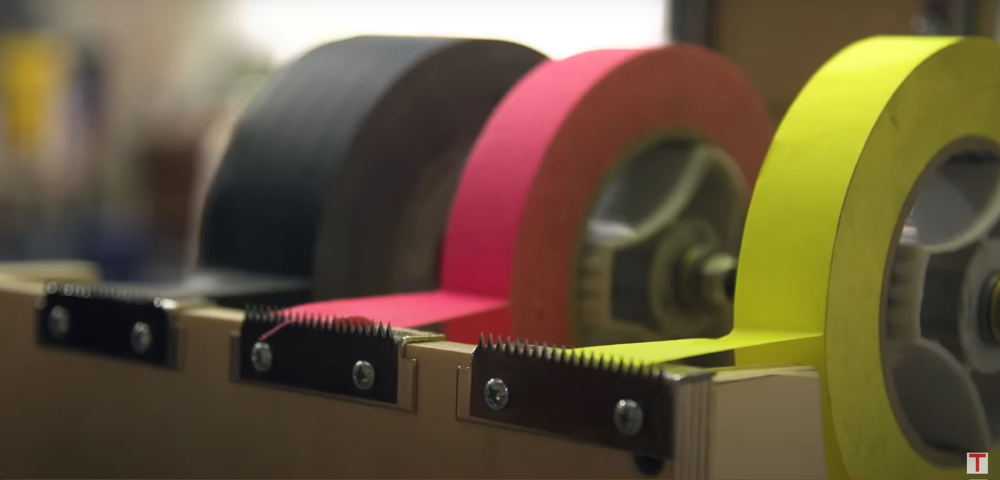
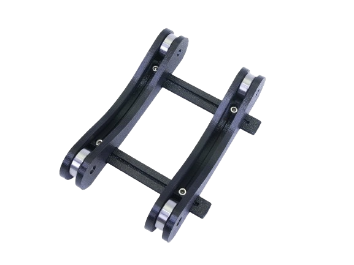
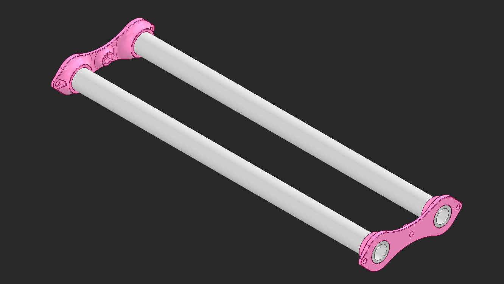
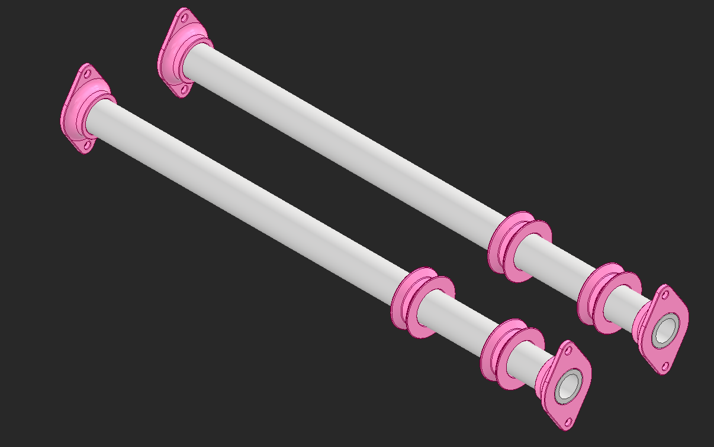
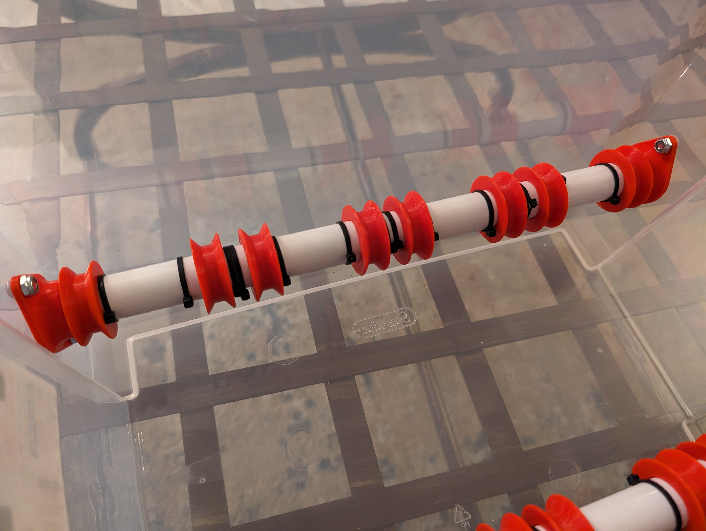
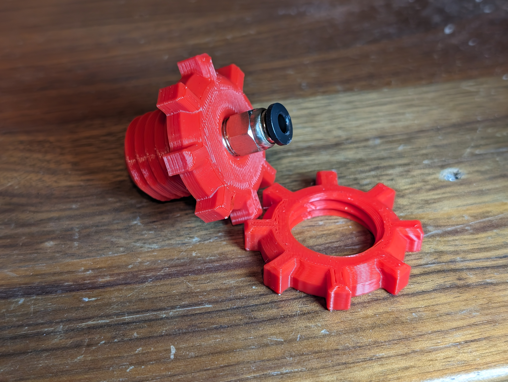
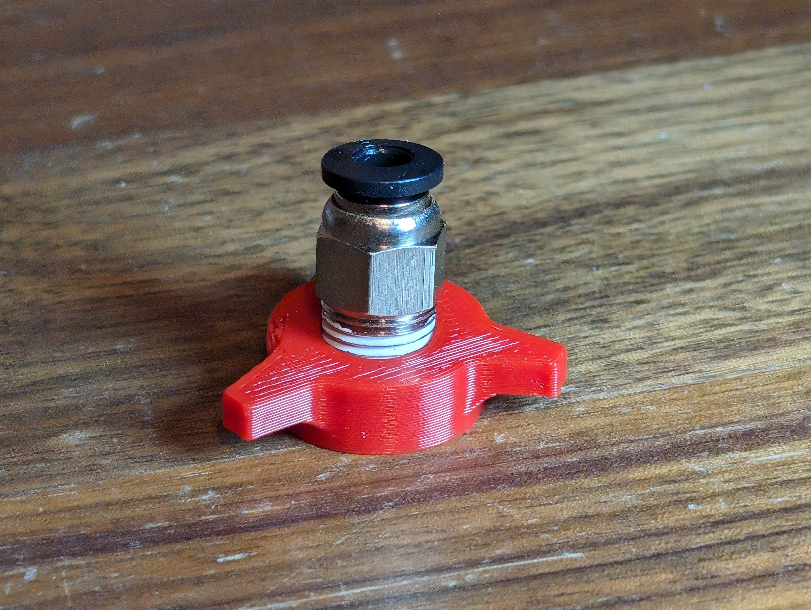
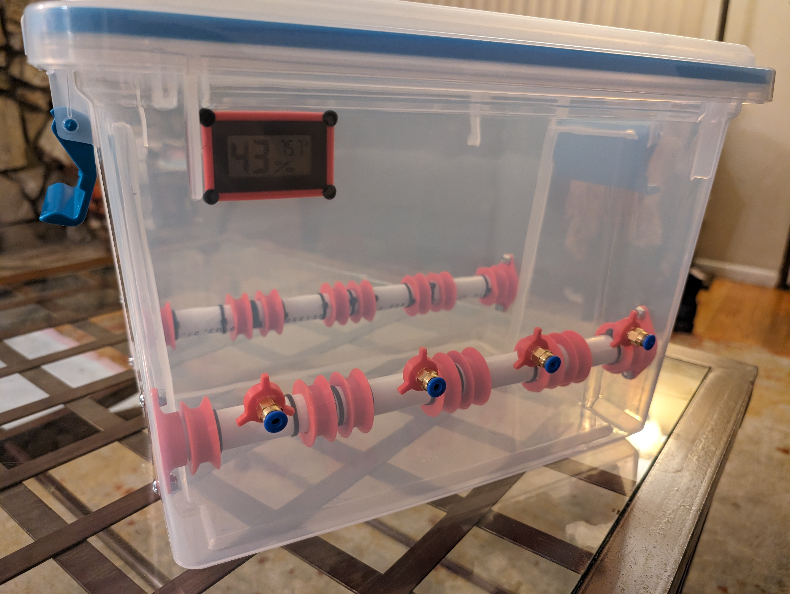

After trying to print with old filament unsuccessfully, I decided to make filament dry boxes.  

<!--truncate--> 
## Design
I've seen filament dry boxes before, they are usually air-tight containers that have color-changing silica gel beads at the bottom.  [CNC Kitchen](https://www.cnckitchen.com/) recently made a video showcasing how functional [solid state dehumidifiers](https://www.youtube.com/watch?v=n7EWexck8NE) are, but their price seems prohibitive.  

I came across this [reddit post about the ultimate filament dry box](https://www.reddit.com/r/3Dprinting/comments/upypgr/the_ultimate_filament_dry_box/) that is all open source on [printables](https://www.printables.com/model/453772-ultimate-filament-dry-box).  The containers used seem like they're the perfect size for 4 rolls of filament and the prints are super simple to fit everything in.  My only problem with this design is how the filament is stored, all 4 rolls are on one piece of PVC.  To replace a roll in the center I'd have to remove another roll.  I want each roll to be independent of each other.  

Adam Savage and Laura Kampf designed a [tape dispenser](https://www.youtube.com/watch?v=dqmF2_h8icM) to solve this problem.  This is a little complicated but very doable to make, especially with 3D printing.  

But I remembered that Prusa has this design for a filament holder that came with my Prusa Mini.  If I replaced the ball bearings with PVC that went the entire length of the containers, I could just place a roll of filament on the PVC and call it a day.  

My first design is two holders for PVC that would get screwed into either side of the container.  I designed this before getting the container and realized the sides are not flat, so this design wouldn't easily work.  

Luckily the solution for this made the design significantly simpler and allowed me to modify the width of everything without reprinting.  I also designed some simple rollers to hold the rolls in place.  

I'll need holes for bowden tubes to get the filament from the dry box to my printer, but the original design by Krieger has files that are super nice for that.  

## Assembly
"Drilling" the holes in the containers was the scariest part.  Krieger said "DO THIS IN A WELL VENTILATED AREA. YOU DO NOT WANT TO BREATHE THE FUMES. DO NOT CUT OR DRILL THE HOLES. THE PLASTIC OF THE BOX WILL SHATTER. ASK ME HOW I KNOW.", so I decided to use a soldering iron to melt out the holes.  I printed all the rollers and the mounts for the PVC, and to keep the rollers in place I decided to use zip-ties.  If these didn't work, I was going to print tight-fitting spacers for the PVC but luckily that wasn't needed.  

While the part Krieger made is beautiful, I don't have a blow torch and don't want to buy conduit just to melt out a hole.  

I designed my own that requires a much smaller hole.  My first design used the M10 bowden connectors but these are massive and don't really have a "screw head".  

I changed the design to use M6 bowden connectors and this worked amazingly.  I also made a quick rectangle to mount a humidity sensor.  

With silica gel beads and filament, this design is done!  I have 2 more containers but I'm going to use them for storage and not directly print out of them.  Maybe at some point, I'll want to print out of them, but that would be a problem for future me.  